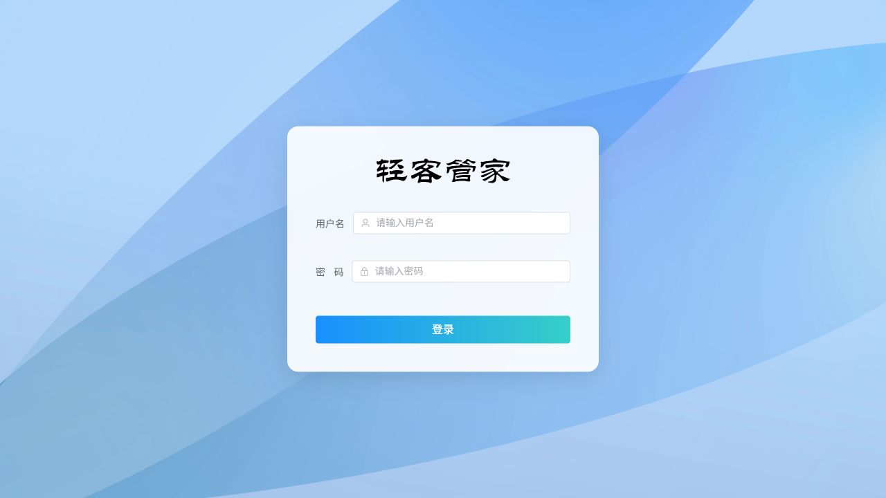
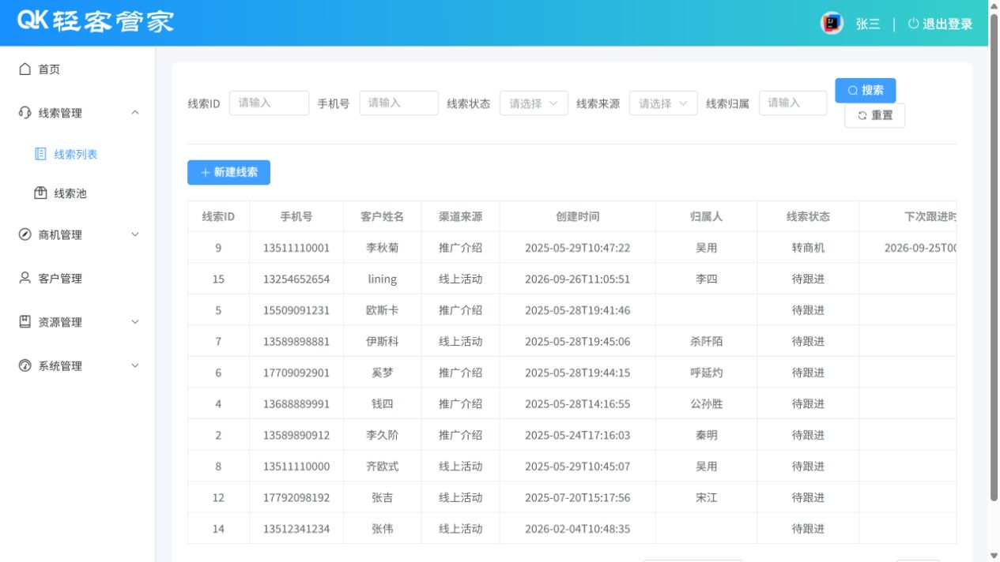
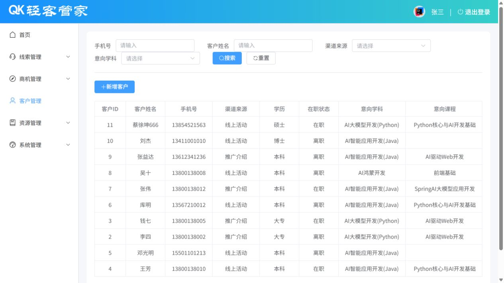
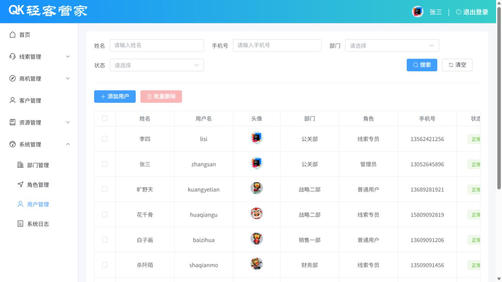

# 轻客管家（qk-manager）

跟着课程做的一个 CRM 后台管理**练手项目**，用来把前后端分离这套流程完整走一遍。

不做成"大而全的系统"，重点是把常见功能自己实现一遍：多模块拆分、增删改查、分页、登录认证、
拦截器、AOP 日志、事务、Redis 缓存、文件上传，以及 Vue 3 + Element Plus 的后台页面开发。

## 界面截图

下面的图是把项目跑起来之后实际截的（登录页 + 三个业务页面）：

<table>
  <tr>
    <td align="center"><br>登录页</td>
    <td align="center"><br>线索列表</td>
  </tr>
  <tr>
    <td align="center"><br>客户管理</td>
    <td align="center"><br>用户管理</td>
  </tr>
</table>

## 这个项目在练什么

### 后端

- **Maven 多模块**：`qk-common` / `qk-entity` / `qk-management` 的拆分，父工程用
  `dependencyManagement` 统一管理依赖版本
- **分层开发**：`controller → service → mapper`，实体、DTO、VO 分开存放
- **MyBatis-Plus**：`BaseMapper` 单表增删改查、`ServiceImpl`、条件构造器、分页；
  复杂的多表关联查询则手写 XML（`resources/mapper/*.xml`）
- **统一返回与异常**：`Result` / `PageResult` 封装响应，`GlobalExceptionHandler` 统一处理异常，
  业务错误抛自定义的 `BusinessException`
- **登录认证**：密码做 MD5 后存库，登录时签发 JWT；`TokenInterceptor` 校验请求头里的 token，
  解析出用户 id 后放进 `ThreadLocal`（`CurrentUserHoler`），除 `/login` 外的接口全部拦截
- **AOP 操作日志**：自定义 `@Log` 注解 + 切面，把操作人、方法、参数、返回值、耗时写进 `operate_log`
- **事务**：线索跟进、转商机这类要改多张表的操作，用 `@Transactional(rollbackFor = Exception.class)`
  保证一起成功或一起回滚
- **Redis 缓存**：首页概览的统计数据缓存 5 分钟
- **文件上传**：上传到阿里云 OSS，AccessKey 从环境变量读取

### 前端

- **Vite 工程化**：`@` 路径别名、`/api` 代理解决跨域
- **页面布局**：Vue 3 组合式 API + Vue Router + Element Plus，搭出顶栏 / 侧边栏 / 内容区的后台布局
- **列表页三件套**：搜索栏 + 表格 + 分页；新增 / 修改用弹窗表单，带基本校验
- **Axios 封装**：请求拦截器统一加 token，响应拦截器统一处理业务状态码，401 时清 token 跳登录
- **登录状态**：token 和用户信息存 localStorage，配合退出登录

### 联调流程

从页面原型 → 接口文档 → 后端接口 → 前端页面的完整走一遍，接口调试用的是 Apifox，
前端通过 Vite 代理直接请求本地后端。

## 适合什么人看

比较适合：

- 学完 Java Web / Spring Boot 基础，想找个完整项目练手，不知道从哪下手的人
- 学过 Vue 3 和 Element Plus，但没独立做过后台管理页面的人
- 想看看 JWT 登录、拦截器、AOP、事务、Redis 缓存、OSS 上传这些常见功能在项目里怎么落地的人
- 想拿一个现成的后台骨架，改成自己业务的人（菜单、模块都是现成的，换掉业务代码即可）

不太适合：

- 完全零基础，还没写过 Java 或 JavaScript 的
- 想直接拿去当生产系统用的，见文末「已知的不足」

## 技术栈

后端：Java 21、Spring Boot 4.1.1、MyBatis-Plus 3.5.17、PageHelper、MySQL 8.0、Redis、JJWT、
Spring AOP、阿里云 OSS SDK

前端：Vue 3、Vite 3、Vue Router、Element Plus、Axios

## 目录结构

```text
qk-manager/
├── qk-parent/                 后端 Maven 多模块工程
│   ├── qk-common/             通用返回结果、异常、JWT、OSS 等工具类
│   ├── qk-entity/             实体类、DTO、VO
│   └── qk-management/         业务代码、配置、Mapper XML 与启动类
├── qk-vue-management/         前端工程（Vue 3 + Vite）
├── sql脚本/qk.sql             建库建表与初始化数据
├── docs/images/               README 里的截图
└── notes/                     项目笔记、环境准备与接口文档
```

## 做了什么

把「线索 → 商机 → 客户」这条线串了起来，另外补了几个后台系统常见的模块：

- 登录认证：用户名密码登录，下发 JWT，拦截器校验
- 首页概览：线索和商机的统计卡片、快捷操作，Redis 缓存 5 分钟
- 线索管理：列表、线索池、新增、分配、跟进、伪线索处理、转商机
- 商机管理：列表、公海池、新增、分配、跟进、踢回公海、转客户
- 客户管理：列表、新增、查看、修改
- 资源管理：课程管理、活动管理
- 系统管理：部门、角色、用户、操作日志

## 把项目跑起来

### 1. 建库

```bash
mysql -u root -p < "sql脚本/qk.sql"
```

脚本会创建 `qk` 库并导入 11 张表和一些演示数据。

### 2. 起 Redis

```bash
redis-server
```

默认连 `127.0.0.1:6379`，只有首页概览的缓存会用到。

### 3. 改后端配置

编辑 `qk-parent/qk-management/src/main/resources/application.yml`：数据库地址、用户名、密码，
Redis 地址，以及阿里云 OSS 的 `endpoint`、`bucketName`、`region`。

OSS 的 AccessKey 代码里是从环境变量读的，只有测上传头像时才需要配：

```bash
export ALIBABA_CLOUD_ACCESS_KEY_ID=your-access-key-id
export ALIBABA_CLOUD_ACCESS_KEY_SECRET=your-access-key-secret
```

### 4. 启动后端

```bash
cd qk-parent
mvn spring-boot:run
```

也可以打包后运行，默认端口 `8080`：

```bash
mvn clean package -DskipTests
java -jar qk-management/target/qk-management-1.0-SNAPSHOT.jar
```

或者在 IDE 里直接运行 `com.qk.QkManagementApplication`。

### 5. 启动前端

```bash
cd qk-vue-management
npm install
npm run dev
```

浏览器打开 `http://localhost:5173`。前端请求带 `/api` 前缀，Vite 会转发到 `8080` 再去掉前缀，
配置在 `qk-vue-management/vite.config.js`。

## 登录账号

初始化数据里的密码是 `MD5(用户名 + "123")`，所以可以这样登：

| 用户名 | 密码 |
| --- | --- |
| `zhangsan` | `zhangsan123` |
| `lisi` | `lisi123` |

## 接口约定

- 除 `/login` 外，所有接口都要在请求头带上 `token`
- 统一返回 `{ code, msg, data }`，`code` 为 `1` 表示成功
- 主要路径：`/login`、`/depts`、`/users`、`/roles`、`/courses`、`/activities`、`/clues`、
  `/businesses`、`/customers`、`/report/overview`、`/logs`、`/upload`
- 详细接口见 [notes/附录-接口文档.md](notes/附录-接口文档.md)

## 已知的不足

练手项目，别当生产代码看：

- 前端路由守卫是注释掉的（`src/router/index.js`），没登录也能直接进页面
- `application.yml` 里直接写了本地数据库密码，实际项目应该走环境变量或配置中心
- 只做了登录校验，没有做接口级的权限控制，角色目前只是数据字段
- 测试覆盖很少，只有零散几个 Controller / Service 测试
- 仓库里没有 Dockerfile 和 CI，部署要照 `notes` 里的步骤手动来

## 项目笔记

`notes/` 目录下是跟着项目一路整理的笔记，从环境搭建到部署都有，哪块忘了可以翻：

| 文档 | 内容 |
| --- | --- |
| [notes/02_环境准备.md](notes/02_环境准备.md) | 工程搭建、模块划分、依赖配置 |
| [notes/03_部门管理.md](notes/03_部门管理.md) | 开发规范、RESTful 风格、部门管理 |
| [notes/04_用户管理.md](notes/04_用户管理.md) | 用户管理、密码加密、文件上传 |
| [notes/05_登录认证.md](notes/05_登录认证.md) | JWT、Filter、Interceptor |
| [notes/06_线索管理.md](notes/06_线索管理.md) | 线索跟进、事务、转商机 |
| [notes/07_首页及日志.md](notes/07_首页及日志.md) | 首页概览、Redis 缓存、操作日志 |
| [notes/08_前端实现1.md](notes/08_前端实现1.md) | 整体布局、路由、部门管理页面 |
| [notes/09_前端实现2.md](notes/09_前端实现2.md) | 用户管理、登录退出、前端部署 |
| [notes/10_Linux项目部署.md](notes/10_Linux项目部署.md) | Linux 部署流程 |
| [notes/11_Docker项目部署.md](notes/11_Docker项目部署.md) | Docker 部署流程 |
| [notes/附录-接口文档.md](notes/附录-接口文档.md) | 全量接口说明 |
