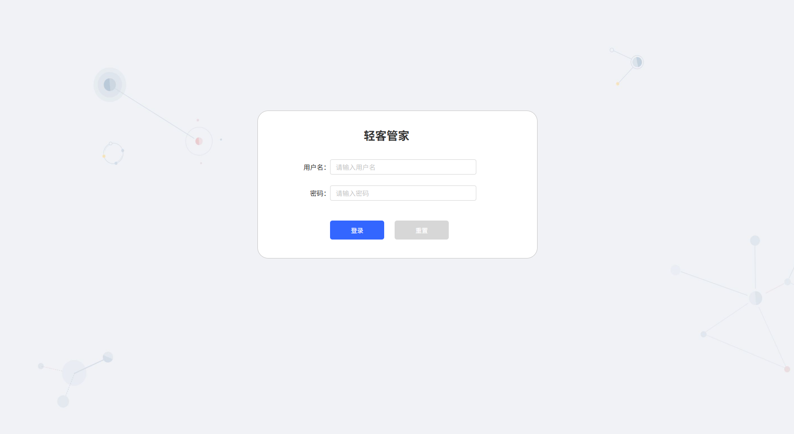
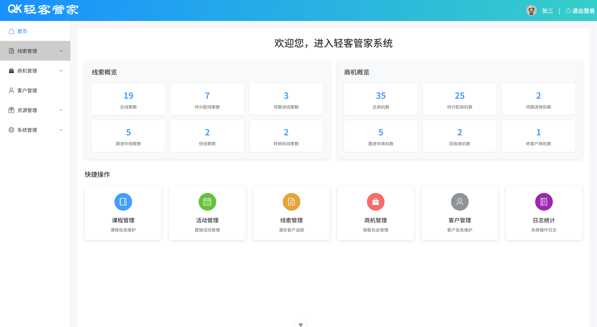
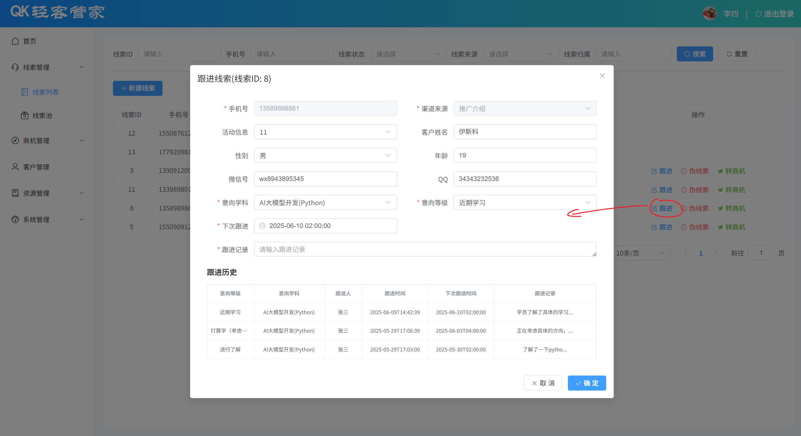
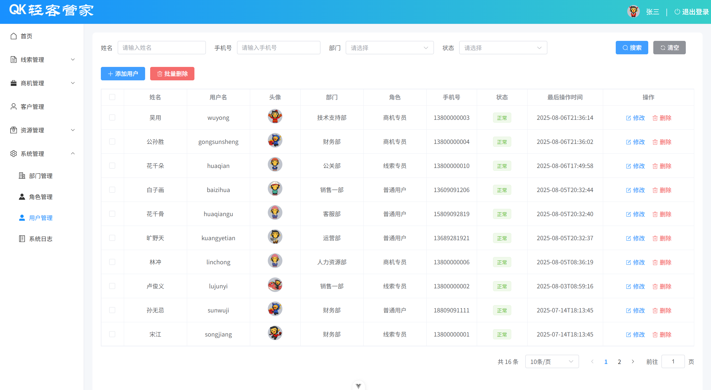

# 轻客管家（qk-manager）

轻客管家是一个面向教培行业 CRM 场景的前后端分离后台管理项目，主要用于完整实践
Spring Boot 多模块开发、JWT 登录认证、RBAC 基础数据管理、线索与商机流转、操作日志、
Redis 缓存、文件上传及 Vue 3 后台页面开发。

项目重点是把常见企业后台功能串成一条完整链路：从环境搭建、接口设计、后端实现，到前端联调和部署演练。
它更适合作为学习练手或后台项目骨架，不建议直接作为生产系统使用。

## 界面展示

<table>
  <tr>
    <td align="center" width="50%">
      <br>
      <strong>登录页</strong>
    </td>
    <td align="center" width="50%">
      <br>
      <strong>首页概览</strong>
    </td>
  </tr>
  <tr>
    <td align="center" width="50%">
      <br>
      <strong>线索管理</strong>
    </td>
    <td align="center" width="50%">
      <br>
      <strong>用户管理</strong>
    </td>
  </tr>
</table>

## 功能模块

- **登录认证**：用户名密码登录、JWT 签发、请求头令牌校验、未登录返回 401
- **首页概览**：线索和商机统计、快捷操作，概览数据使用 Redis 缓存
- **线索管理**：列表、线索池、新增、分配、跟进、伪线索处理、转为商机
- **商机管理**：列表、公海池、新增、分配、跟进、踢回公海、转为客户
- **客户管理**：列表、新增、查看、修改
- **资源管理**：课程管理、活动管理
- **系统管理**：部门管理、角色管理、用户管理、操作日志
- **文件上传**：图片上传至阿里云 OSS

## 技术栈

| 层级 | 技术 |
| --- | --- |
| 后端 | Java 21、Spring Boot 4.1.1、Spring MVC、Spring AOP |
| 持久层 | MyBatis-Plus 3.5.17、PageHelper、MySQL 8 |
| 中间件 | Redis |
| 安全与工具 | JWT、MD5 密码摘要、阿里云 OSS SDK |
| 前端 | Vue 3、Vite 3、Vue Router 4、Element Plus、Axios |
| 构建 | Maven、npm |

## 项目结构

```text
qk-manager/
├── qk-parent/                         后端 Maven 多模块工程
│   ├── qk-common/                     通用返回结果、异常、JWT、OSS 等公共代码
│   ├── qk-entity/                     实体类、DTO、VO
│   └── qk-management/                 控制器、业务逻辑、Mapper、配置和启动类
├── qk-vue-management/                 前端 Vue 3 工程
├── sql脚本/
│   └── qk.sql                         建库、建表及初始化数据
└── notes/                             项目笔记、接口文档与部署说明
```

## 环境要求

- JDK 21
- Maven 3.9+
- Node.js 18+
- MySQL 8
- Redis 7
- 阿里云 OSS（仅测试图片上传时需要）

## 本地启动

### 1. 初始化数据库

执行项目根目录下的 SQL 脚本：

```bash
mysql -u root -p < "sql脚本/qk.sql"
```

脚本会创建 `qk` 数据库和所需数据表，并写入演示数据。

### 2. 启动 Redis

确保 Redis 已在本机启动。默认配置为 `127.0.0.1:6379`，无密码。

### 3. 修改后端配置

编辑
`qk-parent/qk-management/src/main/resources/application.yml`，根据本地环境修改：

- MySQL：数据库地址、用户名、密码
- Redis：主机和端口
- 阿里云 OSS：`endpoint`、`bucketName`、`region`

图片上传使用的 AccessKey 从环境变量读取：

PowerShell：

```powershell
$env:ALIBABA_CLOUD_ACCESS_KEY_ID="your-access-key-id"
$env:ALIBABA_CLOUD_ACCESS_KEY_SECRET="your-access-key-secret"
```

Linux/macOS：

```bash
export ALIBABA_CLOUD_ACCESS_KEY_ID=your-access-key-id
export ALIBABA_CLOUD_ACCESS_KEY_SECRET=your-access-key-secret
```

### 4. 启动后端

```bash
cd qk-parent
mvn spring-boot:run
```

也可以在 IDE 中运行启动类：

```text
com.qk.QkManagementApplication
```

后端默认运行在 `http://localhost:8080`。

打包运行：

```bash
cd qk-parent
mvn clean package -DskipTests
java -jar qk-management/target/qk-management-1.0-SNAPSHOT.jar
```

### 5. 启动前端

```bash
cd qk-vue-management
npm install
npm run dev
```

浏览器访问 `http://localhost:5173`。

开发环境下，前端请求使用 `/api` 前缀，Vite 会将其代理到
`http://localhost:8080` 并移除 `/api`。代理配置位于
`qk-vue-management/vite.config.js`。

## 默认账号

初始化数据中的密码使用 `MD5(username + "123")` 生成，可使用以下账号登录：

| 用户名 | 密码 | 说明 |
| --- | --- | --- |
| `zhangsan` | `zhangsan123` | 管理员 |
| `lisi` | `lisi123` | 普通角色 |

## 接口约定

- 登录接口：`POST /login`
- 除 `/login` 外，请求头需携带 `token`
- 未携带或令牌无效时，服务端返回 `401`
- 统一响应结构：

```json
{
  "code": 1,
  "msg": "success",
  "data": {}
}
```

其中 `code = 1` 表示成功，`code = 0` 表示业务失败。

主要接口路径：

| 模块 | 路径 |
| --- | --- |
| 登录 | `/login` |
| 部门 | `/depts` |
| 用户 | `/users` |
| 角色 | `/roles` |
| 课程 | `/courses` |
| 活动 | `/activities` |
| 线索 | `/clues` |
| 商机 | `/businesses` |
| 客户 | `/customers` |
| 首页概览 | `/report/overview` |
| 操作日志 | `/logs` |
| 文件上传 | `/upload` |

完整接口说明见
[notes/附录-接口文档.md](notes/附录-接口文档.md)。

## 关键实现

- `qk-common`：统一封装 `Result`、`PageResult`、`BusinessException`、JWT 和 OSS 工具
- `qk-entity`：集中管理持久化实体、查询 DTO 和响应 VO
- `qk-management`：提供 Controller、Service、Mapper、AOP 日志、拦截器和全局异常处理
- `TokenInterceptor`：解析请求头 `token`，将当前用户 ID 存入 `ThreadLocal`
- `LogAspect`：通过 `@Log` 注解记录操作人、方法、参数、返回值与耗时
- `@Transactional`：在线索转商机、商机转客户等多表操作中保证事务一致性
- Redis：缓存首页概览统计结果，降低重复查询压力

## 部署文档

- [Linux 项目部署](notes/09_Linux项目部署.md)
- [Docker 项目部署](notes/10_Docker项目部署.md)

## 已知限制

这是一个学习项目，当前仍有以下不足：

- 前端路由守卫处于注释状态，未登录时仍可直接访问页面
- 后端仅校验登录状态，尚未实现接口级权限控制
- `application.yml` 中包含本地数据库信息，生产环境应改为环境变量或配置中心
- 自动测试覆盖较少，目前只有部分 Controller 和 Service 测试
- 仓库未提供统一的 Dockerfile 和 CI 配置

## 项目笔记

| 文档 | 内容 |
| --- | --- |
| [notes/01_环境准备.md](notes/01_环境准备.md) | 工程搭建、模块划分、依赖配置 |
| [notes/02_部门管理.md](notes/02_部门管理.md) | 开发规范、RESTful 风格、部门管理 |
| [notes/03_用户管理.md](notes/03_用户管理.md) | 用户管理、密码加密、文件上传 |
| [notes/04_登录认证.md](notes/04_登录认证.md) | JWT、登录认证与拦截器 |
| [notes/05_线索管理.md](notes/05_线索管理.md) | 线索跟进、事务、转商机 |
| [notes/06_首页及日志.md](notes/06_首页及日志.md) | 首页概览、Redis 缓存、操作日志 |
| [notes/07_前端实现1.md](notes/07_前端实现1.md) | 后台布局、路由和基础页面 |
| [notes/08_前端实现2.md](notes/08_前端实现2.md) | 用户管理、登录退出、前端部署 |
| [notes/09_Linux项目部署.md](notes/09_Linux项目部署.md) | Linux 环境部署流程 |
| [notes/10_Docker项目部署.md](notes/10_Docker项目部署.md) | Docker 与 Docker Compose 部署 |
| [notes/附录-接口文档.md](notes/附录-接口文档.md) | 全量接口说明 |
