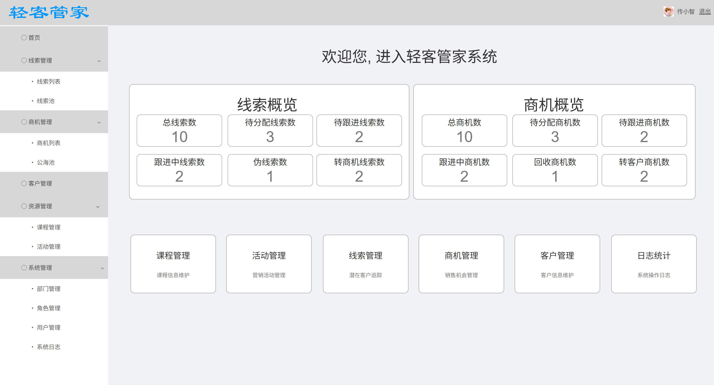
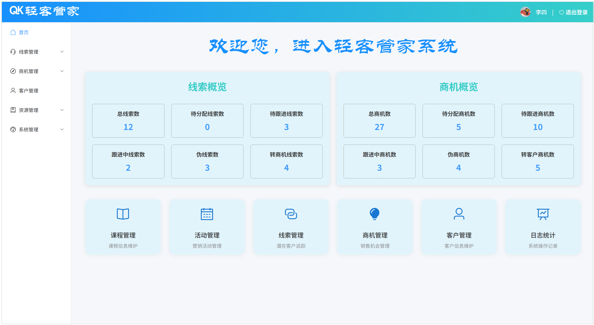
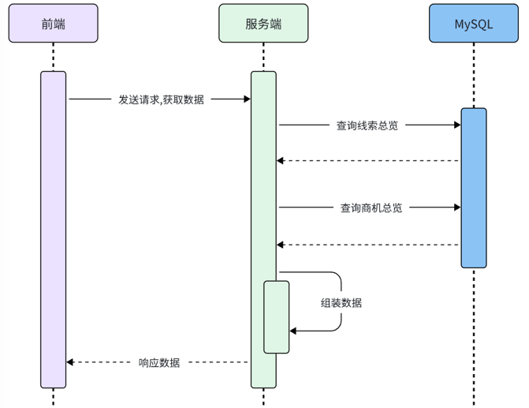
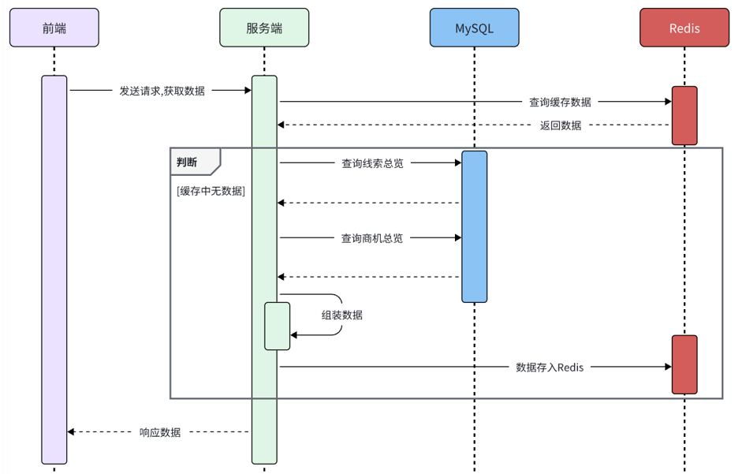
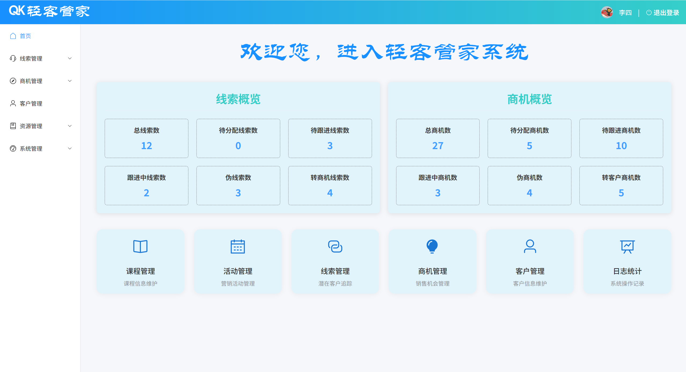
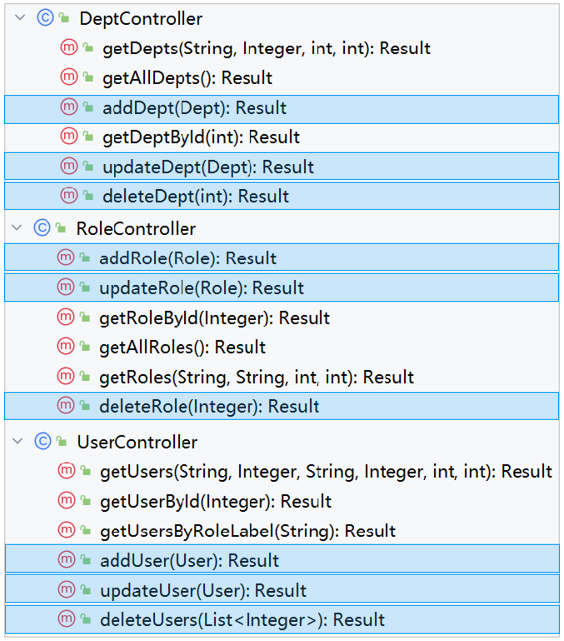

# 一、首页数据概览

## 1.需求分析



当我们访问轻客管家项目时，登录完成之后，就会自动进入轻客管家项目，默认访问的就是首页。而在首页中，要展示出线索概览数据 和 商机概览数据。

线索概览数据包含：

- 总线索数

- 待分配线索数

- 待跟进线索数

- 跟进中线索数

- 伪线索数

- 转商机线索数

商机概览数据包含：

- 总商机数

- 待分配商机数

- 待跟进商机数

- 跟进中商机数

- 回收商机数

- 转客户商机数

## 2.接口说明

首页数据概览的接口文档，请参考：[附录-接口文档](https://lining-lo.github.io/lining-lo-notes/轻客管家/附录-接口文档.html) 中 首页概览 接口。

## 3.准备工作

通过接口文档，我们可以看到最终要给前端响应的数据格式如下：

```json
{
    "code": 1,
    "msg": "success",
    "data": {
        "clueTotal": 9,
        "clueWaitAllot": 3,
        "clueWaitFollow": 3,
        "clueFollowing": 1,
        "clueFalse": 0,
        "clueConvertBusiness": 2,
        "businessTotal": 2,
        "businessWaitAllot": 2,
        "businessWaitFollow": 0,
        "businessFollowing": 0,
        "businessFalse": 0,
        "businessConvertCustomer": 0
    }
}
```

那么接下来，我们就需要来定义实体类，来封装给前端响应的数据。

1.准备数据封装的实体类

在 `qk-entity` 模块下的 `com.qk.vo` 包中定义一个实体类 `OverviewVO`

```java
package com.qk.vo;

import lombok.Data;

/**
 * 线索和商机统计信息实体类
 */
@Data
public class OverviewVO {
    private Integer clueTotal; // 总线索数
    private Integer clueWaitAllot; // 待分配线索数量
    private Integer clueWaitFollow; // 待跟进线索数量
    private Integer clueFollowing; // 跟进中线索数量
    private Integer clueFalse; // 伪线索数量
    private Integer clueConvertBusiness; // 转商机线索数量

    private Integer businessTotal; // 总商机数
    private Integer businessWaitAllot; // 待分配商机数量
    private Integer businessWaitFollow; // 待跟进商机数量
    private Integer businessFollowing; // 跟进中商机数量
    private Integer businessFalse; // 回收商机数量
    private Integer businessConvertCustomer; // 转客户商机数量
}
```

2.准备sql语句

```sql
-- 统计线索的数据: 统计出 总线索数、待分配线索数、待跟进线索数、跟进中线索数、伪线索数、转商机线索数
select
    count(1) as clue_total,
    count(if(status = 1, 1, null)) as clue_wait_allot,
    count(if(status = 2, 1, null)) as clue_wait_follow,
    count(if(status = 3, 1, null)) as clue_following,
    count(if(status = 4, 1, null)) as clue_false,
    count(if(status = 5, 1, null)) as clue_convert_business
from clue;
```

```sql
-- 统计商机数据: 统计出 总商机数、待分配商机数、待跟进商机数、跟进中商机数、回收商机数、转客户商机数
select
    count(1) as business_total,
    count(if(status = 1, 1, null)) as business_wait_allot,
    count(if(status = 2, 1, null)) as business_wait_follow,
    count(if(status = 3, 1, null)) as business_following,
    count(if(status = 4, 1, null)) as business_false,
    count(if(status = 5, 1, null)) as business_convert_customer
from business;
```

> if 函数: 
>
> `if(条件表达式, val1, val2) `：当前条件表达式为true，取值val1，否则就取val2。

## 4.功能实现

1.新建 ReportController

在 `com.qk.controller` 包下定义 `ReportController`，代码如下：

```java
package com.qk.controller;

import com.qk.common.Result;
import com.qk.service.ReportService;
import com.qk.vo.OverviewVO;
import lombok.extern.slf4j.Slf4j;
import org.springframework.beans.factory.annotation.Autowired;
import org.springframework.web.bind.annotation.GetMapping;
import org.springframework.web.bind.annotation.RequestMapping;
import org.springframework.web.bind.annotation.RestController;

@Slf4j
@RestController
@RequestMapping("/report")
public class ReportController {

    @Autowired
    private ReportService reportService;
    
    /**
     * 获取首页概览数据 - /report/overview
     */
    @GetMapping("/overview")
    public Result getOverview() {
        log.info("获取首页概览数据");
        //1 调用service层方法，获取数据
        OverviewVO overview = reportService.getOverview();
        //2 响应Result
        return Result.success(overview);
    }

}
```

2.新建 ReportService 接口

在 `com.qk.service` 包下定义 `ReportService`，代码如下：

```java
package com.qk.service;

import com.qk.vo.OverviewVO;

public interface ReportService {

    /**
     * 获取总览数据
     */
    public OverviewVO getOverview();

}
```

3.新建 ReportServiceImpl 

在 `com.qk.service.impl` 包下定义 `ReportServiceImpl`，代码如下：

```java
package com.qk.service.impl;

import com.qk.mapper.BusinessMapper;
import com.qk.mapper.ClueMapper;
import com.qk.service.ReportService;
import com.qk.vo.OverviewVO;
import org.springframework.beans.BeanUtils;
import org.springframework.beans.factory.annotation.Autowired;
import org.springframework.stereotype.Service;

@Service
public class ReportServiceImpl implements ReportService {

    @Autowired
    private ClueMapper clueMapper;
    @Autowired
    private BusinessMapper businessMapper;

    @Override
    public OverviewVO getOverview() {
        //1. 获取线索概览数据
        OverviewVO clueOverviewVO = clueMapper.getClueOverviewData();

        //2. 获取商机概览数据
        OverviewVO businessOverviewVO = businessMapper.getBusinessOverviewData();

        //3. 合并数据返回，将一个对象身上的属性值合并到另一个对象，为null的就不要覆盖。
        BeanUtils.copyProperties(businessOverviewVO, clueOverviewVO, "clueTotal", "clueWaitAllot", "clueWaitFollow", "clueFollowing", "clueFalse", "clueConvertBusiness");
        return clueOverviewVO;
    }
}
```

4.ClueMapper

在 `ClueMapper` 接口中，增加如下方法：

```java
/**
 * 获取线索总览数据
 * @return 线索总览数据
 */
OverviewVO getClueOverviewData();
```

在 `ClueMapper.xml` 配置文件中，增加如下配置：

```sql
<!-- 获取线索总览数据 -->
<select id="getClueOverviewData" resultType="com.qk.vo.OverviewVO">
    select
        count(1) as clue_total,
        count(if(status = 1, 1, null)) as clue_wait_allot,
        count(if(status = 2, 1, null)) as clue_wait_follow,
        count(if(status = 3, 1, null)) as clue_following,
        count(if(status = 4, 1, null)) as clue_false,
        count(if(status = 5, 1, null)) as clue_convert_business
    from clue;
</select>
```

5.BusinessMapper

在 `BusinessMapper` 接口中，增加如下方法：

```java
/**
 * 获取商机概览数据
 */
OverviewVO getBusinessOverviewData();
```

在 `BusinessMapper.xml` 配置文件\(如果不存在, 需要创建一个\)中，增加如下配置：

```xml
<?xml version="1.0" encoding="UTF-8" ?>
<!DOCTYPE mapper PUBLIC "-//mybatis.org//DTD Mapper 3.0//EN" "http://mybatis.org/dtd/mybatis-3-mapper.dtd">

<mapper namespace="com.qk.mapper.BusinessMapper">
    <!-- 获取商机概览数据 -->
    <select id="getBusinessOverviewData" resultType="com.qk.vo.OverviewVO">
        select
            count(1) as business_total,
            count(if(status = 1, 1, null)) as business_wait_allot,
            count(if(status = 2, 1, null)) as business_wait_follow,
            count(if(status = 3, 1, null)) as business_following,
            count(if(status = 4, 1, null)) as business_false,
            count(if(status = 5, 1, null)) as business_convert_customer
        from business;
    </select>
</mapper>
```

代码编写完毕后，重启服务，打开浏览器进行测试：



那到此呢，关于首页数据概览，我们就已经完成了。

> 思考：
>
> 由于首页数据概览，是每个用户登录系统后，都会访问到的页面，而每个用户看到的数据都是一样的，包含两个部分：线索概览、商机概览。
>
> 所以，对于首页数据概览这个接口访问是比较频繁的，而如果每一次访问都是从Mysql数据库中查询数据，性能较低，而且也会增加Mysql数据库的访问压力。
>
> 那接下来，我们就要对这一块儿的功能进行性能的优化，而提升查询效率，最有效、最直接的方式就是增加缓存，而在企业项目开发中，我们通常会使用Redis数据库来作缓存。

## 5.Redis性能优化

Redis学习完毕后，我们就要通过Redis来作缓存，来优化首页概览数据的页面加载数据，降低数据库的压力。

如果你不熟悉，笔记可参考：[Redies数据库](https://lining-lo.github.io/lining-lo-notes/后端/Redies数据库.html)

在没有加入Redis做缓存之前：



> 在这个流程中，所有的请求过来，都是直接访问Mysql，从Mysql数据库中查询数据。
>

加入Redis缓存之后，访问流程就变为如下的房子了。



> 加入缓存的思路：
>
> 1. 前端发起请求到服务端，服务端，先查询Redis，从Redis查询首页概览数据，如果有数据，就直接返回。
>
> 2. 如果Redis中没有首页概览数据，再查询Mysql数据库，从数据库中查询数据。
>
> 3. 再将Mysql查询的数据缓存到Redis数据库中 （那么下一次再查询时，就有数据了）。
>

具体代码如下：

1.在 `pom.xml` 中引入SpringDataRedis的依赖

在 `qk-management` 模块的 `pom.xml` 中引入如下依赖:

```xml
<dependency>
    <groupId>org.springframework.boot</groupId>
    <artifactId>spring-boot-starter-data-redis</artifactId>
</dependency>
```

2.`application.yml` 中配置Redis的数据库信息

指定连接的是本地的Redis，注解地址 127\.0\.0\.1 ，端口号 6379。

```yaml
spring:
  data:
    redis:
      host: 127.0.0.1
      port: 6379
```

3.`ReportServiceImpl` 中配置具体逻辑

```java
package com.qk.service.impl;

import com.qk.mapper.BusinessMapper;
import com.qk.mapper.ClueMapper;
import com.qk.service.ReportService;
import com.qk.vo.OverviewVO;
import lombok.extern.slf4j.Slf4j;
import org.springframework.beans.BeanUtils;
import org.springframework.beans.factory.annotation.Autowired;
import org.springframework.data.redis.core.RedisTemplate;
import org.springframework.stereotype.Service;
import java.util.concurrent.TimeUnit;

@Slf4j
@Service
public class ReportServiceImpl implements ReportService {

    @Autowired
    private ClueMapper clueMapper;
    @Autowired
    private BusinessMapper businessMapper;
    @Autowired
    private RedisTemplate<Object, Object> redisTemplate;

    @Override
    public OverviewVO getOverview() {
        //1. 查询redis缓存中的数据
        Object dataOverview = redisTemplate.opsForValue().get("DATA_OVERVIEW");
        if(dataOverview != null){
            log.info("查询redis缓存中的数据: {}" , dataOverview);
            return (OverviewVO) dataOverview;
        }

        //2. 查询数据库
        //2.1 获取线索概览数据
        OverviewVO clueOverviewVO = clueMapper.getClueOverviewData();
        //2.2 获取商机概览数据
        OverviewVO businessOverviewVO = businessMapper.getBusinessOverviewData();
        //2.3 合并数据返回
        BeanUtils.copyProperties(businessOverviewVO, clueOverviewVO, "clueTotal", "clueWaitAllot", "clueWaitFollow", "clueFollowing", "clueFalse", "clueConvertBusiness");

        //3. 合并数据返回，将一个对象身上的属性值合并到另一个对象，为null的就不要覆盖。
        log.info("查询数据库中的数据: {}, 缓存到redis中" , clueOverviewVO);
        redisTemplate.opsForValue().set("DATA_OVERVIEW", clueOverviewVO, 5, TimeUnit.MINUTES);
        return clueOverviewVO;
    }
}
```

> 这里我们在缓存数据的时候，需要给缓存设置一个有效期，5分钟之内有效。
>
> 这样，缓存一旦过期，查询redis缓存，就查不到了，没有数据，就会从mysql数据库中加载最新的数据出来。
>
> 如果不设置有效期，数据库中的数据更新了，缓存中还一直都是老的数据。

3.`OverviewVO ` 实体类实现序列化

> 注意：
>
> 在SpringDataRedis操作Redis数据库的时候，会对key，value进行序列化处理，而要能够进行序列化，我们的实体类，必须要实现序列化接口。所以，OverviewVO 实体类需要实现序列化，代码如下：
>

```java
package com.qk.vo;

import lombok.Data;

import java.io.Serializable;

/**
 * 线索和商机统计信息实体类
 */
@Data
public class OverviewVO implements Serializable {
    private Integer clueTotal; // 线索总数
    private Integer clueWaitAllot; // 线索待分配数量
    private Integer clueWaitFollow; // 线索待跟进数量
    private Integer clueFollowing; // 线索跟进中数量
    private Integer clueFalse; // 线索伪线索数量
    private Integer clueConvertBusiness; // 线索转为商机数量

    private Integer businessTotal; // 商机总数
    private Integer businessWaitAllot; // 商机待分配数量
    private Integer businessWaitFollow; // 商机待跟进数量
    private Integer businessFollowing; // 商机跟进中数量
    private Integer businessFalse; // 商机伪线索数量
    private Integer businessConvertCustomer; // 商机转客户数量
}
```

代码编写完毕之后，我们可以再此进行测试：



# 2.日志管理

SpringAOP的相关知识我们就已经全部学习完毕了。最后我们要通过AOP实现操作日志记录的功能。

如果你不熟悉SpringAOP，笔记可参考：[SpringBoot框架 ](https://lining-lo.github.io/lining-lo-notes/框架/SpringBoot框架.html)

## 1.需求

需求：将轻客管家中增、删、改相关接口的操作日志记录到数据库表中

就是当访问部门管理和员工管理当中的增、删、改相关功能接口时，需要详细的操作日志，并保存在数据表中，便于后期数据追踪。

操作日志信息包含：

操作人、操作类、操作方法、请求参数、返回值、方法执行时长

> 所记录的日志信息包括当前接口的操作人是谁操作的，什么时间点操作的，以及访问的是哪个类当中的哪个方法，在访问这个方法的时候传入进来的参数是什么，访问这个方法最终拿到的返回值是什么，以及整个接口方法的运行时长是多长时间。

## 2.分析

1.问题1：项目当中增删改相关的方法是不是有很多？

很多

2.问题2：我们需要针对每一个功能接口方法进行修改，在每一个功能接口当中都来记录这些操作日志吗？

这种做法比较繁琐

以上两个问题的解决方案：可以使用AOP解决\(每一个增删改功能接口中要实现的记录操作日志的逻辑代码是相同\)。

可以把这部分记录操作日志的通用的、重复性的逻辑代码抽取出来定义在一个通知方法当中，我们通过AOP面向切面编程的方式，在不改动原始功能的基础上来对原始的功能进行增强。目前我们所增强的功能就是来记录操作日志，所以也可以使用AOP的技术来实现。使用AOP的技术来实现也是最为简单，最为方便的。

3.问题3：既然要基于AOP面向切面编程的方式来完成的功能，那么我们要使用 AOP五种通知类型当中的哪种通知类型？

答案：环绕通知 `@Around`。因为所记录的操作日志当中包括：操作人、操作时间，访问的是哪个类、哪个方法、方法运行时参数、方法的返回值、方法的运行时长。方法返回值，是在原始方法执行后才能获取到的。方法的运行时长，需要原始方法运行之前记录开始时间，原始方法运行之后记录结束时间。通过计算获得方法的执行耗时。基于以上的分析我们确定要使用Around环绕通知。

4.问题4：最后一个问题，切入点表达式我们该怎么写？

答案：使用 `@annotation` 来描述切入点表达式。要匹配业务接口当中所有的增删改的方法，而增删改方法在命名上没有共同的前缀或后缀。此时如果使用`execution`切入点表达式也可以，但是会比较繁琐。 当遇到增删改的方法名没有规律时，就可以使用 `@annotation`切入点表达式



## 3.步骤

简单分析了一下大概的实现思路后，接下来我们就要来完成案例了。案例的实现步骤其实就两步：

准备工作

- 引入AOP的起步依赖

- 导入资料中准备好的数据库表结构，并引入对应的实体类

编码实现

- 自定义注解`@Log`

- 定义切面类，完成记录操作日志的逻辑

## 4.代码实现

1.准备工作

在 pom\.xml 中引入AOP的依赖

```xml
<dependency>
    <groupId>org.springframework.boot</groupId>
    <artifactId>spring-boot-starter-aop</artifactId>
</dependency>
```

创建数据库表结构

```SQL
-- 操作日志表
create table operate_log(
    id int unsigned auto_increment comment 'ID' primary key,
    operate_user_id int unsigned comment '操作用户ID',
    operate_time datetime comment '操作时间',
    class_name varchar(100) comment '操作的类名',
    method_name varchar(100) comment '操作的方法名',
    method_params varchar(1000) comment '方法参数',
    return_value varchar(2000) comment '返回值',
    cost_time bigint comment '方法执行耗时, 单位:ms'
) comment '操作日志表';
```

创建实体类

```java
package com.qk.entity;

import lombok.Data;
import java.time.LocalDateTime;

@Data
@NoArgsConstructor
@AllArgsConstructor
public class OperateLog {
    private Integer id; //ID
    private Integer operateUserId; //操作用户ID
    private LocalDateTime operateTime; //操作时间
    private String className; //类名称
    private String methodName; //方法名称
    private String methodParams; //方法参数
    private String returnValue; //返回值
    private Long costTime; //耗时
}
```

创建日志操作Mapper接口 `OperateLogMapper`

```java
package com.qk.mapper;

import com.baomidou.mybatisplus.core.mapper.BaseMapper;
import com.qk.entity.OperateLog;

/**
 * 操作日志管理Mapper
 */
@Mapper
public interface OperateLogMapper extends BaseMapper<OperateLog> {
}
```

2.自定义注解 `@Log`

在 `qk-management` 模块的 `com.qk.anno` 包下\.

```java
package com.qk.anno;

import java.lang.annotation.ElementType;
import java.lang.annotation.Retention;
import java.lang.annotation.RetentionPolicy;
import java.lang.annotation.Target;

@Target(ElementType.METHOD)
@Retention(RetentionPolicy.RUNTIME)
public @interface Log{
}
```

2. 在qk\-management的aop包中定义AOP记录日志的切面类

```java
package com.qk.aop;

import com.qk.anno.LogOperation;
import com.qk.entity.OperateLog;
import com.qk.mapper.OperateLogMapper;
import com.qk.utils.CurrentUserHoler;
import org.aspectj.lang.ProceedingJoinPoint;
import org.aspectj.lang.annotation.Around;
import org.aspectj.lang.annotation.Aspect;
import org.aspectj.lang.reflect.MethodSignature;
import org.springframework.beans.factory.annotation.Autowired;
import org.springframework.stereotype.Component;
import java.lang.reflect.Method;
import java.time.LocalDateTime;
import java.util.Arrays;

@Aspect
@Component
public class LogAspect {

    @Autowired
    private OperateLogMapper operateLogMapper;

    @Around("@annotation(com.qk.anno.Log)") 
    public Object aroundAdvice(ProceedingJoinPoint pjp) throws Throwable {
        //1 获取日志信息
        //1.1 private Integer operateUserId; //操作用户ID
        Integer operateUserId = CurrentUserHoler.getCurrentUser();
        //1.2 private LocalDateTime operateTime; //操作时间
        LocalDateTime operateTime = LocalDateTime.now();
        //1.3 private String className; //类名称
        String className = pjp.getTarget().getClass().getName();
        //1.4 private String methodName; //方法名称
        String methodName = pjp.getSignature().getName();
        //1.5 private String methodParams; //方法参数
        String methodParams = Arrays.toString(pjp.getArgs());
        long start = System.currentTimeMillis();
        //1.6 private String returnValue; //返回值
        Object result = pjp.proceed();
        String returnValue = result.toString();
        //1.7 private Long costTime; //耗时
        Long costTime = System.currentTimeMillis() - start;
        
        //2 将日志信息封装成OperateLog对象
        OperateLog log = new OperateLog(null, operateUserId, operateTime, className, methodName, methodParams, returnValue, costTime);
        //3 调用mapper层方法保存日志
        operateLogMapper.insert(log);
        return result;
    }
}
```

3.在需要记录的日志的Controller层的增、删、改方法上，加上注解 `@Log`

```java
package com.qk.controller;

import com.qk.anno.LogOperation;
import com.qk.common.PageResult;
import com.qk.common.Result;
import com.qk.dto.UserDto;
import com.qk.entity.User;
import com.qk.service.UserService;
import lombok.extern.slf4j.Slf4j;
import org.springframework.beans.factory.annotation.Autowired;
import org.springframework.web.bind.annotation.*;

import java.util.List;

/**
 * 用户管理控制器
 */
@Slf4j
@RestController
@RequestMapping("/users")
public class UserController {

    @Autowired
    private UserService userService;

    /**
     * 条件分页查询用户列表
     */
    @GetMapping
    public Result getUsers(UserDto userDto) {
        PageResult<User> userPage = userService.getUsers(userDto);
        return Result.success(userPage);
    }

    /**
     * 根据ID查询用户信息
     */
    @GetMapping("/{id}")
    public Result getUserById(@PathVariable Integer id) {
        User user = userService.getUserById(id);
        return Result.success(user);
    }

    /**
     * 根据角色标识查询用户列表
     */
    @GetMapping("/role/{roleLabel}")
    public Result getUsersByRoleLabel(@PathVariable String roleLabel) {
        log.info("根据角色标识查询用户列表, roleLabel: {}", roleLabel);
        List<User> users = userService.getUsersByRoleLabel(roleLabel);
        return Result.success(users);
    }

    /**
     * 新增用户
     */
    @Log
    @PostMapping
    public Result addUser(@RequestBody User user) {
        log.info("新增用户, user: " + user);
        userService.addUser(user);
        return Result.success();
    }

    /**
     * 修改用户信息
     */
    @Log
    @PutMapping
    public Result updateUser(@RequestBody User user) {
        userService.updateUser(user);
        return Result.success();
    }

    /**
     * 批量删除用户
     */
    @Log
    @DeleteMapping("/{ids}")
    public Result deleteUsers(@PathVariable List<Integer> ids) {
        log.info("批量删除用户, ids: {}" , ids);
        userService.deleteUsers(ids);
        return Result.success();
    }
}
```

重启SpringBoot服务，测试操作日志记录功能：

打开浏览器，针对于员工的数据、部门的数据进行增删改之后。我们打开数据库表结构可以来看一下：


我们会看到，在数据库表中，就清晰的记录了谁、什么时间点、调用了哪个类的哪个方法、传入了什么参数、返回了什么数据，都清晰的记录在数据库中了。

在前面我们学习的都是web开发的技术使用，都是面向应用层面的，我们学会了怎么样去用。而我们今天所要学习的是web后端开发的最后一个篇章springboot原理篇，主要偏向于底层原理。
