# 一、准备工作

## 1.基本说明

我们学习了Vue工程化的基础内容、TS、ElementPlus，那接下来呢，我们要实现轻客管家项目的前端部分，加强大家对于Vue项目的理解，并掌握Vue项目的开发。 

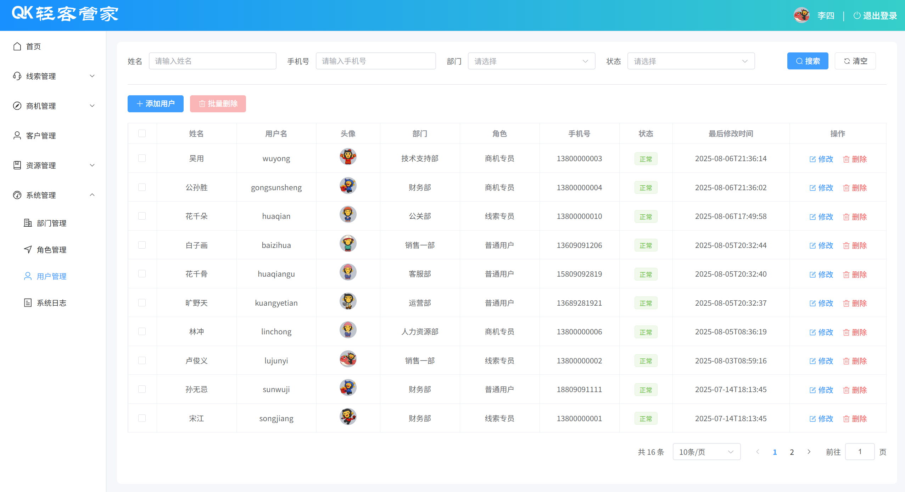

在这个案例中，我们主要完成 部门管理 、角色管理、 员工管理 的功能开发。 而今天呢，我们先来完成部门管理的功能开发，而在完成部门管理的功能开发之前，先需要完成基础的准备工作。 

## 2.开发模式介绍

我们介绍过，现在的企业项目开发有2种开发模式：前后台混合开发 和 前后台分离开发。

前后台混合开发，顾名思义就是前台后台代码混在一起开发。这种开发模式有如下缺点：

- 沟通成本高：后台人员发现前端有问题，需要找前端人员修改，前端修改成功，再交给后台人员使用

- 分工不明确：后台开发人员需要开发后台代码，也需要开发部分前端代码。很难培养专业人才

- 不便管理：所有的代码都在一个工程中

- 难以维护：前端代码更新，和后台无关，但是需要整个工程包括后台一起重新打包部署。

所以我们目前基本都是采用的前后台分离开发方式，如下图所示：

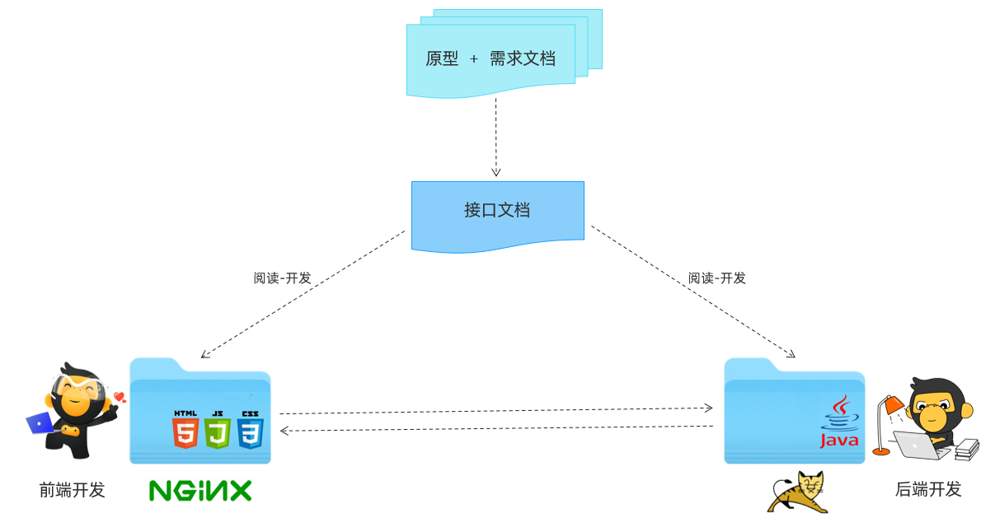

我们将原先的工程分为前端工程和后端工程这2个工程，然后前端工程交给专业的前端人员开发，后端工程交给专业的后端人员开发。

前端页面需要数据，可以通过发送异步请求，从后台工程获取。但是，我们前后台是分开来开发的，那么前端人员怎么知道后台返回数据的格式呢？后端人员开发，怎么知道前端人员需要的数据格式呢？

所以针对这个问题，我们前后台统一制定一套规范！我们前后台开发人员都需要遵循这套规范开发，这就是我们的 接口文档。接口文档有离线版和在线版本，接口文档示可以查询今天提供 资料/接口文档 里面的资料。

那么接口文档的内容怎么来的呢？是我们后台开发者根据产品经理提供的产品原型和需求文档所撰写出来的，产品原型示例可以参考今天提供资料/页面原型 里面的资料。

那么基于前后台分离开发的模式下，我们后台开发者开发一个功能的具体流程如何呢？如下图所示：


1. 需求分析：首先我们需要阅读需求文档，分析需求，理解需求。

2. 接口定义：查询接口文档中关于需求的接口的定义，包括地址，参数，响应数据类型等等

3. 前后台并行开发：各自按照接口文档进行开发，实现需求

4. 测试：前后台开发完了，各自按照接口文档进行测试

5. 前后段联调测试：前段工程请求后端工程，测试功能

## 3.导入基础工程

将资料中提供的基础工程，解压到磁盘目录中。

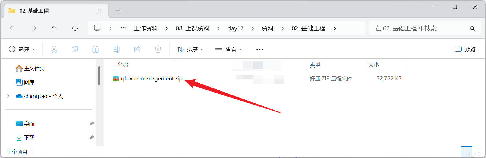

然后使用Cursor将其打开，并将项目启动起来。

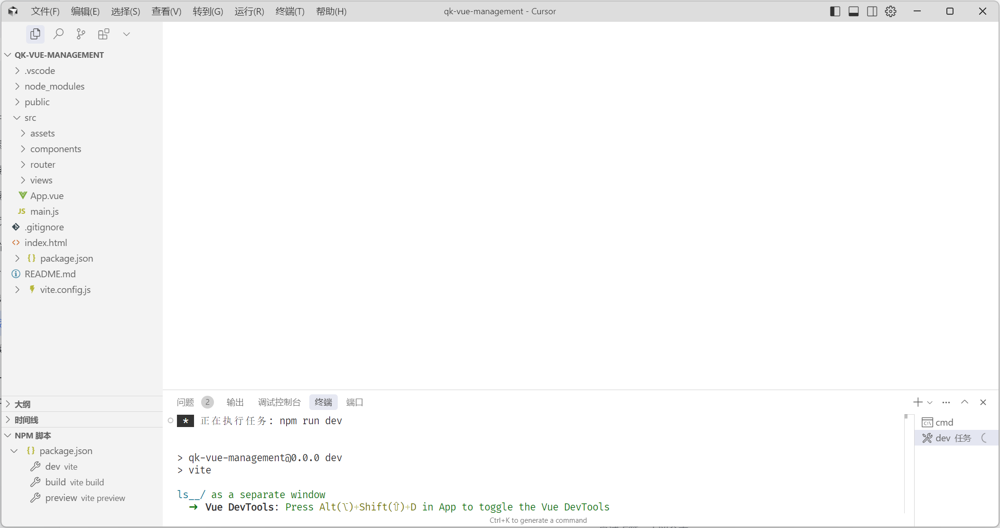

打开浏览器访问：

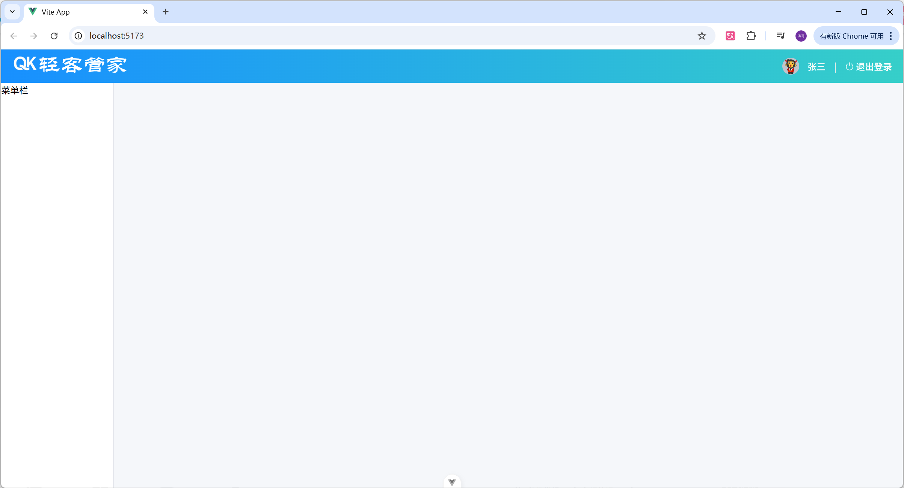

> 在导入进来的基础工程中，仅仅是创建了一个空项目，并安装了ElementPlus、Axios的依赖，以及最为基本的页面结构。
>

# 二、整体布局

## 1.页面布局制作

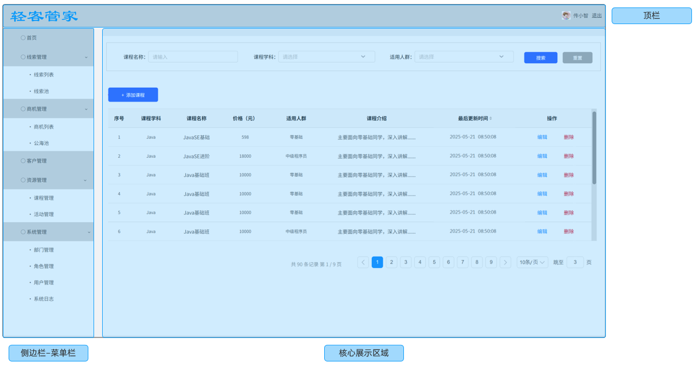

通过页面原型，我们可以看到，轻客管家系统的页面结构分为如图三个部分，分别是：

- 顶栏：展示项目的名字，当前登录用户，退出按钮。

- 侧边栏：展示系统的菜单。

- 核心展示区域：展示系统的核心数据内容。

那接下来呢，我们就可以直接将页面原型截图喂给AI，让AI帮我们完成页面的整体布局实现：

> 提示词：
>
> 请根据提供的页面原型的截图，基于Vue3 \+ ElementPlus帮我制作 “轻客管家” 项目的页面，首先先完成页面的基本布局 。 
> 具体要求如下:
> 1\. 页面的顶部，要展示系统的标题，这部分已经实现，无需改动。
> 2\. 帮我制作左侧的侧边栏，展示出这个管理系统的菜单，具体的菜单结构为：
>    1\. 首页
>    2\. 线索管理
>       2\.1 线索列表
>       2\.2 线索池
>    3\. 商机管理
>       3\.1 商机列表
>       3\.2 公海池
>    4\. 客户管理
>    5\. 资源管理
>       5\.1 课程管理
>       5\.2 活动管理
>    6\. 系统管理
>       6\.1 部门管理
>       6\.2 角色管理
>       6\.3 用户管理
>       6\.4 系统日志
>
> 3\. 右侧为核心展示区域，点击左侧菜单，在右侧要展示出对应的页面，比如点击 "首页"，右侧核心展示区域就要展示首页的页面 。
> 4\. 每一个菜单，对应的页面，在views目录下，已经准备好了空页面 。

最终AI生成，并调整后的代码如下：

1.在 `src/views/layout/Layout.vue` 中增加如下代码: 

```vue
<template>
  <el-container class="layout-container">
    <!-- 头部 -->
    <el-header height="60px">
      <div class="header-left">
        <span class="system-title">轻客管家</span>
      </div>
      <div class="header-right">
        <el-avatar :size="30" src="https://java-ai.oss-cn-beijing.aliyuncs.com/2025/01/1d18e635-0d0a-4950-aef2-3fb97e23ac00.png" />
        <span class="username">张三</span> <span style="color: #fff;">|</span>
        <el-link type="primary" class="logout" :underline="false"><el-icon><SwitchButton /></el-icon> &nbsp;退出登录</el-link>
      </div>
    </el-header>
    
    <el-container>
      <!-- 侧边栏 -->
      <el-aside width="200px">
        <el-menu :default-active="$route.path" class="el-menu-vertical-demo" background-color="#fff" text-color="#333" active-text-color="#1890ff" router>
          <el-menu-item index="/">
            <el-icon><House /></el-icon>
            <span>首页</span>
          </el-menu-item>

          <el-sub-menu index="clue">
            <template #title>
              <el-icon><Document /></el-icon><span>线索管理</span>
            </template>
            <el-menu-item index="/clue/list">
              <el-icon><List /></el-icon><span>线索列表</span>
            </el-menu-item>
            <el-menu-item index="/clue/pool">
              <el-icon><Collection /></el-icon><span>线索池</span>
            </el-menu-item>
          </el-sub-menu>

          <el-sub-menu index="business">
            <template #title>
              <el-icon><Briefcase /></el-icon><span>商机管理</span>
            </template>
            <el-menu-item index="/business/list">
              <el-icon><List /></el-icon><span>商机列表</span>
            </el-menu-item>
            <el-menu-item index="/business/pool">
              <el-icon><Coin /></el-icon><span>公海池</span>
            </el-menu-item>
          </el-sub-menu>

          <el-menu-item index="/customer">
            <el-icon><User /></el-icon><span>客户管理</span>
          </el-menu-item>

          <el-sub-menu index="resource">
            <template #title>
              <el-icon><Box /></el-icon><span>资源管理</span>
            </template>
            <el-menu-item index="/resource/course">
              <el-icon><Notebook /></el-icon><span>课程管理</span>
            </el-menu-item>
            <el-menu-item index="/resource/activity">
              <el-icon><Calendar /></el-icon><span>活动管理</span>
            </el-menu-item>
          </el-sub-menu>

          <el-sub-menu index="system">
            <template #title>
              <el-icon><Setting /></el-icon><span>系统管理</span>
            </template>
            <el-menu-item index="/system/dept">
              <el-icon><OfficeBuilding /></el-icon><span>部门管理</span>
            </el-menu-item>
            <el-menu-item index="/system/role">
              <el-icon><Avatar /></el-icon><span>角色管理</span>
            </el-menu-item>
            <el-menu-item index="/system/user">
              <el-icon><UserFilled /></el-icon><span>用户管理</span>
            </el-menu-item>
            <el-menu-item index="/system/log">
              <el-icon><Memo /></el-icon><span>系统日志</span>
            </el-menu-item>
          </el-sub-menu>

        </el-menu>
      </el-aside>

      <!-- 主要内容区 -->
      <el-main>
        <router-view />
      </el-main>
    </el-container>
  </el-container>
</template>

<script setup>

</script>

<style scoped>
.layout-container {
  height: 100vh;
}

.el-header {
  background: linear-gradient(90deg, #1890ff 0%, #36cfc9 100%);
  border-bottom: 1px solid #dcdfe6;
  display: flex;
  justify-content: space-between;
  align-items: center;
  padding: 0 20px;
}

.system-title {
  font-family: 华文隶书;
  font-size: 40px;
  margin: 0;
  color: #fff;  /* 由于背景色变深，文字改为白色 */
}

.username {
  font-size: 16px;
  color: #fff;  /* 用户名也改为白色 */
}

.logout {
  font-size: 16px;
  color: #fff !important;  /* 退出登录链接也改为白色 */
}

.header-right {
  display: flex;
  align-items: center;
  gap: 15px;
}

.username {
  font-size: 16px;
}

.logout {
  font-size: 16px;
}

.el-aside {
  background-color: #fff;
  border-right: 1px solid #dcdfe6;
}

.el-menu {
  border-right: none;
}

.el-main {
  background-color: #f5f7fa;
  padding: 20px;
}
</style>
```

2.在 `router/index.js` 中增加如下代码: 

```javascript
import { createRouter, createWebHistory } from 'vue-router'

const routes = [
  {
    path: '/',
    name: 'layout',
    component: () => import('../views/layout/Layout.vue'),
    children: [
      { path: '', name: 'home', component: () => import('../views/home/index.vue') },
      { path: 'clue/list', name: 'clue-list', component: () => import('../views/clue/list.vue') },
      { path: 'clue/pool', name: 'clue-pool', component: () => import('../views/clue/pool.vue') },
      { path: 'business/list', name: 'business-list', component: () => import('../views/business/list.vue') },
      { path: 'business/pool', name: 'business-pool', component: () => import('../views/business/pool.vue') },
      { path: 'customer', name: 'customer', component: () => import('../views/customer/index.vue') },
      { path: 'resource/course', name: 'resource-course', component: () => import('../views/resource/course.vue') },
      { path: 'resource/activity', name: 'resource-activity', component: () => import('../views/resource/activity.vue') },
      { path: 'system/dept', name: 'system-dept', component: () => import('../views/system/dept.vue') },
      { path: 'system/role', name: 'system-role', component: () => import('../views/system/role.vue') },
      { path: 'system/user', name: 'system-user', component: () => import('../views/system/user.vue') },
      { path: 'system/log', name: 'system-log', component: () => import('../views/system/log.vue') },
    ]
  }
]

const router = createRouter({
  history: createWebHistory(import.meta.env.BASE_URL),
  routes,
})

export default router

```

3.调整 `App.vue` 中的代码:

```vue
<script setup>

</script>

<template>
  <RouterView></RouterView>
</template>

<style scoped>

</style>
```

最终，浏览器打开后的效果如下：


## 2.页面布局剖析

那在上述AI生成的代码中，用到了ElementPlus中的菜单组件 el\-menu，还用到了Vue\-Router路由组件。

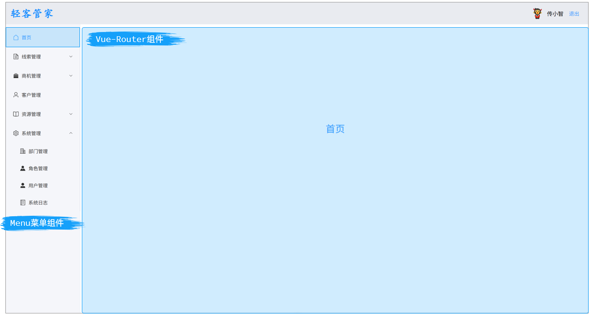

### 2.1.Menu菜单组件

官方文档：https://cn.element-plus.org/zh-CN/component/menu.html

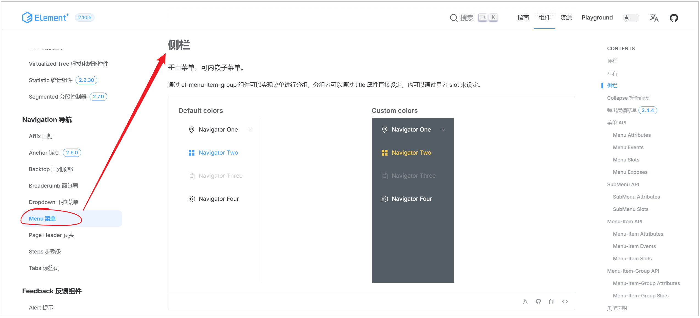

我们要制作各式各样的菜单，就可以参照Menu菜单组件，复制过来，改造成我们需要的样子就可以了。

### 2.2.Vue\-Router路由组件

**介绍**


Vue Router：Vue的官方路由。 为Vue提供富有表现力、可配置的、方便的路由。

Vue中的路由，主要定义的是路径与组件之间的对应关系。

比如，我们打开一个网站，点击左侧菜单，地址栏的地址发生变化。 地址栏地址一旦发生变化，在主区域显示对应的页面组件。 

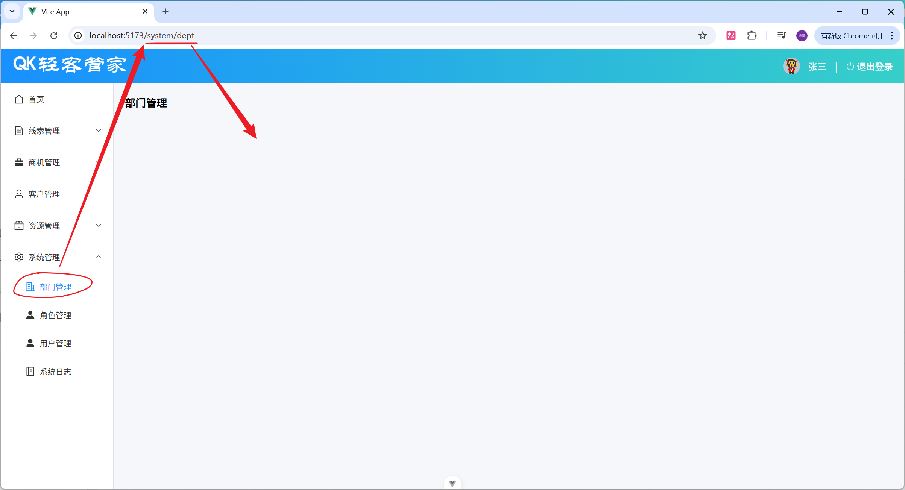

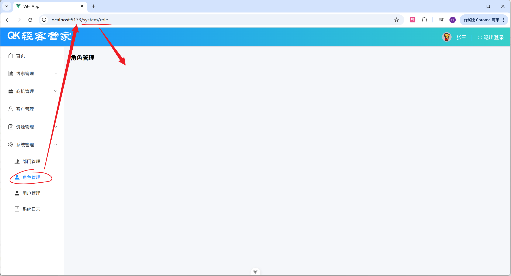

VueRouter主要由以下三个部分组成，如下所示：

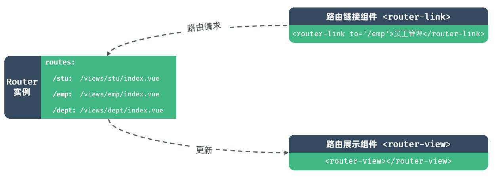

VueRouter：路由器类，根据路由请求在路由视图中动态渲染选中的组件

<router\-link\>：请求链接组件，浏览器会解析成\<a\>

\<router\-view\>：动态视图组件，用来渲染展示与路由路径对应的组件

**项目路由配置\-解析**

1.点击 “部门管理” 菜单时，会访问路径 `/system/dept`，此时会到路由表 `router/index.js` 中查找要访问的页面组件。

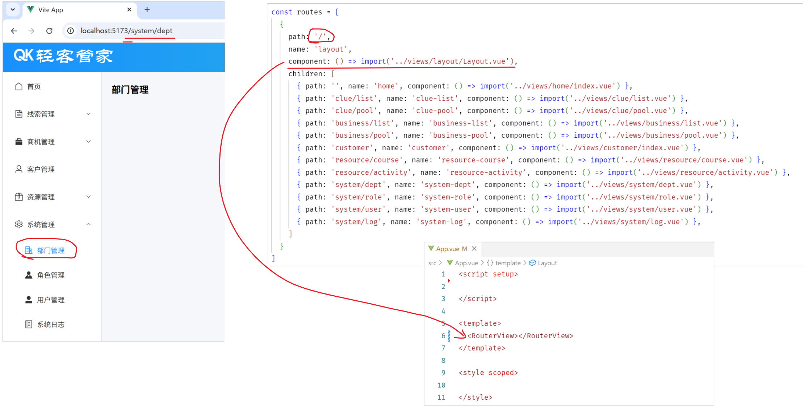

首先，通过根路径 / 匹配到，要访问的组件为 `views/layout/Layout.vue`，匹配到了要访问的页面之后，就会在 `App.vue` 的 `<RouterView>` 标签所在位置，展示该组件`Layout.vue`，也就是展示网页的基本布局。

最终匹配到的形式如下，展示出来的仅仅是页面的基本布局。

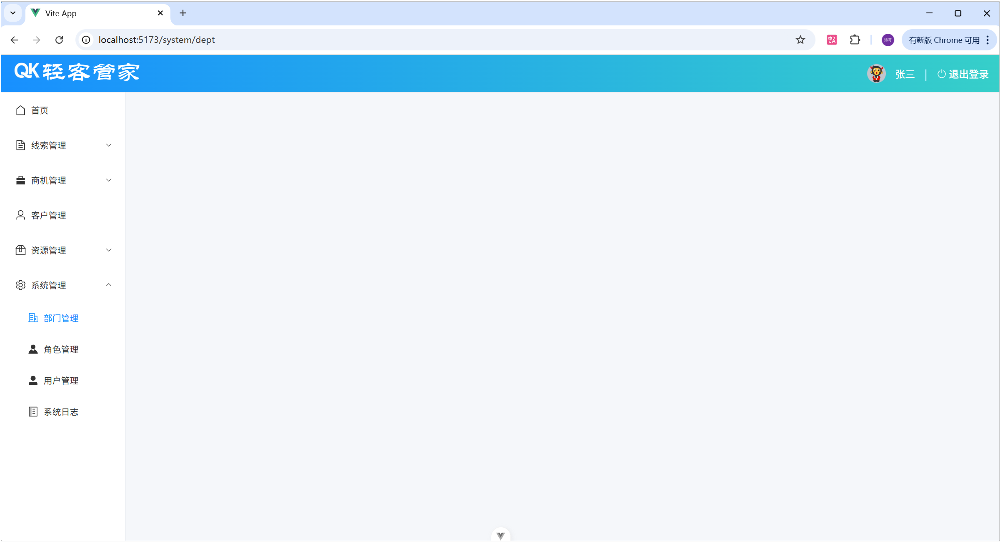

2.紧接着，还会匹配下一级路径，会匹配children中的子路径，找到 `system/dept` 路径对应的组件，并将该组件展示在第一级路径匹配到的组件中（也就是 `Layout.vue`中的 `<RouterView>` 位置）。

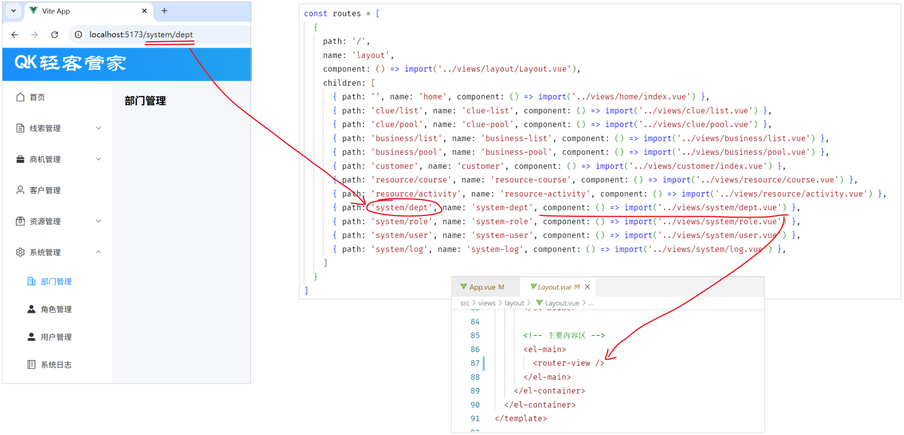

最终匹配到的形式如下，会在页面的基本布局Layout\.vue的\<el\-main\>也就是主展示区域，展示出对应的组件，如下图所示：

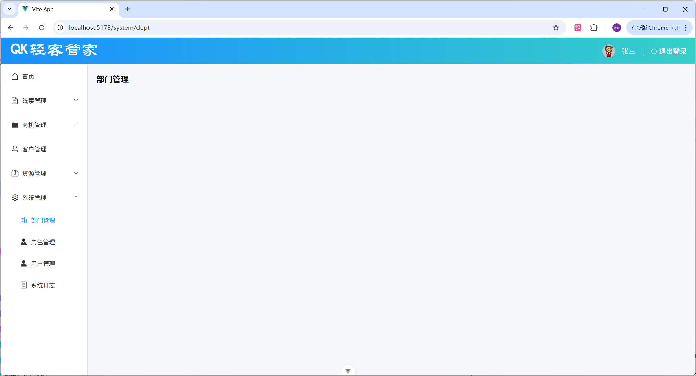

# 三、部门管理\-列表查询

## 1.页面基本布局

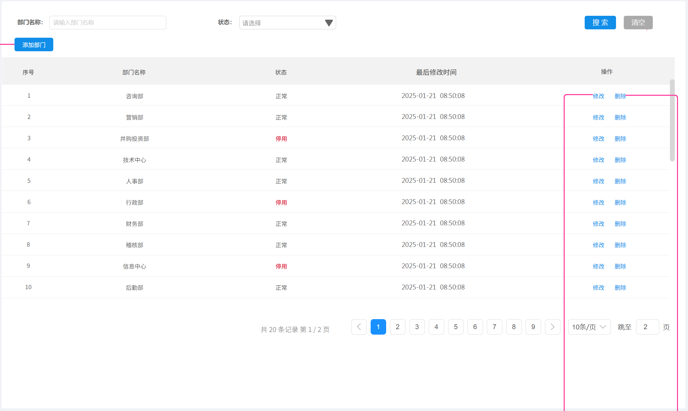

通过页面原型，我们可以看到关于部门列表的布局，包括三个部分：

- 顶部的搜索栏。

- 数据展示的表格。

- 分页条。

具体的页面布局的代码如下：

```vue

<script setup>
import { ref } from 'vue'

// 查询参数
const queryParams = ref({
  name: '',
  status: '',
  page: 1,
  pageSize: 10
})

// 表格数据
const deptList = ref([
    {
        "id": 1,
        "name": "市场一部",
        "status": 1,
        "createTime": "2025-03-23T16:48:58",
        "updateTime": "2025-04-24T20:36:04"
    },
    {
        "id": 2,
        "name": "市场二部",
        "status": 1,
        "createTime": "2025-03-23T16:16:26",
        "updateTime": "2025-04-20T14:18:05"
    }
])
const total = ref(0)

// 搜索
const search = () => {
  
}

// 清空
const clear = () => {
  
}

// 分页大小改变
const handleSizeChange = (val) => {
  
}

// 页码改变
const handleCurrentChange = (val) => {
  
}
</script>

<template>
  <div class="department">
    <!-- 搜索区域 -->
    <el-form :inline="true" :model="queryParams" ref="queryForm" class="search-form">
      <el-form-item label="部门名称">
        <el-input v-model="queryParams.name" placeholder="请输入部门名称"/>
      </el-form-item>
      <el-form-item label="状态">
        <el-select v-model="queryParams.status" placeholder="请选择" clearable style="width: 100%">
          <el-option label="正常" :value="1" />
          <el-option label="停用" :value="0" />
        </el-select>
      </el-form-item>
      <el-form-item class="search-buttons">
        <el-button type="primary" @click="search"><el-icon><Search /></el-icon>搜索</el-button>
        <el-button @click="clear"><el-icon><Refresh /></el-icon>清空</el-button>
      </el-form-item>
    </el-form>

    <!-- 操作按钮区域 -->
    <div class="operation-area">
      <el-button type="primary" @click="handleAdd"><el-icon><Plus /></el-icon>添加部门</el-button>
    </div>

    <!-- 表格区域 -->
    <el-table  :data="deptList"  style="width: 100%" border>
      <el-table-column type="index" label="序号" width="100" align="center" />
      <el-table-column prop="name" label="部门名称" width="350" align="center" />
      <el-table-column prop="status" label="状态" width="350" align="center">
        <template #default="scope">
            {{ scope.row.status === 1 ? '正常' : '停用' }}
        </template>
      </el-table-column>
      <el-table-column prop="updateTime" label="最后修改时间" width="350" align="center" />
      <el-table-column label="操作" align="center">
        <template #default="scope">
          <el-button type="primary" link @click="handleEdit(scope.row.id)">
            <el-icon><Edit /></el-icon>修改
          </el-button>
          <el-button type="danger" link @click="handleDelete(scope.row.id)">
            <el-icon><Delete /></el-icon>删除
          </el-button>
        </template>
      </el-table-column>
    </el-table>

    <!-- 分页区域 -->
    <div class="pagination">
      <el-pagination
        v-model:current-page="queryParams.page"
        v-model:page-size="queryParams.pageSize"
        :page-sizes="[10, 20, 30, 40, 50]"
        layout="total, sizes, prev, pager, next, jumper"
        :total="total"
        @size-change="handleSizeChange"
        @current-change="handleCurrentChange"
      />
    </div>
  </div>
</template>

<style scoped>
.department {
  padding: 20px;
  background-color: #fff;
  min-height: 100%;
  border-radius: 8px; /* 添加圆角 */
}

.operation-area {
  margin: 20px 0;
}

.search-form {
  display: flex;
  align-items: center;
}

.search-form :deep(.el-form-item) {
  margin-right: 20px;
  min-width: 280px;
}

.search-buttons {
  margin-left: auto !important;
  min-width: auto !important;
}

.pagination {
  margin-top: 20px;
  display: flex;
  justify-content: flex-end;
}

.divider {
  height: 0.5px;
  background-color: #dcdfe6;
  margin: 10px 0;
  width: 100%;
}

:deep(.dept-dialog .el-dialog__body) {
  padding-top: 30px;
}

.dept-form {
  width: 80%;
  margin: 0 auto;
}

:deep(.el-button .el-icon) {
  margin-right: 4px;
}
</style>
```

> 说明：
>
> 上述代码都是参照ElementPlus中提供的Form表单组件、Table表格组件、Pagination分页条组件，拷贝过来之后，调整改造成我们需要的样子。【页面的基本布局我们可以直接拷贝过来】
>

最终，浏览器访问后页面效果如下：

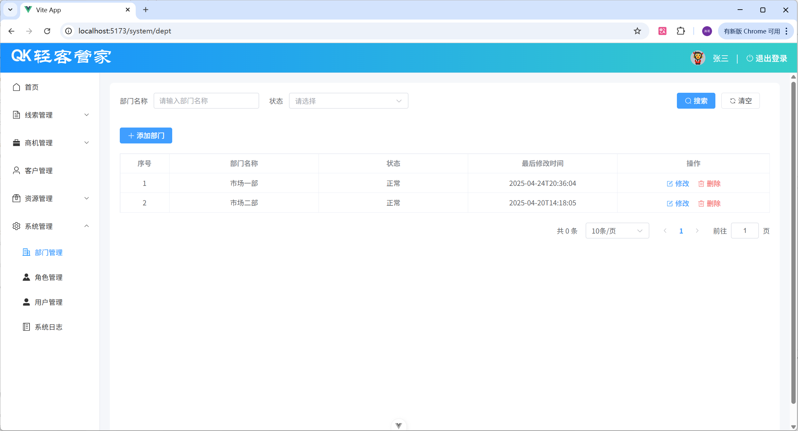

## 2.页面交互

上述的数据，我们是在页面中写死了一组静态数据（来源于接口文档），那接下来呢，我们要将数据变成动态的，要动态从服务器端加载数据并返回，渲染展示在页面上。

页面交互的具体规则如下： 

1.页面加载完毕后，需要执行查询，查询部门列表数据。

2.点击搜索栏的搜索按钮后，需要执行查询，查询部门列表数据。

3.点击搜索栏的清空按钮后，需要清空搜索条件，并执行查询，查询部门列表数据。

4.在页码变化的时候，需要执行查询，查询部门列表数据。

5.在每页展示记录数发生变化的时候，需要执行查询，查询部门列表数据。

那么此时呢，我们就需要通过axios发送异步请求，请求服务器端加载数据。代码如下：

```vue
<script setup>
import { ref, onMounted } from 'vue'
import axios from 'axios'

// 查询参数
const queryParams = ref({
  name: '',
  status: '',
  page: 1,
  pageSize: 10
})

// 表格数据
const deptList = ref([])
const total = ref(0)

onMounted(() => {
  search()
})

// 查询按钮
const search = async () => {
  const result = await axios.get('/api/depts', { params: queryParams.value });
  if(result.data.code == 1){
    deptList.value = result.data.data.rows
    total.value = result.data.data.total
  }
}

// 重置查询
const clear = () => {
  queryParams.value = {
    name: '',
    status: '',
    page: 1,
    pageSize: 10
  }
  search()
}

// 分页大小改变
const handleSizeChange = (val) => {
  search()
}

// 页码改变
const handleCurrentChange = (val) => {
  search()
}
</script>

<template>
  <div class="department">
    <!-- 搜索区域 -->
    <el-form :inline="true" :model="queryParams" ref="queryForm" class="search-form">
      <el-form-item label="部门名称">
        <el-input v-model="queryParams.name" placeholder="请输入部门名称"/>
      </el-form-item>
      <el-form-item label="状态">
        <el-select v-model="queryParams.status" placeholder="请选择" clearable style="width: 100%">
          <el-option label="正常" :value="1" />
          <el-option label="停用" :value="0" />
        </el-select>
      </el-form-item>
      <el-form-item class="search-buttons">
        <el-button type="primary" @click="search"><el-icon><Search /></el-icon>搜索</el-button>
        <el-button @click="clear"><el-icon><Refresh /></el-icon>清空</el-button>
      </el-form-item>
    </el-form>

    <!-- 操作按钮区域 -->
    <div class="operation-area">
      <el-button type="primary" @click="handleAdd"><el-icon><Plus /></el-icon>添加部门</el-button>
    </div>

    <!-- 表格区域 -->
    <el-table  :data="deptList"  style="width: 100%" border>
      <el-table-column type="index" label="序号" width="100" align="center" />
      <el-table-column prop="name" label="部门名称" width="300" align="center" />
      <el-table-column prop="status" label="状态" width="300" align="center">
        <template #default="scope">
            {{ scope.row.status === 1 ? '正常' : '停用' }}
        </template>
      </el-table-column>
      <el-table-column prop="updateTime" label="最后修改时间" width="300" align="center" />
      <el-table-column label="操作" align="center">
        <template #default="scope">
          <el-button type="primary" link @click="handleEdit(scope.row.id)">
            <el-icon><Edit /></el-icon>修改
          </el-button>
          <el-button type="danger" link @click="handleDelete(scope.row.id)">
            <el-icon><Delete /></el-icon>删除
          </el-button>
        </template>
      </el-table-column>
    </el-table>

    <!-- 分页区域 -->
    <div class="pagination">
      <el-pagination
        v-model:current-page="queryParams.page"
        v-model:page-size="queryParams.pageSize"
        :page-sizes="[10, 20, 30, 40, 50]"
        layout="total, sizes, prev, pager, next, jumper"
        :total="total"
        @size-change="handleSizeChange"
        @current-change="handleCurrentChange"
      />
    </div>
  </div>
</template>


<style scoped>
.department {
  padding: 20px;
  background-color: #fff;
  min-height: 100%;
  border-radius: 8px; /* 添加圆角 */
}

.operation-area {
  margin: 20px 0;
}

.search-form {
  display: flex;
  align-items: center;
}

.search-form :deep(.el-form-item) {
  margin-right: 20px;
  min-width: 280px;
}

.search-buttons {
  margin-left: auto !important;
  min-width: auto !important;
}

.pagination {
  margin-top: 20px;
  display: flex;
  justify-content: flex-end;
}

.divider {
  height: 0.5px;
  background-color: #dcdfe6;
  margin: 10px 0;
  width: 100%;
}

:deep(.dept-dialog .el-dialog__body) {
  padding-top: 30px;
}

.dept-form {
  width: 80%;
  margin: 0 auto;
}

:deep(.el-button .el-icon) {
  margin-right: 4px;
}
</style>
```

代码编写完毕后，我们就可以把服务端之前编写的服务端项目启动起来，然后打开浏览器测试，部门列表查询功能：

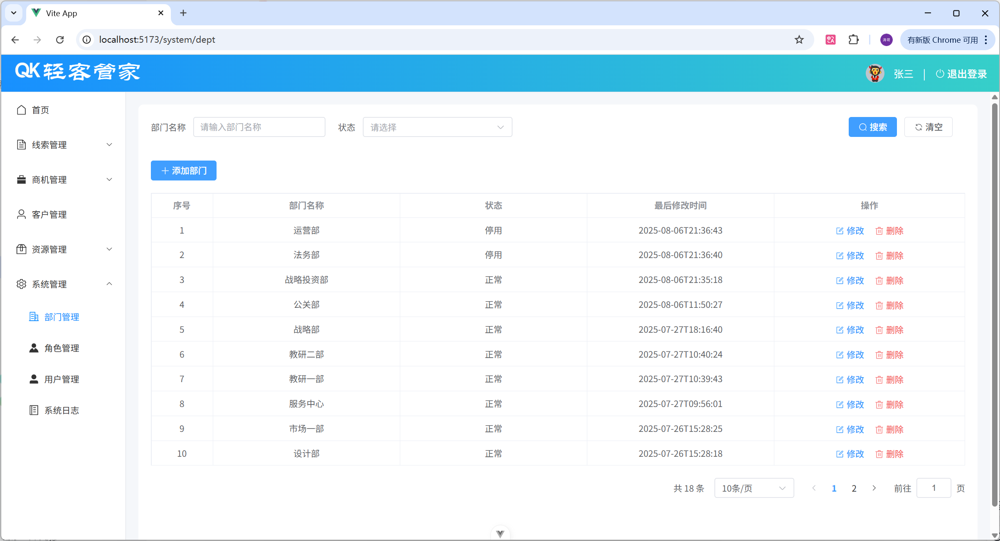

我们可以看到数据可以正常的查询出来，并展示在页面中。

> 注意：
>
> 当前我们还并未开发登录功能，因此，没并不会携带jwt令牌访问服务器端，所以在测试的时候，我们需要把服务端定义的令牌校验的过滤器 或 令牌校验的拦截器注释掉，然后再启动服务端项目，进行测试。
>

## 3.程序优化

### 3.1.问题分析

好的，那么到底呢，我们第一个功能，也就是列表查询的功能呢，就已经搞定了。但是我们要回过头看一下，我们刚才编写的代码：

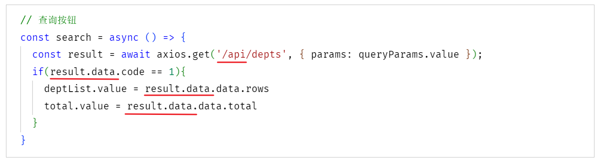

我们可以看到，我们所编写的代码功能虽然实现了，但是与服务端交互的代码存在如下问题：

项目中所有与服务端所有的路径，我们都需要加上一个统一的前缀 `/api` ，如果后续想更换，就需要一个一个调整，很繁琐。【不便维护】

在获取服务端响应的结果时，每一次，我们都必须得使用 `result.data` 来获取到服务端响应的结果，稍不留神，可以就忘记写 `.data` 此时解析就会报错。【数据解析繁琐】

### 3.2.程序优化

为了解决上述问题，我们在前端项目开发时，通常会定义一个请求处理的工具类  \- `src/utils/request.js` 。 在这个工具类中，对axios进行了封装。 

1.增加请求处理工具类 `request.js`，存放位置为`src/utils/request.js`，具体代码如下：

```javascript
import axios from 'axios'

//创建axios实例对象
const request = axios.create({
  baseURL: '/api',
  timeout: 600000
})

//axios的响应 response 拦截器
request.interceptors.response.use(
  (response) => { //成功回调
    return response.data
  },
  (error) => { //失败回调
    return Promise.reject(error)
  }
)

export default request
```

2.而与服务端进行异步交互的逻辑，通常会按模块，封装在一个单独的API中，如：`src/api/dept.js`

```javascript
import request from "@/utils/request"

//列表查询
export const queryPageApi = (params) => request.get('/depts', {params: params})
```

3.修改 `src/views/system/dept.vue` 中的代码

现在就不需要每次直接调用axios发送异步请求了，只需要将我们定义的对应模块的API导入进来，就可以直接使用了。

```vue
<script setup>
import { ref, onMounted } from 'vue'
import {queryPageApi} from '@/api/dept'

// 查询参数
const queryParams = ref({
  name: '',
  status: '',
  page: 1,
  pageSize: 10
})

// 表格数据
const deptList = ref([])
const total = ref(0)

onMounted(() => {
  search()
})

// 查询按钮
const search = async () => {
  const result = await queryPageApi(queryParams.value);
  if(result.code == 1){
    deptList.value = result.data.rows
    total.value = result.data.total
  }
}

// 重置查询
const clear = () => {
  queryParams.value = {
    name: '',
    status: '',
    page: 1,
    pageSize: 10
  }
  search()
}

// 分页大小改变
const handleSizeChange = (val) => {
  search()
}

// 页码改变
const handleCurrentChange = (val) => {
  search()
}
</script>
```

做完上面这三步之后，我们打开浏览器再此进行测试，发现数据依然可以正常展示出来。

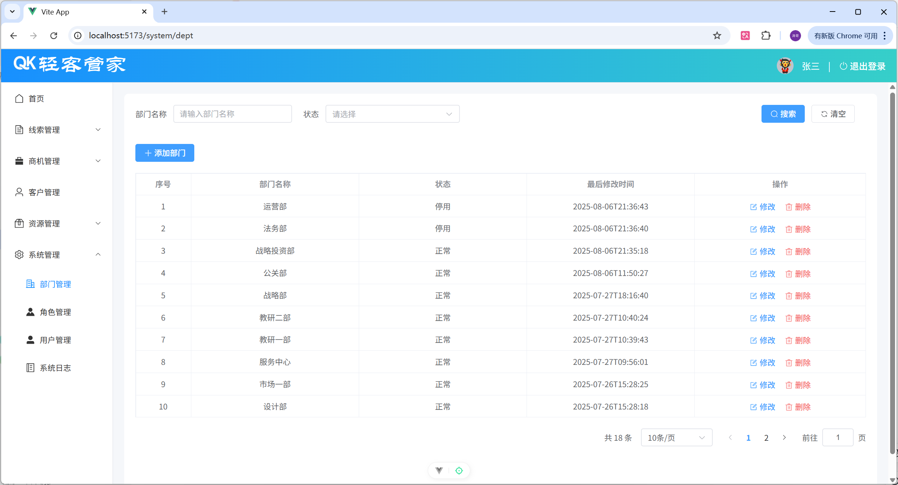

# 四、部门管理\-新增部门

## 1.页面布局

接下来，我们再来完成新增部门的功能实现。

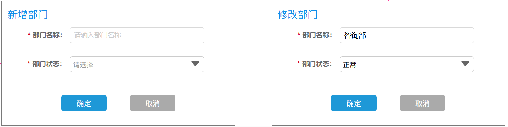

通过页面原型，我们可以看到 新增部门 和 修改部门的表单基本是一模一样，只有表单展示的标题不一样。

因此呢，我们在设计页面的时候，新增部门和编辑部门，可以同用一个Dialog对话框。而这个对话框中，主要包括两个ElementPlus中的组件，分别为：Dialog对话框组件，Form表单组件。

页面的基本布局，在 `dept.vue` 中增加如下代码：

```vue
<script setup>
import { ref, onMounted } from 'vue'
import {queryPageApi} from '@/api/dept'

// 查询参数
const queryParams = ref({
  name: '',
  status: '',
  page: 1,
  pageSize: 10
})

// 表格数据
const deptList = ref([])
const total = ref(0)

onMounted(() => {
  search()
})

// 查询按钮
const search = async () => {
  const result = await queryPageApi(queryParams.value);
  if(result.code == 1){
    deptList.value = result.data.rows
    total.value = result.data.total
  }
}

// 重置查询
const clear = () => {
  queryParams.value = {
    name: '',
    status: '',
    page: 1,
    pageSize: 10
  }
  search()
}

// 分页大小改变
const handleSizeChange = (val) => {
  search()
}

// 页码改变
const handleCurrentChange = (val) => {
  search()
}

// 新增/修改部门对话框
const dialog = ref({
  title: '',
  visible: false
})

const deptForm = ref({
  name: '',
  status: ''
})

// 添加部门按钮
const handleAdd = () => {
  dialog.value.title = '添加部门'
  dialog.value.visible = true
}
</script>

<template>
  <div class="department">
    <!-- 搜索区域 -->
    <el-form :inline="true" :model="queryParams" ref="queryForm" class="search-form">
      <el-form-item label="部门名称">
        <el-input v-model="queryParams.name" placeholder="请输入部门名称"/>
      </el-form-item>
      <el-form-item label="状态">
        <el-select v-model="queryParams.status" placeholder="请选择" clearable style="width: 100%">
          <el-option label="正常" :value="1" />
          <el-option label="停用" :value="0" />
        </el-select>
      </el-form-item>
      <el-form-item class="search-buttons">
        <el-button type="primary" @click="search"><el-icon><Search /></el-icon>搜索</el-button>
        <el-button @click="clear"><el-icon><Refresh /></el-icon>清空</el-button>
      </el-form-item>
    </el-form>

    <!-- 操作按钮区域 -->
    <div class="operation-area">
      <el-button type="primary" @click="handleAdd"><el-icon><Plus /></el-icon>添加部门</el-button>
    </div>

    <!-- 表格区域 -->
    <el-table  :data="deptList"  style="width: 100%" border>
      <el-table-column type="index" label="序号" width="100" align="center" />
      <el-table-column prop="name" label="部门名称" width="300" align="center" />
      <el-table-column prop="status" label="状态" width="300" align="center">
        <template #default="scope">
            {{ scope.row.status === 1 ? '正常' : '停用' }}
        </template>
      </el-table-column>
      <el-table-column prop="updateTime" label="最后修改时间" width="300" align="center" />
      <el-table-column label="操作" align="center">
        <template #default="scope">
          <el-button type="primary" link >
            <el-icon><Edit /></el-icon>修改
          </el-button>
          <el-button type="danger" link >
            <el-icon><Delete /></el-icon>删除
          </el-button>
        </template>
      </el-table-column>
    </el-table>

    <!-- 分页区域 -->
    <div class="pagination">
      <el-pagination
        v-model:current-page="queryParams.page"
        v-model:page-size="queryParams.pageSize"
        :page-sizes="[10, 20, 30, 40, 50]"
        layout="total, sizes, prev, pager, next, jumper"
        :total="total"
        @size-change="handleSizeChange"
        @current-change="handleCurrentChange"
      />
    </div>

    <!-- 添加/修改部门对话框 -->
    <el-dialog :title="dialog.title" v-model="dialog.visible" width="500px" class="dept-dialog">
      <el-form :model="deptForm" label-width="80px" class="dept-form">
        <el-form-item label="部门名称" prop="name">
          <el-input v-model="deptForm.name" placeholder="请输入部门名称" />
        </el-form-item>
        <el-form-item label="状态" prop="status">
          <el-select v-model="deptForm.status" placeholder="请选择" style="width: 100%">
            <el-option label="正常" :value="1" />
            <el-option label="停用" :value="0" />
          </el-select>
        </el-form-item>
      </el-form>
      <template #footer>
        <el-button @click="dialog.visible = false"><el-icon><Close /></el-icon>取 消</el-button>
        <el-button type="primary" @click="save"><el-icon><Check /></el-icon>确 定</el-button>
      </template>
    </el-dialog>
    
  </div>
</template>

<style scoped>
.department {
  padding: 20px;
  background-color: #fff;
  min-height: 100%;
  border-radius: 8px; /* 添加圆角 */
}

.operation-area {
  margin: 20px 0;
}

.search-form {
  display: flex;
  align-items: center;
}

.search-form :deep(.el-form-item) {
  margin-right: 20px;
  min-width: 280px;
}

.search-buttons {
  margin-left: auto !important;
  min-width: auto !important;
}

.pagination {
  margin-top: 20px;
  display: flex;
  justify-content: flex-end;
}

.divider {
  height: 0.5px;
  background-color: #dcdfe6;
  margin: 10px 0;
  width: 100%;
}

:deep(.dept-dialog .el-dialog__body) {
  padding-top: 30px;
}

.dept-form {
  width: 80%;
  margin: 0 auto;
}

:deep(.el-button .el-icon) {
  margin-right: 4px;
}
</style>
```

## 2.页面交互

1.在 `src/api/dept.js` 中增加如下代码

```javascript
//添加部门
export const addDeptApi = (data) => request.post('/depts', data)
```

目前  `src/api/dept.js`  文件中完整代码如下:

```javascript
import request from "@/utils/request"

//列表查询
export const queryPageApi = (params) => request.get('/depts', {params: params})

//添加部门
export const addDeptApi = (data) => request.post('/depts', data)
```

2.在 `src/views/system/dept.vue` 中完成页面布局，并编写交互逻辑，完成数据绑定。 完整代码如下：

```javascript
<script setup>
import { ref, onMounted } from 'vue'
import {queryPageApi, addDeptApi} from '@/api/dept'
import { ElMessage } from 'element-plus'

// 查询参数
const queryParams = ref({
  name: '',
  status: '',
  page: 1,
  pageSize: 10
})

// 表格数据
const deptList = ref([])
const total = ref(0)

onMounted(() => {
  search()
})

// 查询按钮
const search = async () => {
  const result = await queryPageApi(queryParams.value);
  if(result.code == 1){
    deptList.value = result.data.rows
    total.value = result.data.total
  }
}

// 重置查询
const clear = () => {
  queryParams.value = {
    name: '',
    status: '',
    page: 1,
    pageSize: 10
  }
  search()
}

// 分页大小改变
const handleSizeChange = (val) => {
  search()
}

// 页码改变
const handleCurrentChange = (val) => {
  search()
}

// 新增/修改部门对话框
const dialog = ref({
  title: '',
  visible: false
})
const deptForm = ref({
  name: '',
  status: ''
})

// 添加部门按钮
const handleAdd = () => {
  dialog.value.title = '添加部门'
  dialog.value.visible = true
}

// 保存按钮
const save = async () => {
  const result = await addDeptApi(deptForm.value)
  if(result.code == 1){
    dialog.value.visible = false
    ElMessage.success('保存成功')
    search()
  }else{
    ElMessage.error(result.msg)
  }
}
</script>

<template>
  <div class="department">
    <!-- 搜索区域 -->
    <el-form :inline="true" :model="queryParams" ref="queryForm" class="search-form">
      <el-form-item label="部门名称">
        <el-input v-model="queryParams.name" placeholder="请输入部门名称"/>
      </el-form-item>
      <el-form-item label="状态">
        <el-select v-model="queryParams.status" placeholder="请选择" clearable style="width: 100%">
          <el-option label="正常" :value="1" />
          <el-option label="停用" :value="0" />
        </el-select>
      </el-form-item>
      <el-form-item class="search-buttons">
        <el-button type="primary" @click="search"><el-icon><Search /></el-icon>搜索</el-button>
        <el-button @click="clear"><el-icon><Refresh /></el-icon>清空</el-button>
      </el-form-item>
    </el-form>

    <!-- 操作按钮区域 -->
    <div class="operation-area">
      <el-button type="primary" @click="handleAdd"><el-icon><Plus /></el-icon>添加部门</el-button>
    </div>

    <!-- 表格区域 -->
    <el-table  :data="deptList"  style="width: 100%" border>
      <el-table-column type="index" label="序号" width="100" align="center" />
      <el-table-column prop="name" label="部门名称" width="300" align="center" />
      <el-table-column prop="status" label="状态" width="300" align="center">
        <template #default="scope">
            {{ scope.row.status === 1 ? '正常' : '停用' }}
        </template>
      </el-table-column>
      <el-table-column prop="updateTime" label="最后修改时间" width="300" align="center" />
      <el-table-column label="操作" align="center">
        <template #default="scope">
          <el-button type="primary" link >
            <el-icon><Edit /></el-icon>修改
          </el-button>
          <el-button type="danger" link >
            <el-icon><Delete /></el-icon>删除
          </el-button>
        </template>
      </el-table-column>
    </el-table>

    <!-- 分页区域 -->
    <div class="pagination">
      <el-pagination
        v-model:current-page="queryParams.page"
        v-model:page-size="queryParams.pageSize"
        :page-sizes="[10, 20, 30, 40, 50]"
        layout="total, sizes, prev, pager, next, jumper"
        :total="total"
        @size-change="handleSizeChange"
        @current-change="handleCurrentChange"
      />
    </div>

    <!-- 添加/修改部门对话框 -->
    <el-dialog :title="dialog.title" v-model="dialog.visible" width="500px" class="dept-dialog">
      <el-form :model="deptForm" label-width="80px" class="dept-form">
        <el-form-item label="部门名称" prop="name">
          <el-input v-model="deptForm.name" placeholder="请输入部门名称" />
        </el-form-item>
        <el-form-item label="状态" prop="status">
          <el-select v-model="deptForm.status" placeholder="请选择" style="width: 100%">
            <el-option label="正常" :value="1" />
            <el-option label="停用" :value="0" />
          </el-select>
        </el-form-item>
      </el-form>
      <template #footer>
        <el-button @click="dialog.visible = false"><el-icon><Close /></el-icon>取 消</el-button>
        <el-button type="primary" @click="save"><el-icon><Check /></el-icon>确 定</el-button>
      </template>
    </el-dialog>
    
  </div>
</template>


<style scoped>
.department {
  padding: 20px;
  background-color: #fff;
  min-height: 100%;
  border-radius: 8px; /* 添加圆角 */
}

.operation-area {
  margin: 20px 0;
}

.search-form {
  display: flex;
  align-items: center;
}

.search-form :deep(.el-form-item) {
  margin-right: 20px;
  min-width: 280px;
}

.search-buttons {
  margin-left: auto !important;
  min-width: auto !important;
}

.pagination {
  margin-top: 20px;
  display: flex;
  justify-content: flex-end;
}

.divider {
  height: 0.5px;
  background-color: #dcdfe6;
  margin: 10px 0;
  width: 100%;
}

:deep(.dept-dialog .el-dialog__body) {
  padding-top: 30px;
}

.dept-form {
  width: 80%;
  margin: 0 auto;
}

:deep(.el-button .el-icon) {
  margin-right: 4px;
}
</style>
```

## 3.表单校验

Form 组件允许你验证用户的输入是否符合规范，来帮助你找到和纠正错误。`Form` 组件提供了表单验证的功能，只需为 `rules` 属性传入约定的验证规则，并将 `form-Item` 的 `prop` 属性设置为需要验证的特殊键值即可。

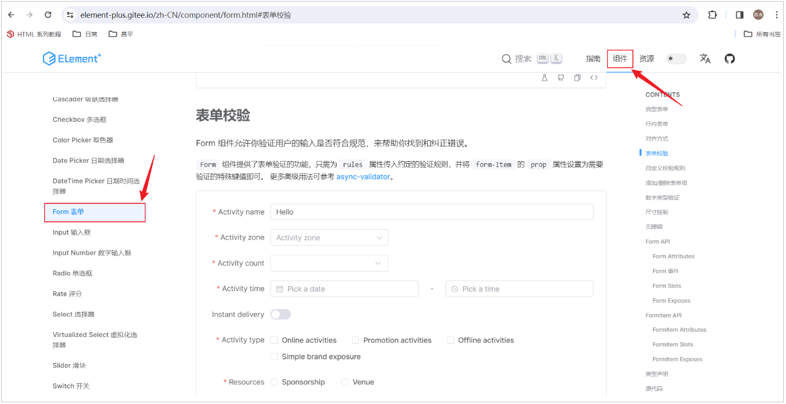

操作步骤：

- 通过ref属性注册元素的引用。

- 定义表单校验规则，通过rules属性与表单绑定，并通过prop属性绑定对应的表单项。

- 表单提交时，校验表单，校验通过，则允许提交表单。

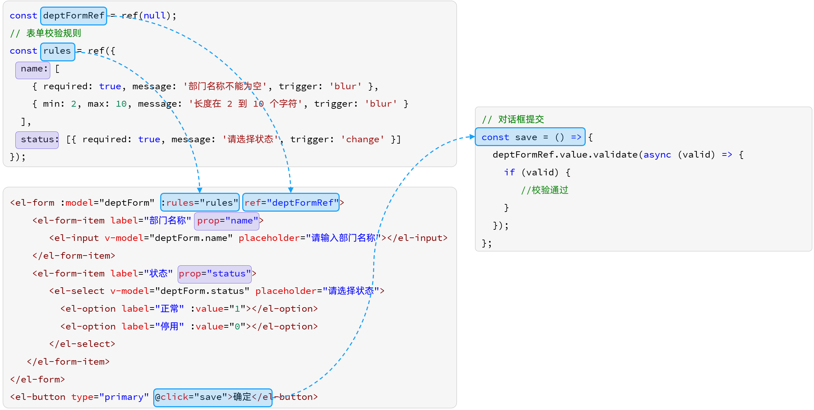

1.定义表单引入 `deptFormRef`，及校验规则 `rules`

```javascript
// 表单校验
const deptFormRef = ref()
const rules = ref({
  name: [
    { required: true, message: '请输入部门名称', trigger: 'blur' },
    { min: 2, max: 10, message: '长度在 2 到 10 个字符', trigger: 'blur' }
  ],
  status: [
    { required: true, message: '请选择部门状态', trigger: 'change' }
  ]
})
```

2.在表单中，配置对应的校验规则。 

```vue
<!-- 添加/修改部门对话框 -->
<el-dialog :title="dialog.title" v-model="dialog.visible" width="500px" class="dept-dialog">
  <el-form :model="deptForm" ref="deptFormRef" :rules="rules" label-width="80px" class="dept-form">
    <el-form-item label="部门名称" prop="name">
      <el-input v-model="deptForm.name" placeholder="请输入部门名称" />
    </el-form-item>
    <el-form-item label="状态" prop="status">
      <el-select v-model="deptForm.status" placeholder="请选择" style="width: 100%">
        <el-option label="正常" :value="1" />
        <el-option label="停用" :value="0" />
      </el-select>
    </el-form-item>
  </el-form>
  <template #footer>
    <el-button @click="dialog.visible = false"><el-icon><Close /></el-icon>取 消</el-button>
    <el-button type="primary" @click="save"><el-icon><Check /></el-icon>确 定</el-button>
  </template>
</el-dialog>
```

3.在保存部门数据时，要校验表单，调整 save 方法，逻辑如下：

```javascript
// 保存按钮
const save = async () => {
  deptFormRef.value.validate(async (valid) => { //valid 为true 表示校验通过
      if (!valid) return
      
      const result = await addDeptApi(deptForm.value)
      if(result.code == 1){
        dialog.value.visible = false
        ElMessage.success('添加成功')
        search()
      }else{
        ElMessage.error(result.msg)
      }
      
  })
  
}
```

# 五、部门管理\-修改部门

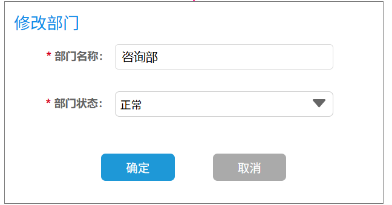

对于修改操作，通常会分为两步进行：

1. 查询回显

2. 保存修改

## 1.查询回显

1.在 `src/api/dept.js` 中定义根据id查询的请求

```JavaScript
//根据ID查询
export const queryInfoApi = (id) => request.get(`/depts/${id}`)
```

2.在 `src/views/system/dept.vue` 中添加根据ID查询回显的逻辑

为修改按钮绑定事件 `<template></template>`:

```vue
<el-table-column label="操作" align="center">
    <template #default="scope">
      <el-button type="primary" link @click="handleEdit(scope.row.id)"><el-icon><Edit /></el-icon>修改</el-button>
      <el-button type="danger" link ><el-icon><Delete /></el-icon>删除</el-button>
    </template>
</el-table-column>
```

在 `<script> </script>` 添加JS逻辑：

```javascript
// 修改部门按钮
const handleEdit = async (id) => {
  const result = await queryInfoApi(id)
  if(result.code == 1){
    deptForm.value = result.data
    dialog.value.title = '修改部门'
    dialog.value.visible = true
  }else {
    ElMessage.error(result.msg)
  }
}
```

到目前为止，完整的  `src/views/system/dept.vue` 代码如下：

```vue
<script setup>
import { ref, onMounted } from 'vue'
import {queryPageApi, addDeptApi, queryInfoApi} from '@/api/dept'
import { ElMessage } from 'element-plus'

// 查询参数
const queryParams = ref({
  name: '',
  status: '',
  page: 1,
  pageSize: 10
})

// 表格数据
const deptList = ref([])
const total = ref(0)

onMounted(() => {
  search()
})

// 查询按钮
const search = async () => {
  const result = await queryPageApi(queryParams.value);
  if(result.code == 1){
    deptList.value = result.data.rows
    total.value = result.data.total
  }
}

// 重置查询
const clear = () => {
  queryParams.value = {
    name: '',
    status: '',
    page: 1,
    pageSize: 10
  }
  search()
}

// 分页大小改变
const handleSizeChange = (val) => {
  search()
}

// 页码改变
const handleCurrentChange = (val) => {
  search()
}

// 表单校验
const deptFormRef = ref()
const rules = ref({
  name: [
    { required: true, message: '请输入部门名称', trigger: 'blur' },
    { min: 2, max: 10, message: '长度在 2 到 10 个字符', trigger: 'blur' }
  ],
  status: [
    { required: true, message: '请选择部门状态', trigger: 'change' }
  ]
})

// 新增/修改部门对话框
const dialog = ref({
  title: '',
  visible: false
})
const deptForm = ref({
  name: '',
  status: ''
})

// 添加部门按钮
const handleAdd = () => {
  dialog.value.title = '添加部门'
  dialog.value.visible = true
}

// 保存按钮
const save = async () => {
  deptFormRef.value.validate(async (valid) => {
      if (!valid) return
      // 添加
      const result = await addDeptApi(deptForm.value)
      if(result.code == 1){
        dialog.value.visible = false
        ElMessage.success('添加成功')
        search()
      }else{
        ElMessage.error(result.msg)
      }
  })
}

// 修改部门按钮
const handleEdit = async (id) => {
  const result = await queryInfoApi(id)
  if(result.code == 1){
    deptForm.value = result.data
    dialog.value.title = '修改部门'
    dialog.value.visible = true
  }else {
    ElMessage.error(result.msg)
  }
}
</script>

<template>
  <div class="department">
    <!-- 搜索区域 -->
    <el-form :inline="true" :model="queryParams" ref="queryForm" class="search-form">
      <el-form-item label="部门名称">
        <el-input v-model="queryParams.name" placeholder="请输入部门名称"/>
      </el-form-item>
      <el-form-item label="状态">
        <el-select v-model="queryParams.status" placeholder="请选择" clearable style="width: 100%">
          <el-option label="正常" :value="1" />
          <el-option label="停用" :value="0" />
        </el-select>
      </el-form-item>
      <el-form-item class="search-buttons">
        <el-button type="primary" @click="search"><el-icon><Search /></el-icon>搜索</el-button>
        <el-button @click="clear"><el-icon><Refresh /></el-icon>清空</el-button>
      </el-form-item>
    </el-form>

    <!-- 操作按钮区域 -->
    <div class="operation-area">
      <el-button type="primary" @click="handleAdd"><el-icon><Plus /></el-icon>添加部门</el-button>
    </div>

    <!-- 表格区域 -->
    <el-table  :data="deptList"  style="width: 100%" border>
      <el-table-column type="index" label="序号" width="100" align="center" />
      <el-table-column prop="name" label="部门名称" width="300" align="center" />
      <el-table-column prop="status" label="状态" width="300" align="center">
        <template #default="scope">
            {{ scope.row.status === 1 ? '正常' : '停用' }}
        </template>
      </el-table-column>
      <el-table-column prop="updateTime" label="最后修改时间" width="300" align="center" />
      <el-table-column label="操作" align="center">
        <template #default="scope">
          <el-button type="primary" link @click="handleEdit(scope.row.id)"><el-icon><Edit /></el-icon>修改</el-button>
          <el-button type="danger" link ><el-icon><Delete /></el-icon>删除</el-button>
        </template>
      </el-table-column>
    </el-table>

    <!-- 分页区域 -->
    <div class="pagination">
      <el-pagination
        v-model:current-page="queryParams.page"
        v-model:page-size="queryParams.pageSize"
        :page-sizes="[10, 20, 30, 40, 50]"
        layout="total, sizes, prev, pager, next, jumper"
        :total="total"
        @size-change="handleSizeChange"
        @current-change="handleCurrentChange"
      />
    </div>

    <!-- 添加/修改部门对话框 -->
    <el-dialog :title="dialog.title" v-model="dialog.visible" width="500px" class="dept-dialog">
      <el-form :model="deptForm" ref="deptFormRef" :rules="rules" label-width="80px" class="dept-form">
        <el-form-item label="部门名称" prop="name">
          <el-input v-model="deptForm.name" placeholder="请输入部门名称" />
        </el-form-item>
        <el-form-item label="状态" prop="status">
          <el-select v-model="deptForm.status" placeholder="请选择" style="width: 100%">
            <el-option label="正常" :value="1" />
            <el-option label="停用" :value="0" />
          </el-select>
        </el-form-item>
      </el-form>
      <template #footer>
        <el-button @click="dialog.visible = false"><el-icon><Close /></el-icon>取 消</el-button>
        <el-button type="primary" @click="save"><el-icon><Check /></el-icon>确 定</el-button>
      </template>
    </el-dialog>
    
  </div>
</template>

<style scoped>
.department {
  padding: 20px;
  background-color: #fff;
  min-height: 100%;
  border-radius: 8px; /* 添加圆角 */
}

.operation-area {
  margin: 20px 0;
}

.search-form {
  display: flex;
  align-items: center;
}

.search-form :deep(.el-form-item) {
  margin-right: 20px;
  min-width: 280px;
}

.search-buttons {
  margin-left: auto !important;
  min-width: auto !important;
}

.pagination {
  margin-top: 20px;
  display: flex;
  justify-content: flex-end;
}

.divider {
  height: 0.5px;
  background-color: #dcdfe6;
  margin: 10px 0;
  width: 100%;
}

:deep(.dept-dialog .el-dialog__body) {
  padding-top: 30px;
}

.dept-form {
  width: 80%;
  margin: 0 auto;
}

:deep(.el-button .el-icon) {
  margin-right: 4px;
}
</style>
```

## 2.修改部门

由于 新增部门 和 修改部门使用的是同一个Dialog对话框，当前点击 “确定” 按钮的时候，有可能执行的是新增操作，也有可能是修改操作。

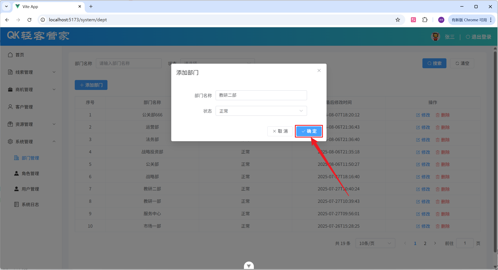

那应该如何辨别到底是新增，还是修改操作呢 ？

其实，我们只需要根据 `deptForm` 对象的id属性值，来判断即可。 如果没有id，则是新增操作 ；如果有id，则是修改操作。

所以，保存修改功能实现如下：

1.在 `src/api/dept.js` 中增加如下修改部门的请求

```javascript
//修改部门
export const updateDeptApi = (data) => request.put('/depts', data)
```

2.在 `src/views/system/dept.vue` 中引入上述函数，并完善\(修改\) save 函数的逻辑

```Java
import {queryPageApi, addDeptApi, queryInfoApi, updateDeptApi} from '@/api/dept'
```

```javascript
// 保存按钮
const save = async () => {
  deptFormRef.value.validate(async (valid) => {
    if (!valid) return
    if(deptForm.value.id){// 修改
      const result = await updateDeptApi(deptForm.value)
      if(result.code == 1){
        dialog.value.visible = false
        ElMessage.success('修改成功')
        search()
      }else{
        ElMessage.error(result.msg)
      }
    }else{
      // 添加
      const result = await addDeptApi(deptForm.value)
      if(result.code == 1){
        dialog.value.visible = false
        ElMessage.success('添加成功')
        search()
      }else{
        ElMessage.error(result.msg)
      }
    }
  })
}
```

最终完整代码如下：

```vue

<script setup>
import { ref, onMounted } from 'vue'
import {queryPageApi, addDeptApi, queryInfoApi, updateDeptApi, deleteDeptApi} from '@/api/dept'
import { ElMessage,ElMessageBox } from 'element-plus'

// 查询参数
const queryParams = ref({
  name: '',
  status: '',
  page: 1,
  pageSize: 10
})

// 表格数据
const deptList = ref([])
const total = ref(0)

onMounted(() => {
  search()
})

// 查询按钮
const search = async () => {
  const result = await queryPageApi(queryParams.value);
  if(result.code == 1){
    deptList.value = result.data.rows
    total.value = result.data.total
  }
}

// 重置查询
const clear = () => {
  queryParams.value = {
    name: '',
    status: '',
    page: 1,
    pageSize: 10
  }
  search()
}

// 分页大小改变
const handleSizeChange = (val) => {
  search()
}

// 页码改变
const handleCurrentChange = (val) => {
  search()
}

// 表单校验
const deptFormRef = ref()
const rules = ref({
  name: [
    { required: true, message: '请输入部门名称', trigger: 'blur' },
    { min: 2, max: 10, message: '长度在 2 到 10 个字符', trigger: 'blur' }
  ],
  status: [
    { required: true, message: '请选择部门状态', trigger: 'change' }
  ]
})

// 新增/修改部门对话框
const dialog = ref({
  title: '',
  visible: false
})
const deptForm = ref({
  name: '',
  status: ''
})

// 添加部门按钮
const handleAdd = () => {
  dialog.value.title = '添加部门'
  dialog.value.visible = true
  deptForm.value = {}
  if(deptFormRef.value){
    deptFormRef.value.resetFields()
  }
}

// 保存按钮
const save = async () => {
  deptFormRef.value.validate(async (valid) => {
    if (!valid) return
    if(deptForm.value.id){// 修改
      const result = await updateDeptApi(deptForm.value)
      if(result.code == 1){
        dialog.value.visible = false
        ElMessage.success('修改成功')
        search()
      }else{
        ElMessage.error(result.msg)
      }
    }else{
      // 添加
      const result = await addDeptApi(deptForm.value)
      if(result.code == 1){
        dialog.value.visible = false
        ElMessage.success('添加成功')
        search()
      }else{
        ElMessage.error(result.msg)
      }
    }
  })
}

// 修改部门按钮
const handleEdit = async (id) => {
  const result = await queryInfoApi(id)
  if(result.code == 1){
    deptForm.value = result.data
    dialog.value.title = '修改部门'
    dialog.value.visible = true
  }else {
    ElMessage.error(result.msg)
  }
}
</script>

<template>
  <div class="department">
    <!-- 搜索区域 -->
    <el-form :inline="true" :model="queryParams" ref="queryForm" class="search-form">
      <el-form-item label="部门名称">
        <el-input v-model="queryParams.name" placeholder="请输入部门名称"/>
      </el-form-item>
      <el-form-item label="状态">
        <el-select v-model="queryParams.status" placeholder="请选择" clearable style="width: 100%">
          <el-option label="正常" :value="1" />
          <el-option label="停用" :value="0" />
        </el-select>
      </el-form-item>
      <el-form-item class="search-buttons">
        <el-button type="primary" @click="search"><el-icon><Search /></el-icon>搜索</el-button>
        <el-button @click="clear"><el-icon><Refresh /></el-icon>清空</el-button>
      </el-form-item>
    </el-form>

    <!-- 操作按钮区域 -->
    <div class="operation-area">
      <el-button type="primary" @click="handleAdd"><el-icon><Plus /></el-icon>添加部门</el-button>
    </div>

    <!-- 表格区域 -->
    <el-table  :data="deptList"  style="width: 100%" border>
      <el-table-column type="index" label="序号" width="100" align="center" />
      <el-table-column prop="name" label="部门名称" width="300" align="center" />
      <el-table-column prop="status" label="状态" width="300" align="center">
        <template #default="scope">
            {{ scope.row.status === 1 ? '正常' : '停用' }}
        </template>
      </el-table-column>
      <el-table-column prop="updateTime" label="最后修改时间" width="300" align="center" />
      <el-table-column label="操作" align="center">
        <template #default="scope">
          <el-button type="primary" link @click="handleEdit(scope.row.id)"><el-icon><Edit /></el-icon>修改</el-button>
          <el-button type="danger" link @click="handleDelete(scope.row.id)" ><el-icon><Delete /></el-icon>删除</el-button>
        </template>
      </el-table-column>
    </el-table>

    <!-- 分页区域 -->
    <div class="pagination">
      <el-pagination
        v-model:current-page="queryParams.page"
        v-model:page-size="queryParams.pageSize"
        :page-sizes="[10, 20, 30, 40, 50]"
        layout="total, sizes, prev, pager, next, jumper"
        :total="total"
        @size-change="handleSizeChange"
        @current-change="handleCurrentChange"
      />
    </div>

    <!-- 添加/修改部门对话框 -->
    <el-dialog :title="dialog.title" v-model="dialog.visible" width="500px" class="dept-dialog">
      <el-form :model="deptForm" ref="deptFormRef" :rules="rules" label-width="80px" class="dept-form">
        <el-form-item label="部门名称" prop="name">
          <el-input v-model="deptForm.name" placeholder="请输入部门名称" />
        </el-form-item>
        <el-form-item label="状态" prop="status">
          <el-select v-model="deptForm.status" placeholder="请选择" style="width: 100%">
            <el-option label="正常" :value="1" />
            <el-option label="停用" :value="0" />
          </el-select>
        </el-form-item>
      </el-form>
      <template #footer>
        <el-button @click="dialog.visible = false"><el-icon><Close /></el-icon>取 消</el-button>
        <el-button type="primary" @click="save"><el-icon><Check /></el-icon>确 定</el-button>
      </template>
    </el-dialog>
    
  </div>
</template>

<style scoped>
.department {
  padding: 20px;
  background-color: #fff;
  min-height: 100%;
  border-radius: 8px; /* 添加圆角 */
}

.operation-area {
  margin: 20px 0;
}

.search-form {
  display: flex;
  align-items: center;
}

.search-form :deep(.el-form-item) {
  margin-right: 20px;
  min-width: 280px;
}

.search-buttons {
  margin-left: auto !important;
  min-width: auto !important;
}

.pagination {
  margin-top: 20px;
  display: flex;
  justify-content: flex-end;
}

.divider {
  height: 0.5px;
  background-color: #dcdfe6;
  margin: 10px 0;
  width: 100%;
}

:deep(.dept-dialog .el-dialog__body) {
  padding-top: 30px;
}

.dept-form {
  width: 80%;
  margin: 0 auto;
}

:deep(.el-button .el-icon) {
  margin-right: 4px;
}
</style>
```

# 六、部门管理\-删除部门

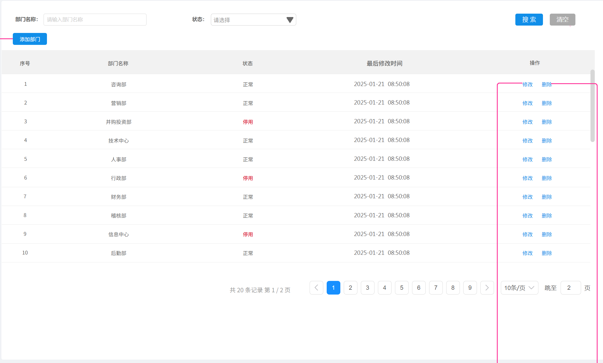

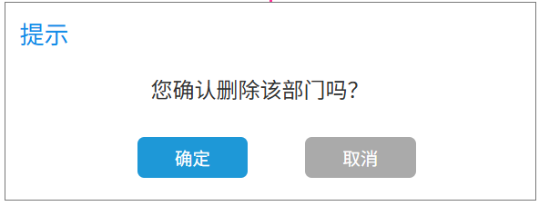

点击删除按钮，需要删除当前这条数据，删除完成之后，刷新页面，展示出最新的数据。

由于删除是一个比较危险的操作，为避免误操作，通常会在点击删除之后，弹出确认框进行确认。

Element 组件：ElMessageBox消息弹出框组件

具体操作步骤：

1.在 `src/api/dept.js` 中增加如下删除部门的请求

```javascript
//删除部门
export const deleteDeptApi = (id) => request.delete(`/depts/${id}`)
```

2.在 `src/views/system/dept.vue` 中为 删除 按钮绑定事件

```vue
<el-table-column label="操作" align="center">
    <template #default="scope">
      <el-button type="primary" link @click="handleEdit(scope.row.id)"><el-icon><Edit /></el-icon>修改</el-button>
      <el-button type="danger" link @click="handleDelete(scope.row.id)" ><el-icon><Delete /></el-icon>删除</el-button>
    </template>
</el-table-column>
```

3.在 `src/views/system/dept.vue`  编写根据ID删除数据的函数 。

```javascript
import {queryPageApi, addDeptApi, queryInfoApi, updateDeptApi, deleteDeptApi} from '@/api/dept'
import { ElMessage,ElMessageBox } from 'element-plus'
```

```javascript
// 删除部门按钮
const handleDelete = async (id) => {
  ElMessageBox.confirm('确认要删除吗？', '提示', {
    confirmButtonText: '确认',
    cancelButtonText: '取消',
    type: 'warning'
  }).then(async () => {
    const result = await deleteDeptApi(id)
    if(result.code == 1){
      ElMessage.success('删除成功')
      search()
    }
  })
}
```

关于部门管理的页面，最终的代码形式如下：

```javascript
<script setup>
import { ref, onMounted } from 'vue'
import {queryPageApi, addDeptApi, queryInfoApi, updateDeptApi, deleteDeptApi} from '@/api/dept'
import { ElMessage,ElMessageBox } from 'element-plus'

// 查询参数
const queryParams = ref({
  name: '',
  status: '',
  page: 1,
  pageSize: 10
})

// 表格数据
const deptList = ref([])
const total = ref(0)

onMounted(() => {
  search()
})

// 查询按钮
const search = async () => {
  const result = await queryPageApi(queryParams.value);
  if(result.code == 1){
    deptList.value = result.data.rows
    total.value = result.data.total
  }
}

// 重置查询
const clear = () => {
  queryParams.value = {
    name: '',
    status: '',
    page: 1,
    pageSize: 10
  }
  search()
}

// 分页大小改变
const handleSizeChange = (val) => {
  search()
}

// 页码改变
const handleCurrentChange = (val) => {
  search()
}

// 表单校验
const deptFormRef = ref()
const rules = ref({
  name: [
    { required: true, message: '请输入部门名称', trigger: 'blur' },
    { min: 2, max: 10, message: '长度在 2 到 10 个字符', trigger: 'blur' }
  ],
  status: [
    { required: true, message: '请选择部门状态', trigger: 'change' }
  ]
})

// 新增/修改部门对话框
const dialog = ref({
  title: '',
  visible: false
})
const deptForm = ref({
  name: '',
  status: ''
})

// 添加部门按钮
const handleAdd = () => {
  dialog.value.title = '添加部门'
  dialog.value.visible = true
  deptForm.value = {}
  if(deptFormRef.value){
    deptFormRef.value.resetFields()
  }
}

// 保存按钮
const save = async () => {
  deptFormRef.value.validate(async (valid) => {
    if (!valid) return
    if(deptForm.value.id){// 修改
      const result = await updateDeptApi(deptForm.value)
      if(result.code == 1){
        dialog.value.visible = false
        ElMessage.success('修改成功')
        search()
      }else{
        ElMessage.error(result.msg)
      }
    }else{
      // 添加
      const result = await addDeptApi(deptForm.value)
      if(result.code == 1){
        dialog.value.visible = false
        ElMessage.success('添加成功')
        search()
      }else{
        ElMessage.error(result.msg)
      }
    }
  })
}

// 修改部门按钮
const handleEdit = async (id) => {
  const result = await queryInfoApi(id)
  if(result.code == 1){
    deptForm.value = result.data
    dialog.value.title = '修改部门'
    dialog.value.visible = true
    if(deptFormRef.value){
      deptFormRef.value.resetFields()
    }
  }else {
    ElMessage.error(result.msg)
  }
}

// 删除部门按钮
const handleDelete = async (id) => {
  ElMessageBox.confirm('确认要删除吗？', '提示', {
    confirmButtonText: '确认',
    cancelButtonText: '取消',
    type: 'warning'
  }).then(async () => {
    const result = await deleteDeptApi(id)
    if(result.code == 1){
      ElMessage.success('删除成功')
      search()
    }
  })
}
</script>

<template>
  <div class="department">
    <!-- 搜索区域 -->
    <el-form :inline="true" :model="queryParams" ref="queryForm" class="search-form">
      <el-form-item label="部门名称">
        <el-input v-model="queryParams.name" placeholder="请输入部门名称"/>
      </el-form-item>
      <el-form-item label="状态">
        <el-select v-model="queryParams.status" placeholder="请选择" clearable style="width: 100%">
          <el-option label="正常" :value="1" />
          <el-option label="停用" :value="0" />
        </el-select>
      </el-form-item>
      <el-form-item class="search-buttons">
        <el-button type="primary" @click="search"><el-icon><Search /></el-icon>搜索</el-button>
        <el-button @click="clear"><el-icon><Refresh /></el-icon>清空</el-button>
      </el-form-item>
    </el-form>

    <!-- 操作按钮区域 -->
    <div class="operation-area">
      <el-button type="primary" @click="handleAdd"><el-icon><Plus /></el-icon>添加部门</el-button>
    </div>

    <!-- 表格区域 -->
    <el-table  :data="deptList"  style="width: 100%" border>
      <el-table-column type="index" label="序号" width="100" align="center" />
      <el-table-column prop="name" label="部门名称" width="300" align="center" />
      <el-table-column prop="status" label="状态" width="300" align="center">
        <template #default="scope">
            {{ scope.row.status === 1 ? '正常' : '停用' }}
        </template>
      </el-table-column>
      <el-table-column prop="updateTime" label="最后修改时间" width="300" align="center" />
      <el-table-column label="操作" align="center">
        <template #default="scope">
          <el-button type="primary" link @click="handleEdit(scope.row.id)"><el-icon><Edit /></el-icon>修改</el-button>
          <el-button type="danger" link @click="handleDelete(scope.row.id)" ><el-icon><Delete /></el-icon>删除</el-button>
        </template>
      </el-table-column>
    </el-table>

    <!-- 分页区域 -->
    <div class="pagination">
      <el-pagination
        v-model:current-page="queryParams.page"
        v-model:page-size="queryParams.pageSize"
        :page-sizes="[10, 20, 30, 40, 50]"
        layout="total, sizes, prev, pager, next, jumper"
        :total="total"
        @size-change="handleSizeChange"
        @current-change="handleCurrentChange"
      />
    </div>

    <!-- 添加/修改部门对话框 -->
    <el-dialog :title="dialog.title" v-model="dialog.visible" width="500px" class="dept-dialog">
      <el-form :model="deptForm" ref="deptFormRef" :rules="rules" label-width="80px" class="dept-form">
        <el-form-item label="部门名称" prop="name">
          <el-input v-model="deptForm.name" placeholder="请输入部门名称" />
        </el-form-item>
        <el-form-item label="状态" prop="status">
          <el-select v-model="deptForm.status" placeholder="请选择" style="width: 100%">
            <el-option label="正常" :value="1" />
            <el-option label="停用" :value="0" />
          </el-select>
        </el-form-item>
      </el-form>
      <template #footer>
        <el-button @click="dialog.visible = false"><el-icon><Close /></el-icon>取 消</el-button>
        <el-button type="primary" @click="save"><el-icon><Check /></el-icon>确 定</el-button>
      </template>
    </el-dialog>
    
  </div>
</template>

<style scoped>
.department {
  padding: 20px;
  background-color: #fff;
  min-height: 100%;
  border-radius: 8px; /* 添加圆角 */
}

.operation-area {
  margin: 20px 0;
}

.search-form {
  display: flex;
  align-items: center;
}

.search-form :deep(.el-form-item) {
  margin-right: 20px;
  min-width: 280px;
}

.search-buttons {
  margin-left: auto !important;
  min-width: auto !important;
}

.pagination {
  margin-top: 20px;
  display: flex;
  justify-content: flex-end;
}

.divider {
  height: 0.5px;
  background-color: #dcdfe6;
  margin: 10px 0;
  width: 100%;
}

:deep(.dept-dialog .el-dialog__body) {
  padding-top: 30px;
}

.dept-form {
  width: 80%;
  margin: 0 auto;
}

:deep(.el-button .el-icon) {
  margin-right: 4px;
}
</style>
```
