# 一、用户管理

我们讲解了Vue工程化，ElementPlus组件库，并且也手动的实现了部门管理的功能开发。

那接下来，我们在做其他的功能模块的时候，其实实现的思路、流程、组件都是一致的，所以今天我们在实现员工管理的页面制作时，我们将使用AI来大幅提高我们的开发效率，也让大家看看基于AI如何帮我们快速的开发前端项目 。

## 1.列表查询

### 1.1.需求

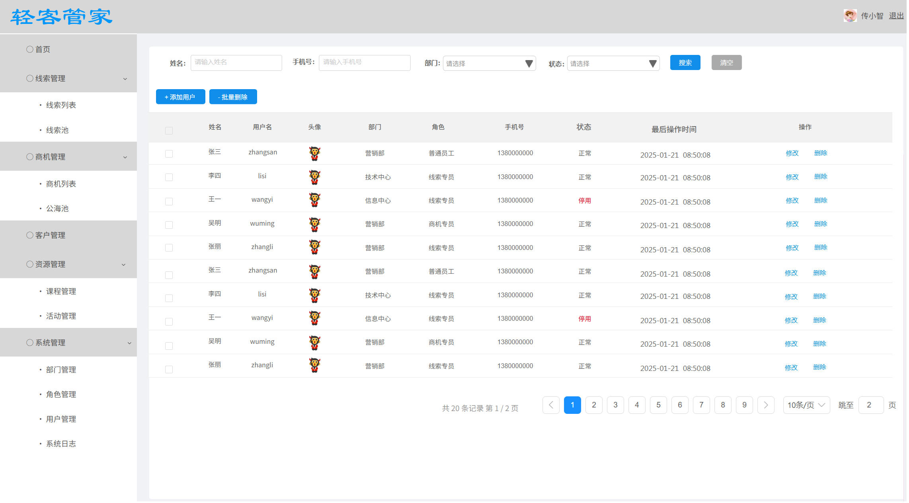

从页面原型中，我们可以看到员工信息列表查询，依然是包含三个部分：搜索栏、数据展示表格、分页条。

### 1.2.实现

> 请根据提供的用户管理的页面原型图，和接口文档完成用户管理的功能开发，先帮我完成用户列表查询的页面布局及功能实现。
> 技术栈: Vue3 + ElementPlus + Axios + Vue3生态其他组件
>
> 具体涉及到的接口信息如下：
>
> 2.1 用户信息分页查询
> 请求路径: /users
> 请求方式: GET
> 请求参数
> 参数格式: queryString
> 参数说明:
> name: 姓名
> phone: 手机号
> deptId: 部门
> status: 状态，1: 正常，0: 停用
> page: 分页查询的页码，默认1
> pageSize: 分页查询的每页记录数，默认10
>
> 请求数据样例:
> /users?page=1&pageSize=10
> /users?name=技术&phone=133&page=1&pageSize=10
> /users?name=技术&phone=133&deptId=1&status=1&page=1&pageSize=10
>
> 响应数据:
> {
>  "code": 1,
>  "msg": "success",
>  "data": {
>  "total": 2,
>  "rows": [
>  {
>  "id": 3,
>  "username": "zhangsanfeng",
>  "name": "张三丰",
>  "phone": "13309091122",
>  "email": "zhangsanfeng@163.com",
>  "gender": 1,
>  "status": 1,
>  "deptId": 1,
>  "roleId": 1,
>  "image": "https://web2025-test.oss-cn-beijing.aliyuncs.com/2025/03/cf2488ac-b40b-4eaf-b3ea-ef348f3ef079.png",
>  "remark": "资深开发工程师",
>  "createTime": "2025-03-23 20:09:07",
>  "updateTime": "2025-04-18 20:26:00",
>  "deptName": "市场二部",
>  "roleName": "管理员"
>  }
>  ]
>  }
> }
>
> 响应数据说明:
> code : 响应码, 1 成功 , 0 失败
> msg : 提示信息
> data : 返回的数据
> |- total : 总记录数
> |- rows : 数据列表
> |- id : id
> |- username : 用户名
> |- name : 姓名
> |- phone : 手机号
> |- email : 邮箱
> |- gender : 性别, 1: 男, 2: 女
> |- status : 状态, 1: 正常, 0: 停用
> |- deptId : 部门ID
> |- roleId : 角色ID
> |- image : 头像url
> |- remark : 备注
> |- deptName : 部门名称
> |- roleName : 角色名称
> |- createTime : 创建时间
> |- updateTime : 修改时间
>
> 2.6 查询所有部门
> 请求路径: /depts/list
> 请求方式: GET
> 请求参数: 无
> 响应数据:
> {
>  "code": 1,
>  "msg": "success",
>  "data": [
>  {
>  "id": 1,
>  "name": "市场一部",
>  "status": 1,
>  "createTime": "2025-03-23 16:48:58",
>  "updateTime": "2025-04-24 20:36:04"
>  }
>  ]
> }
>
> 先完成用户列表查询展示的功能实现, 要求用户管理页面的布局风格，以及样式细节，可以参照部门管理的页面，与其保持一致, 而且api层的js定义，也需要与 dept.js 的代码风格保持一致。

> 注意：除了上述提示词之外，还需要提供页面原型的截图，以及提供必要的上下文信息。

最终AI生成并调整后的代码如下：

1.在 `src/api` 目录中新增 `user.js`

```javascript
import request from "@/utils/request"

// 用户分页查询
export const queryPageApi = (params) => request.get('/users', {params: params})

// 查询所有部门
export const queryDeptListApi = () => request.get('/depts/list') 
```

2.`src/views/system/user.vue` 中的代码如下：

```vue
<script setup>
import { ref, onMounted } from 'vue'
import { queryPageApi, queryDeptListApi } from '@/api/user'
import { ElMessage, ElMessageBox } from 'element-plus'

// 查询参数
const queryParams = ref({
  name: '',
  phone: '',
  deptId: '',
  status: '',
  page: 1,
  pageSize: 10
})

// 表格数据
const userList = ref([])
const total = ref(0)
const deptList = ref([])
const selectedUsers = ref([])

onMounted(() => {
  loadDeptList()
  search()
})

// 加载部门列表
const loadDeptList = async () => {
  const result = await queryDeptListApi()
  if (result.code === 1) {
    deptList.value = result.data
  }
}

// 查询按钮
const search = async () => {
  const result = await queryPageApi(queryParams.value)
  if (result.code === 1) {
    userList.value = result.data.rows
    total.value = result.data.total
  } else {
    ElMessage.error(result.msg || '查询失败')
  }
}

// 重置查询
const clear = () => {
  queryParams.value = {
    name: '',
    phone: '',
    deptId: '',
    status: '',
    page: 1,
    pageSize: 10
  }
  search()
}

// 分页大小改变
const handleSizeChange = (val) => {
  search()
}

// 页码改变
const handleCurrentChange = (val) => {
  search()
}

// 选择变化
const handleSelectionChange = (selection) => {
  selectedUsers.value = selection
}

// 添加用户按钮
const handleAdd = () => {
  ElMessage.info('添加用户功能待实现')
}

// 批量删除按钮
const handleBatchDelete = () => {
  if (selectedUsers.value.length === 0) {
    ElMessage.warning('请选择要删除的用户')
    return
  }
  ElMessage.info('批量删除功能待实现')
}

// 修改用户按钮
const handleEdit = (id) => {
  ElMessage.info('修改用户功能待实现')
}

// 删除用户按钮
const handleDelete = async (id) => {
  ElMessageBox.confirm('确认要删除该用户吗？', '提示', {
    confirmButtonText: '确认',
    cancelButtonText: '取消',
    type: 'warning'
  }).then(() => {
    ElMessage.info('删除用户功能待实现')
  })
}
</script>

<template>
  <div class="user">
    <!-- 搜索区域 -->
    <el-form :inline="true" :model="queryParams" ref="queryForm" class="search-form">
      <el-form-item label="姓名">
        <el-input v-model="queryParams.name" placeholder="请输入姓名"/>
      </el-form-item>
      <el-form-item label="手机号">
        <el-input v-model="queryParams.phone" placeholder="请输入手机号"/>
      </el-form-item>
      <el-form-item label="部门">
        <el-select v-model="queryParams.deptId" placeholder="请选择" clearable>
          <el-option  v-for="dept in deptList"  :key="dept.id"  :label="dept.name"  :value="dept.id" />
        </el-select>
      </el-form-item>
      <el-form-item label="状态">
        <el-select v-model="queryParams.status" placeholder="请选择" clearable>
          <el-option label="正常" :value="1" />
          <el-option label="停用" :value="0" />
        </el-select>
      </el-form-item>
      <el-form-item class="search-buttons">
        <el-button type="primary" @click="search"><el-icon><Search /></el-icon>搜索</el-button>
        <el-button type="info" @click="clear"><el-icon><Refresh /></el-icon>清空</el-button>
      </el-form-item>
    </el-form>

    <!-- 操作按钮区域 -->
    <div class="operation-area">
      <el-button type="primary" @click="handleAdd"><el-icon><Plus /></el-icon>添加用户</el-button>
      <el-button type="danger" @click="handleBatchDelete"><el-icon><Delete /></el-icon>批量删除</el-button>
    </div>

    <!-- 表格区域 -->
    <el-table :data="userList" style="width: 100%" border @selection-change="handleSelectionChange">
      <el-table-column type="selection" width="55" align="center" />
      <el-table-column prop="name" label="姓名" width="150" align="center" />
      <el-table-column prop="username" label="用户名" width="150" align="center" />
      <el-table-column label="头像" width="120" align="center">
        <template #default="scope">
          <el-avatar :size="35" :src="scope.row.image" :icon="UserFilled"/>
        </template>
      </el-table-column>
      <el-table-column prop="deptName" label="部门" width="150" align="center" />
      <el-table-column prop="roleName" label="角色" width="150" align="center" />
      <el-table-column prop="phone" label="手机号" width="120" align="center" />
      <el-table-column prop="status" label="状态" width="120" align="center">
        <template #default="scope">
          <el-tag :type="scope.row.status === 1 ? 'success' : 'danger'">
            {{ scope.row.status === 1 ? '正常' : '停用' }}
          </el-tag>
        </template>
      </el-table-column>
      <el-table-column prop="updateTime" label="最后操作时间" width="180" align="center" />
      <el-table-column label="操作" align="center">
        <template #default="scope">
          <el-button type="primary" link @click="handleEdit(scope.row.id)"><el-icon><Edit /></el-icon>修改</el-button>
          <el-button type="danger" link @click="handleDelete(scope.row.id)"><el-icon><Delete /></el-icon>删除</el-button>
        </template>
      </el-table-column>
    </el-table>

    <!-- 分页区域 -->
    <div class="pagination">
      <el-pagination
        v-model:current-page="queryParams.page"
        v-model:page-size="queryParams.pageSize"
        :page-sizes="[10, 20, 30, 40, 50]"
        layout="total, sizes, prev, pager, next, jumper"
        :total="total"
        @size-change="handleSizeChange"
        @current-change="handleCurrentChange"
      />
    </div>
  </div>
</template>

<style scoped>
.user {
  padding: 20px;
  background-color: #fff;
  min-height: 100%;
  border-radius: 8px;
}

.operation-area {
  margin: 20px 0;
}

.search-form {
  display: flex;
  align-items: center;
  flex-wrap: wrap;
}

.search-form :deep(.el-form-item) {
  margin-right: 20px;
  margin-bottom: 10px;
  min-width: 250px;
}

.search-buttons {
  margin-left: auto !important;
  min-width: auto !important;
}

.pagination {
  margin-top: 20px;
  display: flex;
  justify-content: flex-end;
}

:deep(.el-button .el-icon) {
  margin-right: 4px;
}

:deep(.el-table .el-table__cell) {
  padding: 8px 0;
}
</style>
```

代码编写完毕后，打开浏览器，查看页面效果：


## 2.增删改

### 1.需求

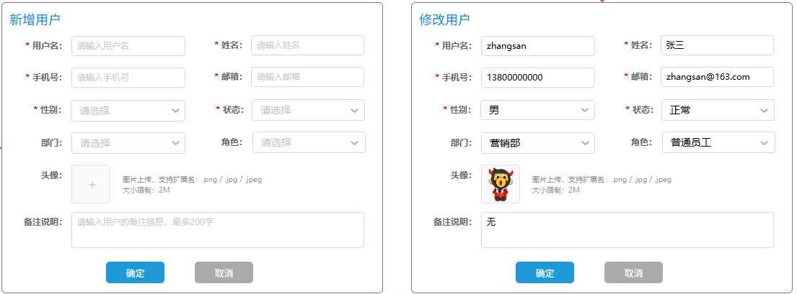

新增用户 和 修改用户的表单，除了标题部分，其他都是完全一样的，因此，也是可以直接复用同一个表单的。


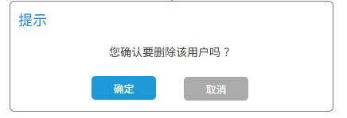

删除操作，有两个入口，一个是每条数据后面的删除按钮，点击之后删除当前用户信息。还有一个入口是表格上方的 批量删除 按钮，点击之后会执行批量删除操作。

### 2.实现

> 提示词：
> 请根据提供的用户管理的页面原型图，和接口文档完成用户管理的功能开发，完成新增用户、修改用户、删除用户的功能实现。
> 技术栈: Vue3 + ElementPlus + Axios + Vue3生态其他组件
>
> 具体涉及到的接口信息如下：
>
> 2.1 删除用户
> 请求路径: /users/{ids}
> 请求方式: DELETE
> 请求参数:
> 示例地址：
> /users/1
> /users/1,2,3
> /users/2,4,5
> 响应数据:
> {
> "code": 1,
> "msg": "success",
> "data": null
> }
>
> 2.2 添加用户
> 请求路径: /users
> 请求方式: POST
> 请求参数:
> {
> "username": "yanshisan",
> "password": "123456",
> "name": "燕十三",
> "phone": "13800138016",
> "email": "yanshisan@example.com",
> "gender": 1,
> "status": 1,
> "deptId": 1,
> "roleId": 1,
> "image": "https://example.com/admin.jpg",
> "remark": "普通员工"
> }
> 响应数据：
> {
> "code": 1,
> "msg": "success",
> "data": null
> }
>
> 2.3 根据ID查询用户
> 请求路径: /users/{id}
> 请求方式: GET
> 请求参数示例：
> /users/1
> /users/3
> 响应数据:
> {
> "code": 1,
> "msg": "success",
> "data": {
> "id": 1,
> "username": "zhangsan",
> "password": "123456",
> "name": "张三",
> "phone": "13800138001",
> "email": "admin@example.com",
> "gender": 1,
> "status": 1,
> "deptId": 1,
> "roleId": 1,
> "image": "https://example.com/admin.jpg",
> "remark": "系统管理员",
> "createTime": "2025-03-23 16:42:35",
> "updateTime": "2025-03-23 16:42:35"
> }
> }
>
> 2.4 修改用户
> 请求路径: /users
> 请求方式: PUT
> 请求参数:
> {
> "id": 16,
> "username": "yanshisan",
> "password": "123456789",
> "name": "燕十三",
> "phone": "13800138016",
> "email": "yanshisan@example.com",
> "gender": 1,
> "status": 1,
> "deptId": 1,
> "roleId": 1,
> "image": "https://example.com/yanshisan.jpg",
> "remark": "普通员工"
> }
> 响应数据:
> {
> "code": 1,
> "msg": "success",
> "data": null
> }
>
> 2.5 查询所有角色
> 请求路径: /roles/list
> 请求方式: GET
> 请求参数: 无
> 响应数据:
> {
> "code": 1,
> "msg": "success",
> "data": [
> {
> "id": 3,
> "name": "普通用户",
> "label": "user_normal",
> "remark": "普通用户",
> "createTime": "2025-03-23 16:42:35",
> "updateTime": "2025-04-18 19:48:00"
> }
> ]
> }
>
> 2.6 文件上传需要请求服务端的接口， 接口信息如下：
> 请求路径：/upload
> 请求方式：POST
> 接口描述：上传图片接口
> 请求参数格式: multipart/form‑data
> 请求参数：参数名‑image , 参数类型‑file
> 响应结果：
> {
> "code": 1,
> "msg": "success",
> "data": "https://web‑framework.oss‑cn‑hangzhou.aliyuncs.com/2022‑09‑02‑00‑27‑0400.jpg"
> }
>
> 完成用户信息新增、修改、删除的功能实现, 要求用户管理页面的布局风格，以及样式细节，可以参照部门管理的页面，与其保持一致, 而且api层的js定义，也需要与 dept.js 的代码风格保持一致。

> 注意：除了上述提示词之外，还需要提供页面原型的截图，以及提供必要的上下文信息。

AI生成，最终调整后的完整代码如下： 

1.`src/api/user.js` 中的代码如下:

```javascript
import request from "@/utils/request"

// 用户分页查询
export const queryPageApi = (params) => request.get('/users', {params: params})

// 查询所有部门
export const queryDeptListApi = () => request.get('/depts/list')

// 查询所有角色
export const queryRoleListApi = () => request.get('/roles/list')

// 添加用户
export const addUserApi = (data) => request.post('/users', data)

// 根据ID查询用户
export const queryUserInfoApi = (id) => request.get(`/users/${id}`)

// 修改用户
export const updateUserApi = (data) => request.put('/users', data)

// 删除用户
export const deleteUserApi = (ids) => request.delete(`/users/${ids}`) 
```

2.`src/views/user.vue` 中的代码如下:

```vue
<script setup>
import { ref, onMounted } from 'vue'
import { 
  queryPageApi, 
  queryDeptListApi, 
  queryRoleListApi,
  addUserApi,
  queryUserInfoApi,
  updateUserApi,
  deleteUserApi
} from '@/api/user'
import { ElMessage, ElMessageBox } from 'element-plus'

// 查询参数
const queryParams = ref({
  name: '',
  phone: '',
  deptId: '',
  status: '',
  page: 1,
  pageSize: 10
})

// 表格数据
const userList = ref([])
const total = ref(0)
const deptList = ref([])
const roleList = ref([])
const selectedUsers = ref([])

// 表单相关
const userFormRef = ref()
const userForm = ref({
  username: '',
  name: '',
  phone: '',
  email: '',
  gender: '',
  status: '',
  deptId: '',
  roleId: '',
  image: '',
  remark: ''
})

// 对话框
const dialog = ref({
  title: '',
  visible: false
})

// 表单验证规则
const rules = ref({
  username: [
    { required: true, message: '请输入用户名', trigger: 'blur' },
    { min: 2, max: 20, message: '长度在 2 到 20 个字符', trigger: 'blur' }
  ],
  name: [
    { required: true, message: '请输入姓名', trigger: 'blur' },
    { min: 2, max: 20, message: '长度在 2 到 20 个字符', trigger: 'blur' }
  ],
  phone: [
    { required: true, message: '请输入手机号', trigger: 'blur' },
    { pattern: /^1[3-9]\d{9}$/, message: '请输入正确的手机号', trigger: 'blur' }
  ],
  email: [
    { required: true, message: '请输入邮箱', trigger: 'blur' },
    { type: 'email', message: '请输入正确的邮箱地址', trigger: 'blur' },
    { min: 5, max: 50, message: '长度在 5 到 50 个字符', trigger: 'blur' }
  ],
  gender: [
    { required: true, message: '请选择性别', trigger: 'change' }
  ],
  status: [
    { required: true, message: '请选择状态', trigger: 'change' }
  ]
})

// 文件上传相关
const uploadAction = '/api/upload' // 根据实际接口调整
const uploadHeaders = {
  // 根据实际需要设置请求头
}

onMounted(() => {
  loadDeptList()
  loadRoleList()
  search()
})

// 加载部门列表
const loadDeptList = async () => {
  const result = await queryDeptListApi()
  if (result.code === 1) {
    deptList.value = result.data
  }
}

// 加载角色列表
const loadRoleList = async () => {
  const result = await queryRoleListApi()
  if (result.code === 1) {
    roleList.value = result.data
  }
}

// 查询按钮
const search = async () => {
  const result = await queryPageApi(queryParams.value)
  if (result.code === 1) {
    userList.value = result.data.rows
    total.value = result.data.total
  } else {
    ElMessage.error(result.msg || '查询失败')
  }
}

// 重置查询
const clear = () => {
  queryParams.value = {
    name: '',
    phone: '',
    deptId: '',
    status: '',
    page: 1,
    pageSize: 10
  }
  search()
}

// 分页大小改变
const handleSizeChange = (val) => {
  search()
}

// 页码改变
const handleCurrentChange = (val) => {
  search()
}

// 选择变化
const handleSelectionChange = (selection) => {
  selectedUsers.value = selection
}

// 添加用户按钮
const handleAdd = () => {
  dialog.value.title = '新增用户'
  dialog.value.visible = true
  userForm.value = {
    username: '',
    name: '',
    phone: '',
    email: '',
    gender: '',
    status: '',
    deptId: '',
    roleId: '',
    image: '',
    remark: ''
  }
  if (userFormRef.value) {
    userFormRef.value.resetFields()
  }
}

// 修改用户按钮
const handleEdit = async (id) => {
  const result = await queryUserInfoApi(id)
  if (result.code === 1) {
    userForm.value = result.data
    dialog.value.title = '修改用户'
    dialog.value.visible = true
    if (userFormRef.value) {
      userFormRef.value.resetFields()
    }
  } else {
    ElMessage.error(result.msg)
  }
}

// 删除用户按钮
const handleDelete = async (id) => {
  ElMessageBox.confirm('您确认要删除该用户吗？', '提示', {
    confirmButtonText: '确定',
    cancelButtonText: '取消',
    type: 'warning'
  }).then(async () => {
    const result = await deleteUserApi(id)
    if (result.code === 1) {
      ElMessage.success('删除成功')
      search()
    } else {
      ElMessage.error(result.msg || '删除失败')
    }
  })
}

// 批量删除按钮
const handleBatchDelete = () => {
  if (selectedUsers.value.length === 0) {
    ElMessage.warning('请选择要删除的用户')
    return
  }
  
  const ids = selectedUsers.value.map(user => user.id).join(',')
  ElMessageBox.confirm(`确认要删除选中的 ${selectedUsers.value.length} 个用户吗？`, '提示', {
    confirmButtonText: '确定',
    cancelButtonText: '取消',
    type: 'warning'
  }).then(async () => {
    const result = await deleteUserApi(ids)
    if (result.code === 1) {
      ElMessage.success('批量删除成功')
      search()
    } else {
      ElMessage.error(result.msg || '批量删除失败')
    }
  })
}

// 保存按钮
const save = async () => {
  userFormRef.value.validate(async (valid) => {
    if (!valid) return
    let result
    if (userForm.value.id) {
      // 修改用户
      result = await updateUserApi(userForm.value)
    } else {
      // 添加用户
      result = await addUserApi(userForm.value)
    }
    
    if (result.code === 1) {
      dialog.value.visible = false
      ElMessage.success(userForm.value.id ? '修改成功' : '添加成功')
      search()
    } else {
      ElMessage.error(result.msg || '操作失败')
    }
  })
}

// 头像上传成功
const handleAvatarSuccess = (response, file) => {
  if (response.code === 1) {
    userForm.value.image = response.data
    ElMessage.success('头像上传成功')
  } else {
    ElMessage.error(response.msg || '头像上传失败')
  }
}

// 头像上传前验证
const beforeAvatarUpload = (file) => {
  const isJPG = file.type === 'image/jpeg' || file.type === 'image/jpg'
  const isPNG = file.type === 'image/png'
  const isLt2M = file.size / 1024 / 1024 < 2

  if (!isJPG && !isPNG) {
    ElMessage.error('头像只能是 JPG/PNG 格式!')
    return false
  }
  if (!isLt2M) {
    ElMessage.error('头像大小不能超过 2MB!')
    return false
  }
  return true
}
</script>

<template>
  <div class="user">
    <!-- 搜索区域 -->
    <el-form :inline="true" :model="queryParams" ref="queryForm" class="search-form">
      <el-form-item label="姓名">
        <el-input v-model="queryParams.name" placeholder="请输入姓名"/>
      </el-form-item>
      <el-form-item label="手机号">
        <el-input v-model="queryParams.phone" placeholder="请输入手机号"/>
      </el-form-item>
      <el-form-item label="部门">
        <el-select v-model="queryParams.deptId" placeholder="请选择" clearable>
          <el-option  v-for="dept in deptList"  :key="dept.id"  :label="dept.name"  :value="dept.id" />
        </el-select>
      </el-form-item>
      <el-form-item label="状态">
        <el-select v-model="queryParams.status" placeholder="请选择" clearable>
          <el-option label="正常" :value="1" />
          <el-option label="停用" :value="0" />
        </el-select>
      </el-form-item>
      <el-form-item class="search-buttons">
        <el-button type="primary" @click="search"><el-icon><Search /></el-icon>搜索</el-button>
        <el-button type="info" @click="clear"><el-icon><Refresh /></el-icon>清空</el-button>
      </el-form-item>
    </el-form>

    <!-- 操作按钮区域 -->
    <div class="operation-area">
      <el-button type="primary" @click="handleAdd"><el-icon><Plus /></el-icon>添加用户</el-button>
      <el-button type="danger" @click="handleBatchDelete"><el-icon><Delete /></el-icon>批量删除</el-button>
    </div>

    <!-- 表格区域 -->
    <el-table :data="userList" style="width: 100%" border @selection-change="handleSelectionChange">
      <el-table-column type="selection" width="55" align="center" />
      <el-table-column prop="name" label="姓名" width="150" align="center" />
      <el-table-column prop="username" label="用户名" width="150" align="center" />
      <el-table-column label="头像" width="120" align="center">
        <template #default="scope">
          <el-avatar :size="35" :src="scope.row.image" :icon="UserFilled"/>
        </template>
      </el-table-column>
      <el-table-column prop="deptName" label="部门" width="150" align="center" />
      <el-table-column prop="roleName" label="角色" width="150" align="center" />
      <el-table-column prop="phone" label="手机号" width="120" align="center" />
      <el-table-column prop="status" label="状态" width="120" align="center">
        <template #default="scope">
          <el-tag :type="scope.row.status === 1 ? 'success' : 'danger'">
            {{ scope.row.status === 1 ? '正常' : '停用' }}
          </el-tag>
        </template>
      </el-table-column>
      <el-table-column prop="updateTime" label="最后操作时间" width="180" align="center" />
      <el-table-column label="操作" align="center">
        <template #default="scope">
          <el-button type="primary" link @click="handleEdit(scope.row.id)"><el-icon><Edit /></el-icon>修改</el-button>
          <el-button type="danger" link @click="handleDelete(scope.row.id)"><el-icon><Delete /></el-icon>删除</el-button>
        </template>
      </el-table-column>
    </el-table>

    <!-- 分页区域 -->
    <div class="pagination">
      <el-pagination
        v-model:current-page="queryParams.page"
        v-model:page-size="queryParams.pageSize"
        :page-sizes="[10, 20, 30, 40, 50]"
        layout="total, sizes, prev, pager, next, jumper"
        :total="total"
        @size-change="handleSizeChange"
        @current-change="handleCurrentChange"
      />
    </div>

    <!-- 添加/修改用户对话框 -->
    <el-dialog :title="dialog.title" v-model="dialog.visible" width="800px" class="user-dialog">
      <el-form :model="userForm" ref="userFormRef" :rules="rules" label-width="80px" class="user-form">
        <el-row :gutter="20">
          <el-col :span="12">
            <el-form-item label="用户名" prop="username">
              <el-input v-model="userForm.username" placeholder="请输入用户名" />
            </el-form-item>
          </el-col>
          <el-col :span="12">
            <el-form-item label="姓名" prop="name">
              <el-input v-model="userForm.name" placeholder="请输入姓名" />
            </el-form-item>
          </el-col>
        </el-row>
        <el-row :gutter="20">
          <el-col :span="12">
            <el-form-item label="手机号" prop="phone">
              <el-input v-model="userForm.phone" placeholder="请输入手机号" />
            </el-form-item>
          </el-col>
          <el-col :span="12">
            <el-form-item label="邮箱" prop="email">
              <el-input v-model="userForm.email" placeholder="请输入邮箱" />
            </el-form-item>
          </el-col>
        </el-row>
        <el-row :gutter="20">
          <el-col :span="12">
            <el-form-item label="性别" prop="gender">
              <el-select v-model="userForm.gender" placeholder="请选择" style="width: 100%">
                <el-option label="男" :value="1" />
                <el-option label="女" :value="2" />
              </el-select>
            </el-form-item>
          </el-col>
          <el-col :span="12">
            <el-form-item label="状态" prop="status">
              <el-select v-model="userForm.status" placeholder="请选择" style="width: 100%">
                <el-option label="正常" :value="1" />
                <el-option label="停用" :value="0" />
              </el-select>
            </el-form-item>
          </el-col>
        </el-row>
        <el-row :gutter="20">
          <el-col :span="12">
            <el-form-item label="部门" prop="deptId">
              <el-select v-model="userForm.deptId" placeholder="请选择" style="width: 100%">
                <el-option  v-for="dept in deptList" :key="dept.id" :label="dept.name" :value="dept.id" />
              </el-select>
            </el-form-item>
          </el-col>
          <el-col :span="12">
            <el-form-item label="角色" prop="roleId">
              <el-select v-model="userForm.roleId" placeholder="请选择" style="width: 100%">
                <el-option v-for="role in roleList" :key="role.id"  :label="role.name" :value="role.id" />
              </el-select>
            </el-form-item>
          </el-col>
        </el-row>
        <el-form-item label="头像">
          <el-upload
            class="avatar-uploader"
            :action="uploadAction"
            :show-file-list="false"
            :on-success="handleAvatarSuccess"
            :before-upload="beforeAvatarUpload"
            :headers="uploadHeaders"
            name="image"
          >
            
            <el-icon v-else class="avatar-uploader-icon"><Plus /></el-icon>
          </el-upload>
          <div class="upload-tip">图片上传,支持扩展名: .png/.jpg/.jpeg 大小限制: 2M</div>
        </el-form-item>
        <el-form-item label="备注说明" prop="remark">
          <el-input v-model="userForm.remark" type="textarea" :rows="3" placeholder="请输入用户的备注信息,最多200字" maxlength="200" show-word-limit/>
        </el-form-item>
      </el-form>
      <template #footer>
        <el-button @click="dialog.visible = false"><el-icon><Close /></el-icon>取 消</el-button>
        <el-button type="primary" @click="save"><el-icon><Check /></el-icon>确 定</el-button>
      </template>
    </el-dialog>

  </div>
</template>

<style scoped>
.user {
  padding: 20px;
  background-color: #fff;
  min-height: 100%;
  border-radius: 8px;
}

.operation-area {
  margin: 20px 0;
}

.search-form {
  display: flex;
  align-items: center;
  flex-wrap: wrap;
}

.search-form :deep(.el-form-item) {
  margin-right: 20px;
  margin-bottom: 10px;
  min-width: 250px;
}

.search-buttons {
  margin-left: auto !important;
  min-width: auto !important;
}

.pagination {
  margin-top: 20px;
  display: flex;
  justify-content: flex-end;
}

:deep(.el-button .el-icon) {
  margin-right: 4px;
}

:deep(.el-table .el-table__cell) {
  padding: 8px 0;
}

/* 用户对话框样式 */
:deep(.user-dialog .el-dialog__body) {
  padding-top: 30px;
}

.user-form {
  width: 90%;
  margin: 0 auto;
}

/* 头像上传样式 */
.avatar-uploader {
  text-align: center;
}

.avatar-uploader .el-upload {
  border: 1px dashed #d9d9d9;
  border-radius: 6px;
  cursor: pointer;
  position: relative;
  overflow: hidden;
  transition: var(--el-transition-duration-fast);
}

.avatar-uploader .el-upload:hover {
  border-color: var(--el-color-primary);
}

.avatar-uploader-icon {
  font-size: 28px;
  color: #8c939d;
  width: 80px;
  height: 80px;
  text-align: center;
  line-height: 80px;
  border: #d8d4d4 solid 1px;
  border-radius: 10%;
}

.avatar {
  width: 80px;
  height: 80px;
  display: block;
  border: #d8d4d4 solid 1px;
  border-radius: 10%;
}

.upload-tip {
  font-size: 12px;
  color: #999;
  margin-top: 8px;
  line-height: 1.4;
}
</style>
```

代码生成并调整完毕后，打开浏览器，测试：

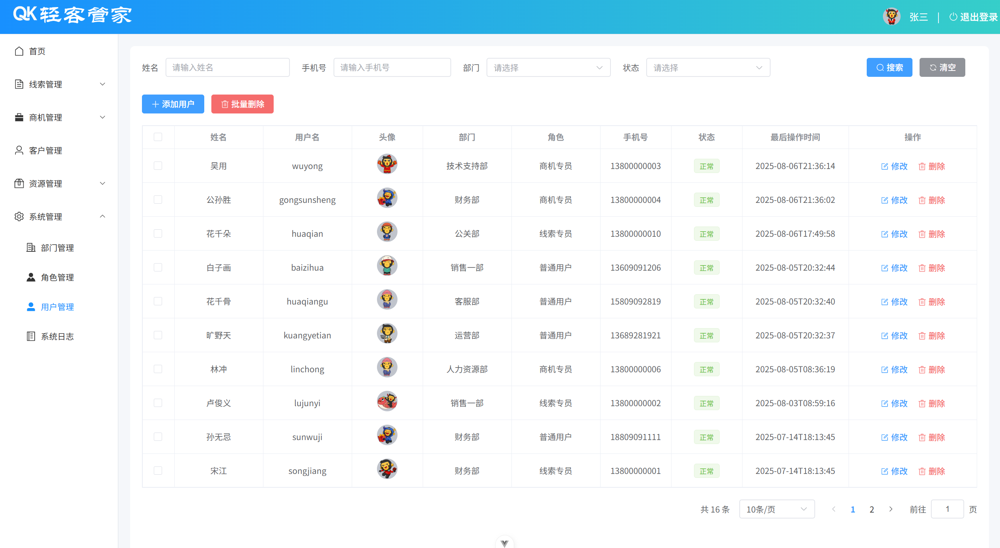

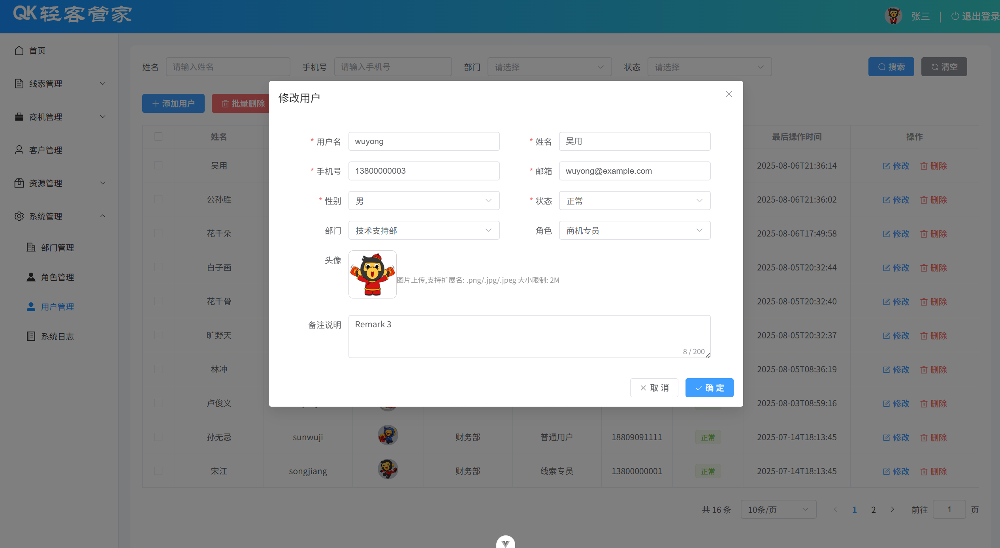

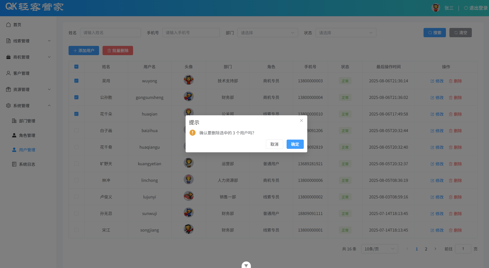

# 二、首页展示

## 1.需求

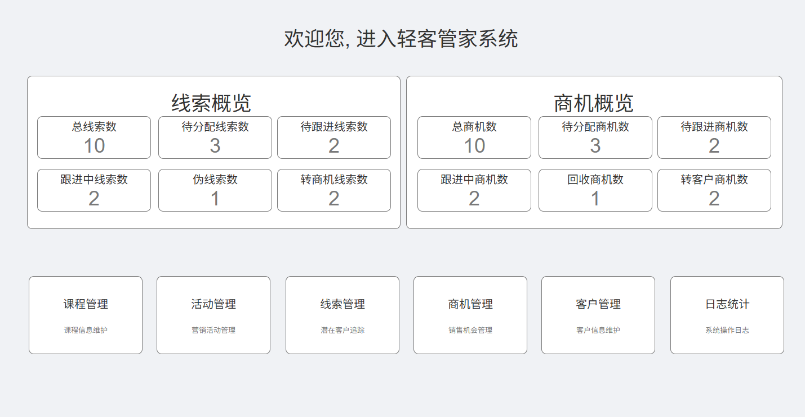

首页，展示的内容包括两个部分：

线索概览数据 及 商机概览数据

快捷操作栏，点击对应的卡片，可以直接定位到对应的菜单，进而操作对应的功能。

## 2.实现

> 提示词：
>
> 请根据页面原型和需求文档完成首页的页面开发, 主要用来展示线索、商机的概要信息，及一些快捷操作 。 具体要求如下:
> 1\. 技术栈: Vue3 \+ ElementPlus \+ Axios \+ Vue3生态其他组件
> 2\. 具体的接口信息如下：
>     2\.1 请求路径：/report/overview
>     2\.2 请求方式：GET
>     2\.3 接口描述：查询首页线索、商机的概览数据
>     2\.4 响应数据: 
>         \{
>             "code": 1,
>             "msg": "success",
>             "data": \{
>                 "clueTotal": 9,
>                 "clueWaitAllot": 3,
>                 "clueWaitFollow": 3,
>                 "clueFollowing": 1,
>                 "clueFalse": 0,
>                 "clueConvertBusiness": 2,
>                 "businessTotal": 2,
>                 "businessWaitAllot": 2,
>                 "businessWaitFollow": 0,
>                 "businessFollowing": 0,
>                 "businessFalse": 0,
>                 "businessConvertCustomer": 0
>             \}
>         \}
>     2\.5 响应数据说明: 
>           \|\- clueTotal: 总线索数
>           \|\- clueWaitAllot: 待分配线索数
>           \|\- clueWaitFollow: 待跟进线索数
>           \|\- clueFollowing: 跟进中线索数
>           \|\- clueFalse: 伪线索数
>           \|\- clueConvertBusiness: 转商机线索数
>           \|\- businessTotal: 总商机数
>           \|\- businessWaitAllot: 待分配商机数
>           \|\- businessWaitFollow: 待跟进商机数
>           \|\- businessFollowing: 跟进中商机数
>           \|\- businessFalse: 回收商机数
>           \|\- businessConvertCustomer: 转客户商机数
> 3\. 页面风格，适配当前已完成的页面，api层的js定义，也需要与 dept\.js 的代码风格保持一致。

AI生成的代码，调整后的内容如下：

1.在 `src/api` 目录下增加 `home.js` 文件，内容如下：

```javascript
import request from "@/utils/request"

// 查询首页线索、商机的概览数据
export const getOverviewApi = () => request.get('/report/overview') 
```

2.生成 `src/views/home/index.vue` 的页面布局和逻辑，内容如下：

```vue
<script setup>
import { ref, onMounted } from 'vue'
import { useRouter } from 'vue-router'
import { getOverviewApi } from '@/api/home'
import { ElMessage } from 'element-plus'
import { Document, Briefcase, User,  Notebook, Calendar,  Memo} from '@element-plus/icons-vue'

const router = useRouter()

// 概览数据
const overviewData = ref({
  clueTotal: 0,
  clueWaitAllot: 0,
  clueWaitFollow: 0,
  clueFollowing: 0,
  clueFalse: 0,
  clueConvertBusiness: 0,
  businessTotal: 0,
  businessWaitAllot: 0,
  businessWaitFollow: 0,
  businessFollowing: 0,
  businessFalse: 0,
  businessConvertCustomer: 0
})

// 快捷操作菜单
const quickActions = [
  {
    title: '课程管理',
    subtitle: '课程信息维护',
    icon: Notebook,
    route: '/resource/course',
    color: '#409EFF'
  },
  {
    title: '活动管理',
    subtitle: '营销活动管理',
    icon: Calendar,
    route: '/resource/activity',
    color: '#67C23A'
  },
  {
    title: '线索管理',
    subtitle: '潜在客户追踪',
    icon: Document,
    route: '/clue/list',
    color: '#E6A23C'
  },
  {
    title: '商机管理',
    subtitle: '销售机会管理',
    icon: Briefcase,
    route: '/business/list',
    color: '#F56C6C'
  },
  {
    title: '客户管理',
    subtitle: '客户信息维护',
    icon: User,
    route: '/customer',
    color: '#909399'
  },
  {
    title: '日志统计',
    subtitle: '系统操作日志',
    icon: Memo,
    route: '/system/log',
    color: '#9C27B0'
  }
]

onMounted(() => {
  loadOverviewData()
})

// 加载概览数据
const loadOverviewData = async () => {
  try {
    const result = await getOverviewApi()
    if (result.code === 1) {
      overviewData.value = result.data
    } else {
      ElMessage.error(result.msg || '获取概览数据失败')
    }
  } catch (error) {
    console.error('获取概览数据失败:', error)
    ElMessage.error('获取概览数据失败，请稍后重试')
  }
}

// 快捷操作跳转
const handleQuickAction = (route) => {
  router.push(route)
}
</script>

<template>
  <div class="home-container">
    <!-- 欢迎标题 -->
    <div class="welcome-section">
      <h1 class="welcome-title">欢迎您，进入轻客管家系统</h1>
    </div>

    <!-- 概览数据区域 -->
    <div class="overview-section">
      <!-- 线索概览 -->
      <div class="overview-card">
        <div class="card-header">
          <h3 class="card-title">线索概览</h3>
        </div>
        <div class="card-content">
          <div class="metric-grid">
            <div class="metric-item">
              <div class="metric-value">{{ overviewData.clueTotal }}</div>
              <div class="metric-label">总线索数</div>
            </div>
            <div class="metric-item">
              <div class="metric-value">{{ overviewData.clueWaitAllot }}</div>
              <div class="metric-label">待分配线索数</div>
            </div>
            <div class="metric-item">
              <div class="metric-value">{{ overviewData.clueWaitFollow }}</div>
              <div class="metric-label">待跟进线索数</div>
            </div>
            <div class="metric-item">
              <div class="metric-value">{{ overviewData.clueFollowing }}</div>
              <div class="metric-label">跟进中线索数</div>
            </div>
            <div class="metric-item">
              <div class="metric-value">{{ overviewData.clueFalse }}</div>
              <div class="metric-label">伪线索数</div>
            </div>
            <div class="metric-item">
              <div class="metric-value">{{ overviewData.clueConvertBusiness }}</div>
              <div class="metric-label">转商机线索数</div>
            </div>
          </div>
        </div>
      </div>

      <!-- 商机概览 -->
      <div class="overview-card">
        <div class="card-header">
          <h3 class="card-title">商机概览</h3>
        </div>
        <div class="card-content">
          <div class="metric-grid">
            <div class="metric-item">
              <div class="metric-value">{{ overviewData.businessTotal }}</div>
              <div class="metric-label">总商机数</div>
            </div>
            <div class="metric-item">
              <div class="metric-value">{{ overviewData.businessWaitAllot }}</div>
              <div class="metric-label">待分配商机数</div>
            </div>
            <div class="metric-item">
              <div class="metric-value">{{ overviewData.businessWaitFollow }}</div>
              <div class="metric-label">待跟进商机数</div>
            </div>
            <div class="metric-item">
              <div class="metric-value">{{ overviewData.businessFollowing }}</div>
              <div class="metric-label">跟进中商机数</div>
            </div>
            <div class="metric-item">
              <div class="metric-value">{{ overviewData.businessFalse }}</div>
              <div class="metric-label">回收商机数</div>
            </div>
            <div class="metric-item">
              <div class="metric-value">{{ overviewData.businessConvertCustomer }}</div>
              <div class="metric-label">转客户商机数</div>
            </div>
          </div>
        </div>
      </div>
    </div>

    <!-- 快捷操作区域 -->
    <div class="quick-actions-section">
      <h3 class="section-title">快捷操作</h3>
      <div class="actions-grid">
        <div 
          v-for="action in quickActions" 
          :key="action.title"
          class="action-card"
          @click="handleQuickAction(action.route)"
        >
          <div class="action-icon" :style="{ backgroundColor: action.color }">
            <el-icon :size="24" color="#fff">
              <component :is="action.icon" />
            </el-icon>
          </div>
          <div class="action-content">
            <div class="action-title">{{ action.title }}</div>
            <div class="action-subtitle">{{ action.subtitle }}</div>
          </div>
        </div>
      </div>
    </div>
  </div>
</template>

<style scoped>
.home-container {
  padding: 20px;
  background-color: #fff;
  min-height: 100%;
  border-radius: 8px;
}

.welcome-section {
  text-align: center;
  margin-bottom: 30px;
}

.welcome-title {
  font-size: 28px;
  color: #333;
  margin: 0;
  font-weight: 500;
}

.overview-section {
  display: grid;
  grid-template-columns: 1fr 1fr;
  gap: 20px;
  margin-bottom: 30px;
}

.overview-card {
  background-color: #f8f9fa;
  border-radius: 8px;
  padding: 20px;
  box-shadow: 0 2px 8px rgba(0, 0, 0, 0.1);
}

.card-header {
  margin-bottom: 20px;
}

.card-title {
  font-size: 18px;
  color: #333;
  margin: 0;
  font-weight: 500;
}

.metric-grid {
  display: grid;
  grid-template-columns: repeat(3, 1fr);
  gap: 15px;
}

.metric-item {
  text-align: center;
  padding: 15px;
  background-color: #fff;
  border-radius: 6px;
  box-shadow: 0 1px 3px rgba(0, 0, 0, 0.1);
  transition: transform 0.2s ease;
}

.metric-item:hover {
  transform: translateY(-2px);
}

.metric-value {
  font-size: 24px;
  font-weight: bold;
  color: #409EFF;
  margin-bottom: 8px;
}

.metric-label {
  font-size: 12px;
  color: #666;
  line-height: 1.4;
}

.quick-actions-section {
  margin-top: 30px;
}

.section-title {
  font-size: 18px;
  color: #333;
  margin-bottom: 20px;
  font-weight: 500;
}

.actions-grid {
  display: grid;
  grid-template-columns: repeat(6, 1fr);
  gap: 20px;
}

.action-card {
  background-color: #fff;
  border-radius: 8px;
  padding: 20px;
  text-align: center;
  box-shadow: 0 2px 8px rgba(0, 0, 0, 0.1);
  cursor: pointer;
  transition: all 0.3s ease;
  border: 1px solid #f0f0f0;
}

.action-card:hover {
  transform: translateY(-4px);
  box-shadow: 0 4px 16px rgba(0, 0, 0, 0.15);
  border-color: #409EFF;
}

.action-icon {
  width: 50px;
  height: 50px;
  border-radius: 50%;
  display: flex;
  align-items: center;
  justify-content: center;
  margin: 0 auto 15px;
}

.action-content {
  text-align: center;
}

.action-title {
  font-size: 16px;
  color: #333;
  font-weight: 500;
  margin-bottom: 8px;
}

.action-subtitle {
  font-size: 12px;
  color: #666;
  line-height: 1.4;
}

/* 响应式设计 */
@media (max-width: 1200px) {
  .actions-grid {
    grid-template-columns: repeat(3, 1fr);
  }
}

@media (max-width: 768px) {
  .overview-section {
    grid-template-columns: 1fr;
  }
  
  .actions-grid {
    grid-template-columns: repeat(2, 1fr);
  }
  
  .metric-grid {
    grid-template-columns: repeat(2, 1fr);
  }
}
</style>

```

最终生成的页面内容如下所示:


# 三、登录退出

## 1.登录

### 1.1.需求

员工的增删改查功能我们完成之后，最后我们再来完成一个功能，那就是登录退出功能。


登录页面所在位置为：`src/views/login/index.vue`，页面的基本布局，我们在资料中已经提供好了，可以直接复制进来。

### 1.2.准备工作

1.将资料中准备的登录的基础页面布局复制进来（`src/views/login/index.vue`）。

```vue
<script setup>
import { ref } from 'vue'
import { ElMessage } from 'element-plus'

const loginForm = ref({
  username: '',
  password: ''
})

const handleLogin = async () => {

}
</script>

<template>
  <div class="login-container">
    <div class="login-box">
      <div class="system-title">轻客管家</div>
      <el-form :model="loginForm" >
        <el-form-item label="用户名">
          <el-input v-model="loginForm.username" placeholder="请输入用户名">
            <template #prefix>
              <el-icon><User /></el-icon>
            </template>
          </el-input>
        </el-form-item>
        <el-form-item label="密&nbsp;&nbsp;&nbsp;&nbsp;码">
          <el-input v-model="loginForm.password" type="password" placeholder="请输入密码">
            <template #prefix>
              <el-icon><Lock /></el-icon>
            </template>
          </el-input>
        </el-form-item>
        <el-form-item>
          <el-button type="primary" class="login-btn" @click="handleLogin">登录</el-button>
        </el-form-item>
      </el-form>
    </div>
  </div>
</template>

<style scoped>
.login-container {
  height: 100vh;
  display: flex;
  justify-content: center;
  align-items: center;
  background: url('@/assets/bg.jpg') center center / cover no-repeat;
  position: relative;
  overflow: hidden;
}

.login-container::before {
  content: '';
  position: absolute;
  width: 200%;
  height: 200%;
  top: -50%;
  left: -50%;
  background: radial-gradient(circle, rgba(255,255,255,0.1) 0%, rgba(255,255,255,0) 60%);
  animation: rotate 30s linear infinite;
}

.system-title {
  font-family: 华文隶书;
  font-size: 50px;
  text-align: center;
  margin-bottom: 30px;
}

@keyframes rotate {
  from { transform: rotate(0deg); }
  to { transform: rotate(360deg); }
}

.login-box {
  width: 450px;
  padding: 40px;
  background-color: rgba(255, 255, 255, 0.9);
  border-radius: 16px;
  box-shadow: 0 8px 32px rgba(0, 0, 0, 0.1);
  backdrop-filter: blur(10px);
  border: 1px solid rgba(255, 255, 255, 0.2);
  position: relative;
  z-index: 1;
}

.el-input {
  margin-bottom: 20px;
  width: 100%;
}

.el-form-item:last-child {
  margin-bottom: 0;
}
.el-button {
  width: 100%;
  height: 40px;
  font-size: 16px;
  background: linear-gradient(90deg, #1890ff, #36cfc9);
  border: none;
  transition: transform 0.3s ease;
}

.el-button:hover {
  transform: translateY(-2px);
  box-shadow: 0 4px 12px rgba(24, 144, 255, 0.3);
}

.login-btn {
  width: 100%;
  margin-top: 10px;
}

</style>
```

2.在 `router/index.js` 中配置路由信息

```javascript
import { createRouter, createWebHistory } from 'vue-router'

const routes = [
  {
    path: '/',
    name: 'layout',
    component: () => import('../views/layout/Layout.vue'),
    children: [
      { path: '', name: 'home', component: () => import('../views/home/index.vue') },
      { path: 'clue/list', name: 'clue-list', component: () => import('../views/clue/list.vue') },
      { path: 'clue/pool', name: 'clue-pool', component: () => import('../views/clue/pool.vue') },
      { path: 'business/list', name: 'business-list', component: () => import('../views/business/list.vue') },
      { path: 'business/pool', name: 'business-pool', component: () => import('../views/business/pool.vue') },
      { path: 'customer', name: 'customer', component: () => import('../views/customer/index.vue') },
      { path: 'resource/course', name: 'resource-course', component: () => import('../views/resource/course.vue') },
      { path: 'resource/activity', name: 'resource-activity', component: () => import('../views/resource/activity.vue') },
      { path: 'system/dept', name: 'system-dept', component: () => import('../views/system/dept.vue') },
      { path: 'system/role', name: 'system-role', component: () => import('../views/system/role.vue') },
      { path: 'system/user', name: 'system-user', component: () => import('../views/system/user.vue') },
      { path: 'system/log', name: 'system-log', component: () => import('../views/system/log.vue') },
    ]
  },
  {
    path: '/login',
    name: 'login',
    component: () => import('../views/login/index.vue')
  },
]

const router = createRouter({
  history: createWebHistory(import.meta.env.BASE_URL),
  routes,
})

export default router

```

### 1.3.功能实现

1.在 `src/api` 目录下增加 `login.js`，代码如下：

```javascript
import request from '@/utils/request'

//登录
export const loginApi = (data) => request.post('/login', data)
```

2.在 `src/views/login/index.vue` 中完成登录功能的代码实现，具体代码如下：

```vue
<script setup>
import { ref } from 'vue'
import { ElMessage } from 'element-plus'
import { loginApi } from '@/api/login'
import { useRouter } from 'vue-router'

const router = useRouter()
const loginForm = ref({
  username: '',
  password: ''
})

const handleLogin = async () => {
  const result = await loginApi(loginForm.value)
  if (result.code == 1) {
    ElMessage.success("登录成功")
    localStorage.setItem('token', result.data.token)
    localStorage.setItem('userInfo', JSON.stringify(result.data))

    // 路由到 /
    router.push('/')
  } else {
    ElMessage.error(result.msg)
  }
}
</script>

<template>
  <div class="login-container">
    <div class="login-box">
      <div class="system-title">轻客管家</div>
      <el-form :model="loginForm" >
        <el-form-item label="用户名">
          <el-input v-model="loginForm.username" placeholder="请输入用户名">
            <template #prefix>
              <el-icon><User /></el-icon>
            </template>
          </el-input>
        </el-form-item>
        <el-form-item label="密&nbsp;&nbsp;&nbsp;&nbsp;码">
          <el-input v-model="loginForm.password" type="password" placeholder="请输入密码">
            <template #prefix>
              <el-icon><Lock /></el-icon>
            </template>
          </el-input>
        </el-form-item>
        <el-form-item>
          <el-button type="primary" class="login-btn" @click="handleLogin">登录</el-button>
        </el-form-item>
      </el-form>
    </div>
  </div>
</template>

<style scoped>
.login-container {
  height: 100vh;
  display: flex;
  justify-content: center;
  align-items: center;
  background: url('@/assets/bg.jpg') center center / cover no-repeat;
  position: relative;
  overflow: hidden;
}

.login-container::before {
  content: '';
  position: absolute;
  width: 200%;
  height: 200%;
  top: -50%;
  left: -50%;
  background: radial-gradient(circle, rgba(255,255,255,0.1) 0%, rgba(255,255,255,0) 60%);
  animation: rotate 30s linear infinite;
}

.system-title {
  font-family: 华文隶书;
  font-size: 50px;
  text-align: center;
  margin-bottom: 30px;
}

@keyframes rotate {
  from { transform: rotate(0deg); }
  to { transform: rotate(360deg); }
}

.login-box {
  width: 450px;
  padding: 40px;
  background-color: rgba(255, 255, 255, 0.9);
  border-radius: 16px;
  box-shadow: 0 8px 32px rgba(0, 0, 0, 0.1);
  backdrop-filter: blur(10px);
  border: 1px solid rgba(255, 255, 255, 0.2);
  position: relative;
  z-index: 1;
}

.el-input {
  margin-bottom: 20px;
  width: 100%;
}

.el-form-item:last-child {
  margin-bottom: 0;
}
.el-button {
  width: 100%;
  height: 40px;
  font-size: 16px;
  background: linear-gradient(90deg, #1890ff, #36cfc9);
  border: none;
  transition: transform 0.3s ease;
}

.el-button:hover {
  transform: translateY(-2px);
  box-shadow: 0 4px 12px rgba(24, 144, 255, 0.3);
}

.login-btn {
  width: 100%;
  margin-top: 10px;
}

</style>
```

> localStorage介绍：
>
> `localStorage` 是浏览器提供的本地存储机制，存储空间约5MB，存储形式为key\-value形式，键和值均为字符串类型。
>
> API方法：
>
> - `localStorage.setItem(key, value)`：存储key\-value
>
> - `localStorage.getItem(key)`：根据key获取value
>
> - `localStorage.removeItem(key)`：根据key删除对应的键值对
>
> - `localStorage.clear()`：清空

代码编写完毕后，我们就可以打开浏览器测试一下。

用户名，密码输入错误

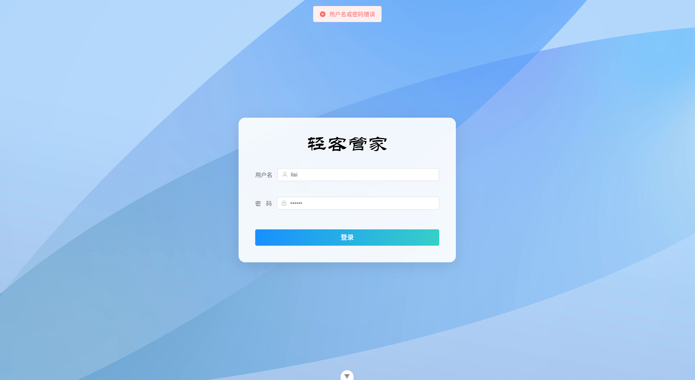

用户名密码输入正确

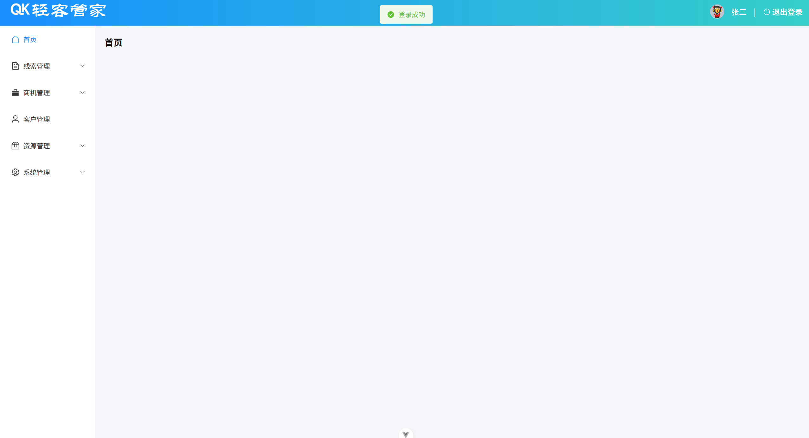

### 1.4.携带令牌访问服务端

在用户登录成功之后，在后续的每一次请求中，我们都需要携带令牌访问服务器端。而在一个项目中，与服务器交互的次数是非常多的，如果在每一次的增、删、改、查操作中，我们都从localStorage中将令牌取出来，然后再添加到请求头中，是非常繁琐的，那其实，我们所有的请求基本都是基于axios的实例发起的，所以，我们可以借助于axios的拦截器，来简化我们的操作。具体流程如下：

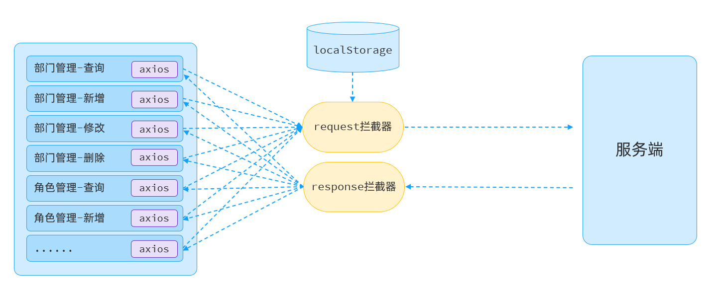

具体流程为：

在请求服务端的时候，我们在axios的请求拦截器中，拦截到所有的请求，然后从localStorage中获取token令牌，添加在请求头中，携带到服务端。

服务端，接收到请求会对请求进行拦截校验，如果令牌非法，会响应401状态，那这里呢，我们可以借助于response响应拦截器，拦截服务端响应数据，一旦发现状态码为401，直接路由到登录页面。

具体代码实现为，在 `src/utils/request.js` 中增加如下代码:

```javascript
import axios from 'axios'
import router from '@/router'
import { ElMessage } from 'element-plus'

//创建axios实例对象
const request = axios.create({
  baseURL: '/api',
  timeout: 600000
})

//axios的请求 request 拦截器
request.interceptors.request.use(
  (config) => { //成功回调
    const token =  localStorage.getItem('token')
    if (token) {
      config.headers.token = token
    }
    return config
  },
  (error) => { //失败回调
    return Promise.reject(error)
  }
)

//axios的响应 response 拦截器
request.interceptors.response.use(
  (response) => { //成功回调
    return response.data
  },
  (error) => { //失败回调
    if(error && error.status == 401){
      localStorage.removeItem('token')
      localStorage.removeItem('userInfo')
      router.push('/login')
      ElMessage.error('登录已过期，请重新登录')
    }else{
      ElMessage.error('系统异常')
    }
    return Promise.reject(error)
  }
)

export default request
```

代码编写完成之后，打开浏览器进行测试：

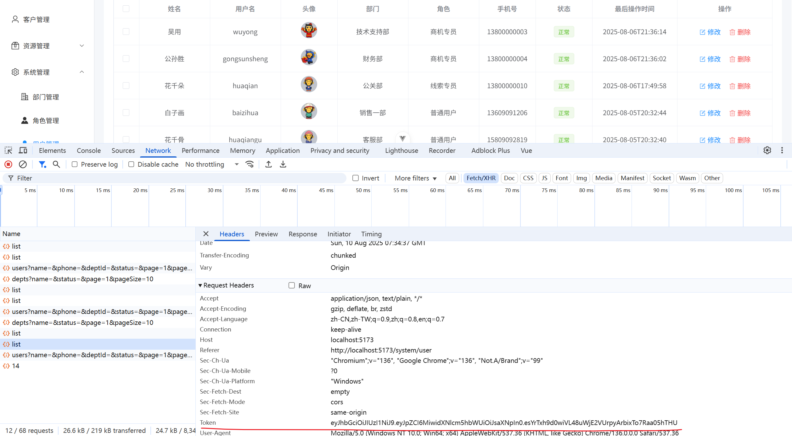

我们可以看到，在后续的每一次请求时，都会携带令牌访问服务器端。

## 2.退出

### 2.1.需求

登录功能完成之后，我们再来完成退出功能。

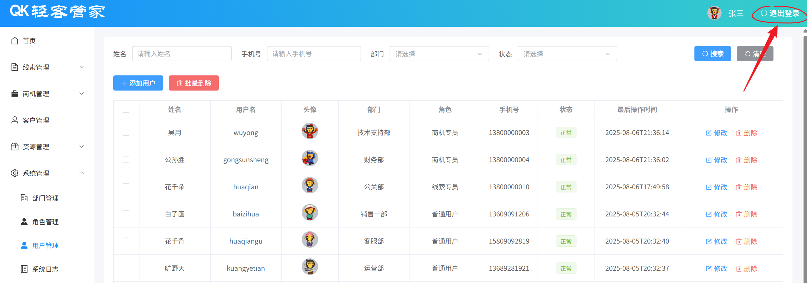

退出登录功能的具体逻辑：

点击退出登录，打开确认框，如果点击确认，则执行退出操作，需要清空localStorage中的登录信息，并跳转到登录页面。

### 2.2.实现

在 `src/views/layout/Layout.vue` 中增加退出登录的功能实现

```vue
<script setup>
import {onMounted, ref} from 'vue'
import { useRouter } from 'vue-router'
import { ElMessageBox,ElMessage } from 'element-plus'

const router = useRouter()
//当前登录用户信息
const userInfo = ref({})

//获取当前登录用户信息
onMounted(() => {
  userInfo.value = JSON.parse(localStorage.getItem('userInfo'))
})

//退出登录
const logout = () => { 
  ElMessageBox.confirm('确定要退出登录吗？', '提示', {
    confirmButtonText: '确定',
    cancelButtonText: '取消',
    type: 'warning'
  }).then(() => {
    localStorage.removeItem('userInfo')
    localStorage.removeItem('token')
    ElMessage.success('退出登录成功')
    // 跳转到登录页面
    router.push('/login')
  }).catch(() => {
    ElMessage.info('取消退出登录')
  })
}

</script>

<template>
  <el-container class="layout-container">
    <!-- 头部 -->
    <el-header height="60px">
      <div class="header-left">
        <span class="system-title">轻客管家</span>
      </div>
      <div class="header-right">
        <el-avatar :size="30" :src="userInfo.image" />
        <span class="username">{{ userInfo.name }}</span> <span style="color: #fff;">|</span>
        <el-link type="primary" class="logout" underline="never" @click="logout"><el-icon><SwitchButton /></el-icon> &nbsp;退出登录</el-link>
      </div>
    </el-header>
    
    <el-container>
      <!-- 侧边栏 -->
      <el-aside width="200px">
        <el-menu :default-active="$route.path" class="el-menu-vertical-demo" background-color="#fff" text-color="#333" active-text-color="#1890ff" router>
          <el-menu-item index="/">
            <el-icon><House /></el-icon>
            <span>首页</span>
          </el-menu-item>

          <el-sub-menu index="clue">
            <template #title>
              <el-icon><Document /></el-icon><span>线索管理</span>
            </template>
            <el-menu-item index="/clue/list">
              <el-icon><List /></el-icon><span>线索列表</span>
            </el-menu-item>
            <el-menu-item index="/clue/pool">
              <el-icon><Collection /></el-icon><span>线索池</span>
            </el-menu-item>
          </el-sub-menu>

          <el-sub-menu index="business">
            <template #title>
              <el-icon><Briefcase /></el-icon><span>商机管理</span>
            </template>
            <el-menu-item index="/business/list">
              <el-icon><List /></el-icon><span>商机列表</span>
            </el-menu-item>
            <el-menu-item index="/business/pool">
              <el-icon><Coin /></el-icon><span>公海池</span>
            </el-menu-item>
          </el-sub-menu>

          <el-menu-item index="/customer">
            <el-icon><User /></el-icon><span>客户管理</span>
          </el-menu-item>

          <el-sub-menu index="resource">
            <template #title>
              <el-icon><Box /></el-icon><span>资源管理</span>
            </template>
            <el-menu-item index="/resource/course">
              <el-icon><Notebook /></el-icon><span>课程管理</span>
            </el-menu-item>
            <el-menu-item index="/resource/activity">
              <el-icon><Calendar /></el-icon><span>活动管理</span>
            </el-menu-item>
          </el-sub-menu>

          <el-sub-menu index="system">
            <template #title>
              <el-icon><Setting /></el-icon><span>系统管理</span>
            </template>
            <el-menu-item index="/system/dept">
              <el-icon><OfficeBuilding /></el-icon><span>部门管理</span>
            </el-menu-item>
            <el-menu-item index="/system/role">
              <el-icon><Avatar /></el-icon><span>角色管理</span>
            </el-menu-item>
            <el-menu-item index="/system/user">
              <el-icon><UserFilled /></el-icon><span>用户管理</span>
            </el-menu-item>
            <el-menu-item index="/system/log">
              <el-icon><Memo /></el-icon><span>系统日志</span>
            </el-menu-item>
          </el-sub-menu>

        </el-menu>
      </el-aside>

      <!-- 主要内容区 -->
      <el-main>
        <router-view />
      </el-main>
    </el-container>
  </el-container>
</template>

<style scoped>
.layout-container {
  height: 100vh;
}

.el-header {
  background: linear-gradient(90deg, #1890ff 0%, #36cfc9 100%);
  border-bottom: 1px solid #dcdfe6;
  display: flex;
  justify-content: space-between;
  align-items: center;
  padding: 0 20px;
}

.system-title {
  font-family: 华文隶书;
  font-size: 40px;
  margin: 0;
  color: #fff;  /* 由于背景色变深，文字改为白色 */
}

.username {
  font-size: 16px;
  color: #fff;  /* 用户名也改为白色 */
}

.logout {
  font-size: 16px;
  color: #fff !important;  /* 退出登录链接也改为白色 */
}

.header-right {
  display: flex;
  align-items: center;
  gap: 15px;
}

.username {
  font-size: 16px;
}

.logout {
  font-size: 16px;
}

.el-aside {
  background-color: #fff;
  border-right: 1px solid #dcdfe6;
}

.el-menu {
  border-right: none;
}

.el-main {
  background-color: #f5f7fa;
  padding: 20px;
}
</style>
```

代码编写完毕之后，打开浏览器测试一下：

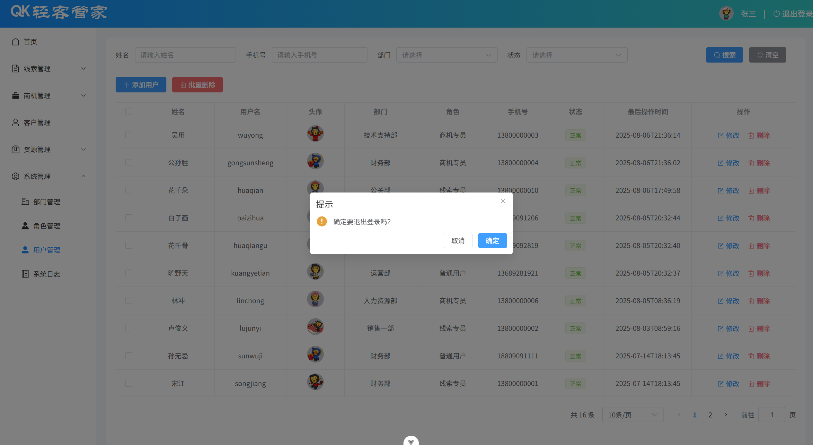

## 3.图片上传401问题

目前，我们已经完成了部门管理，用户管理，以及登录退出等所有的功能。 但是其实目前程序中还存在一点小问题，那就是图片上传的时候，服务器端响应 401。如下图：

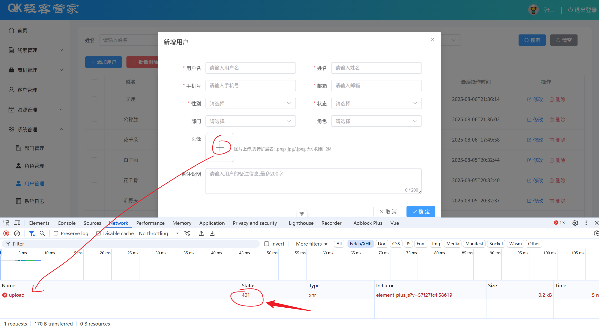

出现这个问题的原因是因为图片上传我们使用的是 ElementPlus 中提供的 `el-upload` 组件，请求服务端的时候并未通过 `axios`，所以也并不会通过我们配置的axios的拦截器，携带请求头token 了。 服务器端，拦截到请求之后，发现未携带令牌，就会出现这个问题。

那接下来，针对于这个文件上传的请求，我们则需要单独处理一下。处理思路如下：

- 页面加载完毕后，从localStorage中获取登录员工信息，然后获取到token令牌。

- 然后在文件上传时，在请求头中将令牌携带到服务端。

具体操作步骤：

在 `src/views/system/user.vue` 中的 `<script></script>` 添加如下代码，最终完整代码如下：

```vue
<script setup>
import { ref, onMounted } from 'vue'
import { 
  queryPageApi, 
  queryDeptListApi, 
  queryRoleListApi,
  addUserApi,
  queryUserInfoApi,
  updateUserApi,
  deleteUserApi
} from '@/api/user'
import { ElMessage, ElMessageBox } from 'element-plus'

// 查询参数
const queryParams = ref({
  name: '',
  phone: '',
  deptId: '',
  status: '',
  page: 1,
  pageSize: 10
})

// 表格数据
const userList = ref([])
const total = ref(0)
const deptList = ref([])
const roleList = ref([])
const selectedUsers = ref([])

// 表单相关
const userFormRef = ref()
const userForm = ref({
  username: '',
  name: '',
  phone: '',
  email: '',
  gender: '',
  status: '',
  deptId: '',
  roleId: '',
  image: '',
  remark: ''
})

// 对话框
const dialog = ref({
  title: '',
  visible: false
})

// 表单验证规则
const rules = ref({
  username: [
    { required: true, message: '请输入用户名', trigger: 'blur' },
    { min: 2, max: 20, message: '长度在 2 到 20 个字符', trigger: 'blur' }
  ],
  name: [
    { required: true, message: '请输入姓名', trigger: 'blur' },
    { min: 2, max: 20, message: '长度在 2 到 20 个字符', trigger: 'blur' }
  ],
  phone: [
    { required: true, message: '请输入手机号', trigger: 'blur' },
    { pattern: /^1[3-9]\d{9}$/, message: '请输入正确的手机号', trigger: 'blur' }
  ],
  email: [
    { required: true, message: '请输入邮箱', trigger: 'blur' },
    { type: 'email', message: '请输入正确的邮箱地址', trigger: 'blur' },
    { min: 5, max: 50, message: '长度在 5 到 50 个字符', trigger: 'blur' }
  ],
  gender: [
    { required: true, message: '请选择性别', trigger: 'change' }
  ],
  status: [
    { required: true, message: '请选择状态', trigger: 'change' }
  ]
})

// 文件上传相关
const uploadAction = '/api/upload' // 根据实际接口调整
const uploadHeaders = ref({}) // 文件上传组件header信息

onMounted(() => {
  loadDeptList()
  loadRoleList()
  search()
  
  //加载localStorage的token
  const token = localStorage.getItem('token')
  console.log('token:', token);
  if(token){
    uploadHeaders.value = { token: token }
  }
})

// 加载部门列表
const loadDeptList = async () => {
  const result = await queryDeptListApi()
  if (result.code === 1) {
    deptList.value = result.data
  }
}

// 加载角色列表
const loadRoleList = async () => {
  const result = await queryRoleListApi()
  if (result.code === 1) {
    roleList.value = result.data
  }
}

// 查询按钮
const search = async () => {
  const result = await queryPageApi(queryParams.value)
  if (result.code === 1) {
    userList.value = result.data.rows
    total.value = result.data.total
  } else {
    ElMessage.error(result.msg || '查询失败')
  }
}

// 重置查询
const clear = () => {
  queryParams.value = {
    name: '',
    phone: '',
    deptId: '',
    status: '',
    page: 1,
    pageSize: 10
  }
  search()
}

// 分页大小改变
const handleSizeChange = (val) => {
  search()
}

// 页码改变
const handleCurrentChange = (val) => {
  search()
}

// 选择变化
const handleSelectionChange = (selection) => {
  selectedUsers.value = selection
}

// 添加用户按钮
const handleAdd = () => {
  dialog.value.title = '新增用户'
  dialog.value.visible = true
  userForm.value = {
    username: '',
    name: '',
    phone: '',
    email: '',
    gender: '',
    status: '',
    deptId: '',
    roleId: '',
    image: '',
    remark: ''
  }
  if (userFormRef.value) {
    userFormRef.value.resetFields()
  }
}

// 修改用户按钮
const handleEdit = async (id) => {
  const result = await queryUserInfoApi(id)
  if (result.code === 1) {
    userForm.value = result.data
    dialog.value.title = '修改用户'
    dialog.value.visible = true
    if (userFormRef.value) {
      userFormRef.value.resetFields()
    }
  } else {
    ElMessage.error(result.msg)
  }
}

// 删除用户按钮
const handleDelete = async (id) => {
  ElMessageBox.confirm('您确认要删除该用户吗？', '提示', {
    confirmButtonText: '确定',
    cancelButtonText: '取消',
    type: 'warning'
  }).then(async () => {
    const result = await deleteUserApi(id)
    if (result.code === 1) {
      ElMessage.success('删除成功')
      search()
    } else {
      ElMessage.error(result.msg || '删除失败')
    }
  })
}

// 批量删除按钮
const handleBatchDelete = () => {
  if (selectedUsers.value.length === 0) {
    ElMessage.warning('请选择要删除的用户')
    return
  }
  
  const ids = selectedUsers.value.map(user => user.id).join(',')
  ElMessageBox.confirm(`确认要删除选中的 ${selectedUsers.value.length} 个用户吗？`, '提示', {
    confirmButtonText: '确定',
    cancelButtonText: '取消',
    type: 'warning'
  }).then(async () => {
    const result = await deleteUserApi(ids)
    if (result.code === 1) {
      ElMessage.success('批量删除成功')
      search()
    } else {
      ElMessage.error(result.msg || '批量删除失败')
    }
  })
}

// 保存按钮
const save = async () => {
  userFormRef.value.validate(async (valid) => {
    if (!valid) return
    let result
    if (userForm.value.id) {
      // 修改用户
      result = await updateUserApi(userForm.value)
    } else {
      // 添加用户
      result = await addUserApi(userForm.value)
    }
    
    if (result.code === 1) {
      dialog.value.visible = false
      ElMessage.success(userForm.value.id ? '修改成功' : '添加成功')
      search()
    } else {
      ElMessage.error(result.msg || '操作失败')
    }
  })
}

// 头像上传成功
const handleAvatarSuccess = (response, file) => {
  if (response.code === 1) {
    userForm.value.image = response.data
    ElMessage.success('头像上传成功')
  } else {
    ElMessage.error(response.msg || '头像上传失败')
  }
}

// 头像上传前验证
const beforeAvatarUpload = (file) => {
  const isJPG = file.type === 'image/jpeg' || file.type === 'image/jpg'
  const isPNG = file.type === 'image/png'
  const isLt2M = file.size / 1024 / 1024 < 2

  if (!isJPG && !isPNG) {
    ElMessage.error('头像只能是 JPG/PNG 格式!')
    return false
  }
  if (!isLt2M) {
    ElMessage.error('头像大小不能超过 2MB!')
    return false
  }
  return true
}
</script>

<template>
  <div class="user">
    <!-- 搜索区域 -->
    <el-form :inline="true" :model="queryParams" ref="queryForm" class="search-form">
      <el-form-item label="姓名">
        <el-input v-model="queryParams.name" placeholder="请输入姓名"/>
      </el-form-item>
      <el-form-item label="手机号">
        <el-input v-model="queryParams.phone" placeholder="请输入手机号"/>
      </el-form-item>
      <el-form-item label="部门">
        <el-select v-model="queryParams.deptId" placeholder="请选择" clearable>
          <el-option  v-for="dept in deptList"  :key="dept.id"  :label="dept.name"  :value="dept.id" />
        </el-select>
      </el-form-item>
      <el-form-item label="状态">
        <el-select v-model="queryParams.status" placeholder="请选择" clearable>
          <el-option label="正常" :value="1" />
          <el-option label="停用" :value="0" />
        </el-select>
      </el-form-item>
      <el-form-item class="search-buttons">
        <el-button type="primary" @click="search"><el-icon><Search /></el-icon>搜索</el-button>
        <el-button type="info" @click="clear"><el-icon><Refresh /></el-icon>清空</el-button>
      </el-form-item>
    </el-form>

    <!-- 操作按钮区域 -->
    <div class="operation-area">
      <el-button type="primary" @click="handleAdd"><el-icon><Plus /></el-icon>添加用户</el-button>
      <el-button type="danger" @click="handleBatchDelete"><el-icon><Delete /></el-icon>批量删除</el-button>
    </div>

    <!-- 表格区域 -->
    <el-table :data="userList" style="width: 100%" border @selection-change="handleSelectionChange">
      <el-table-column type="selection" width="55" align="center" />
      <el-table-column prop="name" label="姓名" width="150" align="center" />
      <el-table-column prop="username" label="用户名" width="150" align="center" />
      <el-table-column label="头像" width="120" align="center">
        <template #default="scope">
          <el-avatar :size="35" :src="scope.row.image" />
        </template>
      </el-table-column>
      <el-table-column prop="deptName" label="部门" width="150" align="center" />
      <el-table-column prop="roleName" label="角色" width="150" align="center" />
      <el-table-column prop="phone" label="手机号" width="120" align="center" />
      <el-table-column prop="status" label="状态" width="120" align="center">
        <template #default="scope">
          <el-tag :type="scope.row.status === 1 ? 'success' : 'danger'">
            {{ scope.row.status === 1 ? '正常' : '停用' }}
          </el-tag>
        </template>
      </el-table-column>
      <el-table-column prop="updateTime" label="最后操作时间" width="180" align="center" />
      <el-table-column label="操作" align="center">
        <template #default="scope">
          <el-button type="primary" link @click="handleEdit(scope.row.id)"><el-icon><Edit /></el-icon>修改</el-button>
          <el-button type="danger" link @click="handleDelete(scope.row.id)"><el-icon><Delete /></el-icon>删除</el-button>
        </template>
      </el-table-column>
    </el-table>

    <!-- 分页区域 -->
    <div class="pagination">
      <el-pagination
        v-model:current-page="queryParams.page"
        v-model:page-size="queryParams.pageSize"
        :page-sizes="[10, 20, 30, 40, 50]"
        layout="total, sizes, prev, pager, next, jumper"
        :total="total"
        @size-change="handleSizeChange"
        @current-change="handleCurrentChange"
      />
    </div>

    <!-- 添加/修改用户对话框 -->
    <el-dialog :title="dialog.title" v-model="dialog.visible" width="800px" class="user-dialog">
      <el-form :model="userForm" ref="userFormRef" :rules="rules" label-width="80px" class="user-form">
        <el-row :gutter="20">
          <el-col :span="12">
            <el-form-item label="用户名" prop="username">
              <el-input v-model="userForm.username" placeholder="请输入用户名" />
            </el-form-item>
          </el-col>
          <el-col :span="12">
            <el-form-item label="姓名" prop="name">
              <el-input v-model="userForm.name" placeholder="请输入姓名" />
            </el-form-item>
          </el-col>
        </el-row>
        <el-row :gutter="20">
          <el-col :span="12">
            <el-form-item label="手机号" prop="phone">
              <el-input v-model="userForm.phone" placeholder="请输入手机号" />
            </el-form-item>
          </el-col>
          <el-col :span="12">
            <el-form-item label="邮箱" prop="email">
              <el-input v-model="userForm.email" placeholder="请输入邮箱" />
            </el-form-item>
          </el-col>
        </el-row>
        <el-row :gutter="20">
          <el-col :span="12">
            <el-form-item label="性别" prop="gender">
              <el-select v-model="userForm.gender" placeholder="请选择" style="width: 100%">
                <el-option label="男" :value="1" />
                <el-option label="女" :value="2" />
              </el-select>
            </el-form-item>
          </el-col>
          <el-col :span="12">
            <el-form-item label="状态" prop="status">
              <el-select v-model="userForm.status" placeholder="请选择" style="width: 100%">
                <el-option label="正常" :value="1" />
                <el-option label="停用" :value="0" />
              </el-select>
            </el-form-item>
          </el-col>
        </el-row>
        <el-row :gutter="20">
          <el-col :span="12">
            <el-form-item label="部门" prop="deptId">
              <el-select v-model="userForm.deptId" placeholder="请选择" style="width: 100%">
                <el-option  v-for="dept in deptList" :key="dept.id" :label="dept.name" :value="dept.id" />
              </el-select>
            </el-form-item>
          </el-col>
          <el-col :span="12">
            <el-form-item label="角色" prop="roleId">
              <el-select v-model="userForm.roleId" placeholder="请选择" style="width: 100%">
                <el-option v-for="role in roleList" :key="role.id"  :label="role.name" :value="role.id" />
              </el-select>
            </el-form-item>
          </el-col>
        </el-row>
        <el-form-item label="头像">
          <el-upload
            class="avatar-uploader"
            :action="uploadAction"
            :show-file-list="false"
            :on-success="handleAvatarSuccess"
            :before-upload="beforeAvatarUpload"
            :headers="uploadHeaders"
            name="image"
          >
            
            <el-icon v-else class="avatar-uploader-icon"><Plus /></el-icon>
          </el-upload>
          <div class="upload-tip">图片上传,支持扩展名: .png/.jpg/.jpeg 大小限制: 2M</div>
        </el-form-item>
        <el-form-item label="备注说明" prop="remark">
          <el-input v-model="userForm.remark" type="textarea" :rows="3" placeholder="请输入用户的备注信息,最多200字" maxlength="200" show-word-limit/>
        </el-form-item>
      </el-form>
      <template #footer>
        <el-button @click="dialog.visible = false"><el-icon><Close /></el-icon>取 消</el-button>
        <el-button type="primary" @click="save"><el-icon><Check /></el-icon>确 定</el-button>
      </template>
    </el-dialog>

  </div>
</template>

<style scoped>
.user {
  padding: 20px;
  background-color: #fff;
  min-height: 100%;
  border-radius: 8px;
}

.operation-area {
  margin: 20px 0;
}

.search-form {
  display: flex;
  align-items: center;
  flex-wrap: wrap;
}

.search-form :deep(.el-form-item) {
  margin-right: 20px;
  margin-bottom: 10px;
  min-width: 250px;
}

.search-buttons {
  margin-left: auto !important;
  min-width: auto !important;
}

.pagination {
  margin-top: 20px;
  display: flex;
  justify-content: flex-end;
}

:deep(.el-button .el-icon) {
  margin-right: 4px;
}

:deep(.el-table .el-table__cell) {
  padding: 8px 0;
}

/* 用户对话框样式 */
:deep(.user-dialog .el-dialog__body) {
  padding-top: 30px;
}

.user-form {
  width: 90%;
  margin: 0 auto;
}

/* 头像上传样式 */
.avatar-uploader {
  text-align: center;
}

.avatar-uploader .el-upload {
  border: 1px dashed #d9d9d9;
  border-radius: 6px;
  cursor: pointer;
  position: relative;
  overflow: hidden;
  transition: var(--el-transition-duration-fast);
}

.avatar-uploader .el-upload:hover {
  border-color: var(--el-color-primary);
}

.avatar-uploader-icon {
  font-size: 28px;
  color: #8c939d;
  width: 80px;
  height: 80px;
  text-align: center;
  line-height: 80px;
  border: #d8d4d4 solid 1px;
  border-radius: 10%;
}

.avatar {
  width: 80px;
  height: 80px;
  display: block;
  border: #d8d4d4 solid 1px;
  border-radius: 10%;
}

.upload-tip {
  font-size: 12px;
  color: #999;
  margin-top: 8px;
  line-height: 1.4;
}
</style>
```

添加上头信息之后，就可以正常的进行文件上传了。

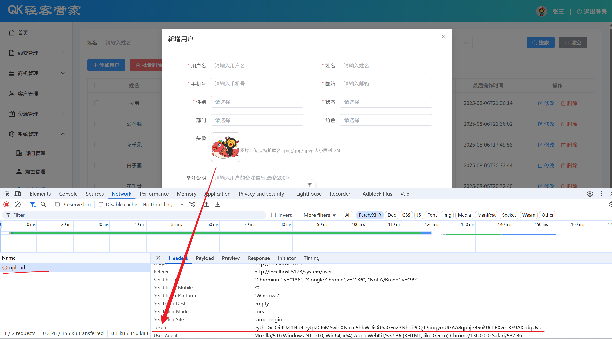

# 四、打包部署

到此呢，部门管理、用户管理、登录认证的功能，我们都已经完成了。 那接下来，我们就来说一下前端工程的打包部署。 前端项目最终开发完毕之后，是需要打包，然后部署在nginx服务器上运行的 。

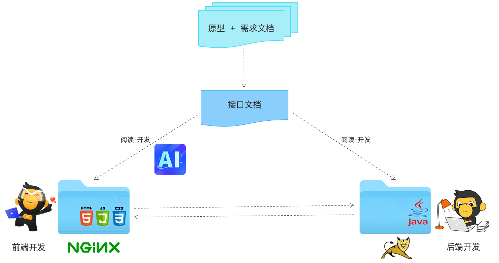

## 1.打包

直接双击npm脚本中的 `build` 即可将项目打包，打包后的文件会出现在 `dist` 目录中。

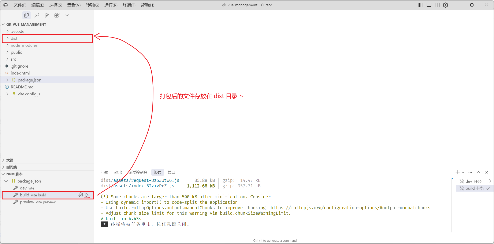

## 2.部署

**Nginx**

介绍：Nginx是一款轻量级的Web服务器/反向代理服务器及电子邮件（IMAP/POP3）代理服务器。其特点是占有内存少，并发能力强，在各大型互联网公司都有非常广泛的使用。

官网：[https://nginx\.org/](https://nginx.org/)

**部署**

打包完成之后，就可以将打包后的项目，部署到 `nginx` 服务器上了，记得将nginx解压到一个没有中文不带空格的目录中 。

然后直接将 `dist` 目录中的内容，拷贝到nginx的解压目录中的 `html` 中即可 \(html目录下原有的两个文件, 可以直接删除\)。

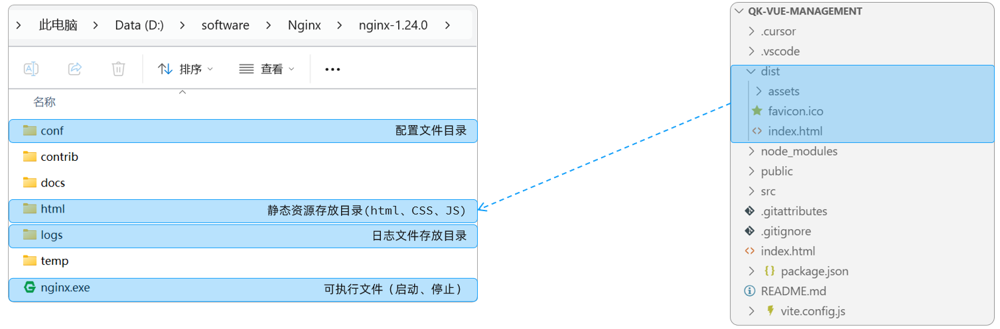

然后，在nginx服务器的核心配置文件 `conf/nginx` 中，在  `http` 配置块里面 添加如下反向代理的配置，完整的 `nginx.conf` 配置文件内容如下\(资料中已经提供, 直接替换默认的配置文件即可\):

```bash
#user  nobody;
worker_processes  1;

events {
    worker_connections  1024;
}


http {
    include       mime.types;
    default_type  application/octet-stream;

    sendfile        on;
    keepalive_timeout  65;

    server {
        listen       80;
        server_name  localhost;
        client_max_body_size 10m;

        location / {
           root   html;
           index  index.html index.htm;
           try_files $uri $uri/ /index.html;
        }
        
       location ^~ /api/ {
          rewrite ^/api/(.*)$ /$1 break;
          proxy_pass http://localhost:8080;
       }
        
        error_page   500 502 503 504  /50x.html;
        location = /50x.html {
           root   html;
        }
   }
}

```

然后就可以双击 `nginx.exe` 启动项目了。 访问 http://localhost

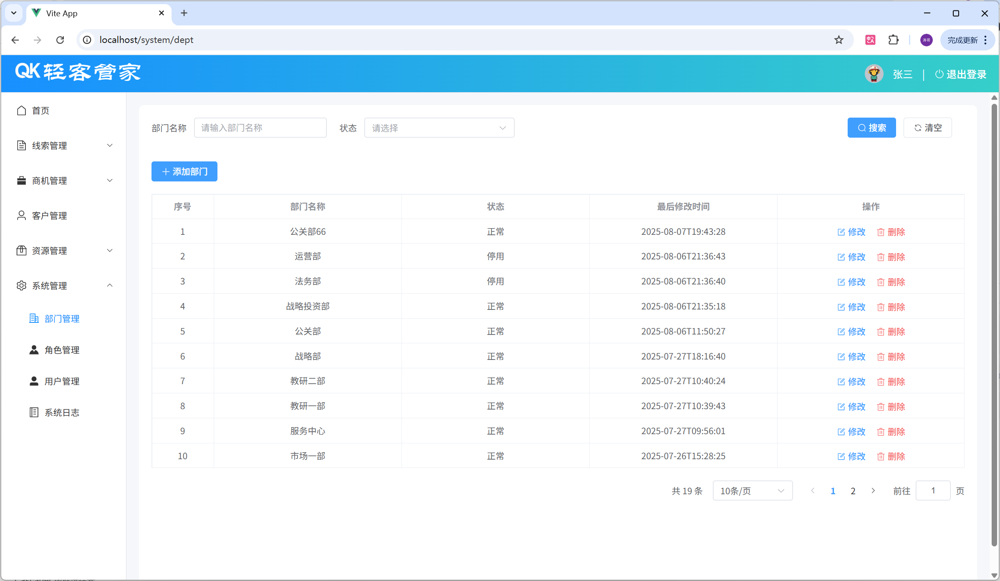
