# 一、Linux概述


Linux是一套免费使用和自由传播的操作系统。说到操作系统，大家比较熟知的应该就是Windows和MacOS操作系统，我们今天所学习的Linux也是一款操作系统。

我们作为javaEE开发工程师，将来在企业中开发时会涉及到很多的数据库、中间件等技术，比如MySQL、Redis、MQ等技术，而这些应用软件大多都是需要安装在Linux系统中使用的。我们做为开发人员，是需要通过远程工具连接Linux操作系统，然后来操作这些软件的。而且一些小公司，可能还需要我们自己在服务器上安装这些软件。

所以，不管从企业的用人需求层面，还是个人发展需要层面来讲，我们作为服务端开发工程师，Linux的基本使用是我们必不可少的技能。

对于Linux的常用指令的学习，最好的学习方法就是：多敲

## 1.主流操作系统

不同领域的主流操作系统，主要分为以下这么几类： 桌面操作系统、服务器操作系统、移动设备操作系统、嵌入式操作系统。接下来，这几个领域中，代表性的操作系统是那些?

1.桌面操作系统

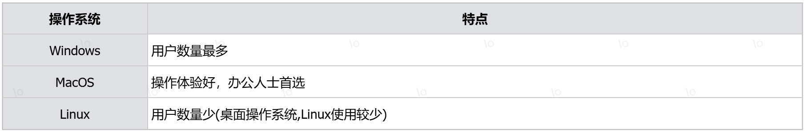

2.服务器操作系统

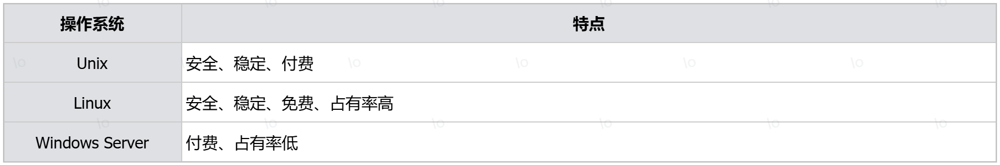

3.移动设备操作系统

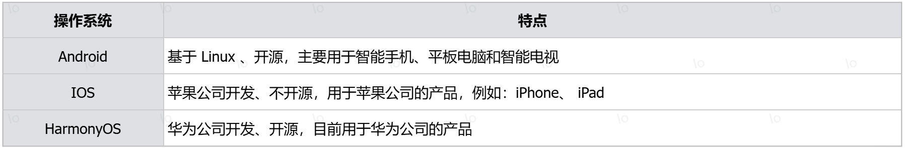

## 2.Linux系统版本

Linux系统的版本分为两种，分别是： 内核版 和 发行版。

1.内核版

- 由Linus Torvalds及其团队开发、维护

- 免费、开源

- 负责控制硬件

2.发行版

- 基于Linux内核版进行扩展

- 由各个Linux厂商开发、维护

- 有收费版本和免费版本

我们使用Linux操作系统，实际上选择的是Linux的发行版本。在linux系统中，有各种各样的发行版本，具体如下： 

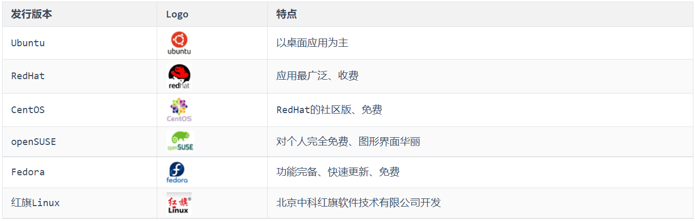

除了上述罗列出来的发行版，还有很多Linux发行版，这里，我们就不再一一列举了。

## 3.系统安装

### 3.1.安装方式

Linux系统的安装方式，主要包含以下两种：


虚拟机（Virtual Machine）指通过软件模拟的具有完整硬件系统功能、运行在完全隔离环境中的完整计算机系统。常用虚拟机软件： 

- VMWare 

- VirtualBox

- VMLite WorkStation

- Qemu

- HopeddotVOS

那么我们就可以将Linux操作系统安装在虚拟机中，我们选择的虚拟机软件是VMware。

### 3.2.安装VMware


在我们的资料中提供了VMware的安装程序。找到资料中的 Vmware的安装包（exe文件），然后双击下一步下一步的安装即可。


备注：如果之前安装过，就不用安装了。不要卸载！！！！ 不要卸载！！！！  不要卸载！！！！

安装步骤:

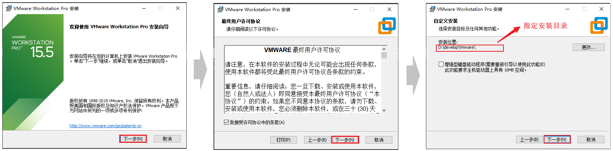

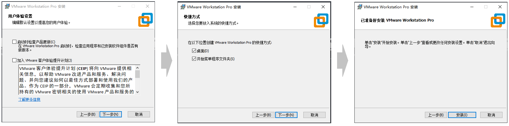

以上就是VMware在安装时的每一步操作，基本上就是点击 "下一步" 一直进行安装。

### 3.3.挂载Linux系统

1.打开Vmware虚拟机，打开 `编辑` \-\> `虚拟网络编辑器(N)...`

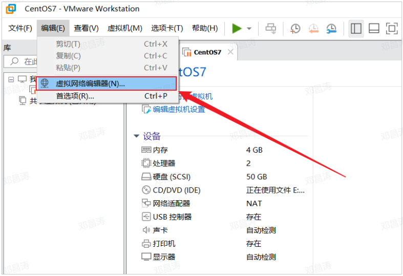

选择 `NAT模式`，然后选择右下角的 `更改设置`。

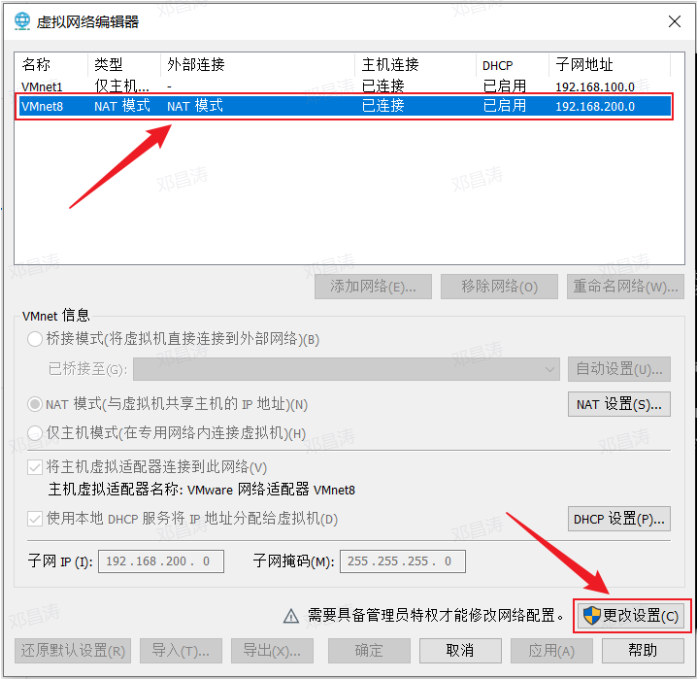

设置子网IP为 `192.168.100.0`，然后选择 `应用` \-\> `确定`。

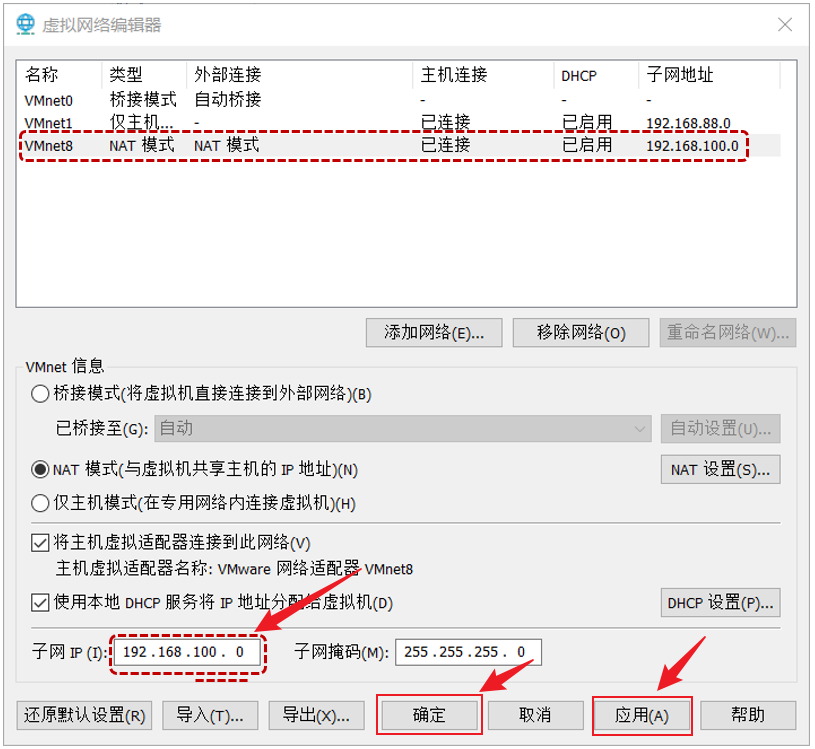

2.解压 `资料/Linux镜像/CentOS7-1.zip` 到一个比较大的磁盘中 \(没有中文的目录\)。

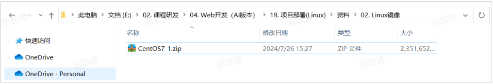

3.打开解压目录，双击 `.vmx` 文件，选择以 `Vmware Workstation` 打开这个文件。

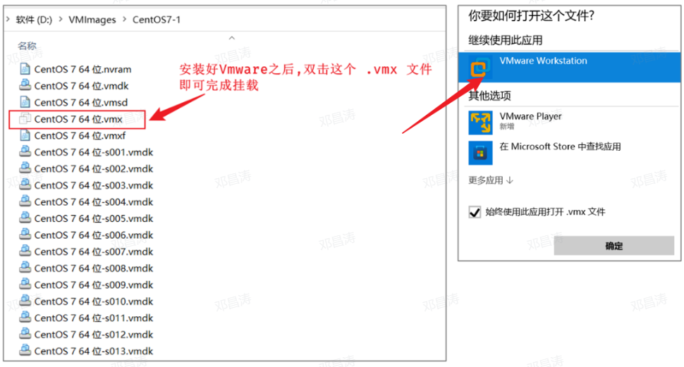

4.挂载完毕之后，启动Linux服务器。

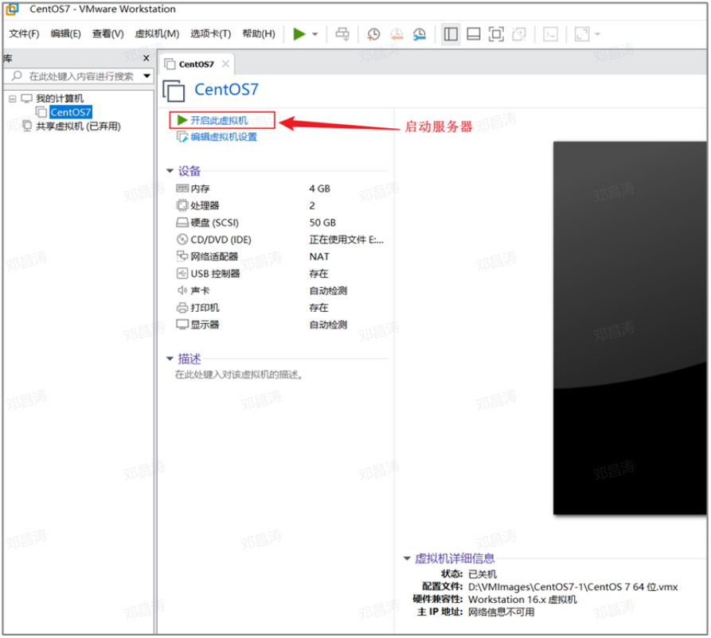

启动过程中，如果出现如下界面，选择 `我已移动该虚拟机`。

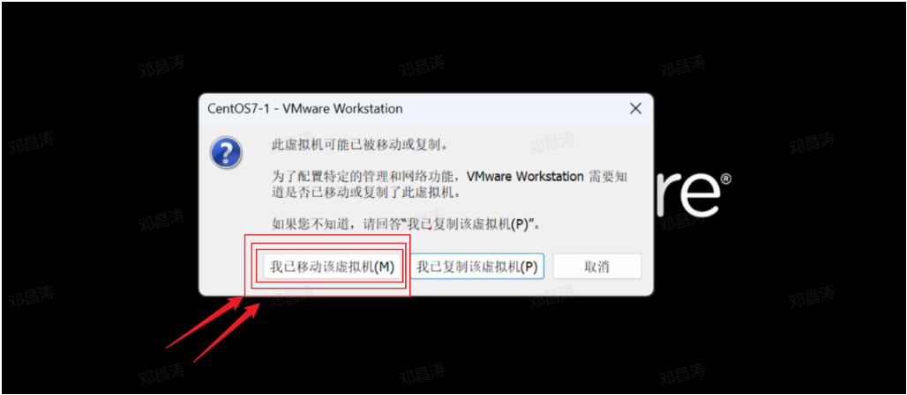

5.启动完毕之后，登录服务器。 输入用户名：`root`，密码：`1234`  （注意：linux系统输入密码是不显示的，输入完毕，回车即可登录）

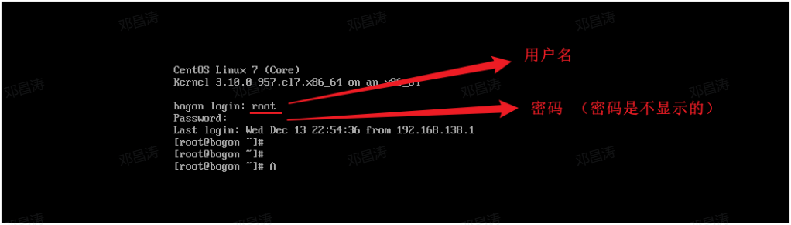

## 4.安装SSH连接工具

### 4.1.SSH连接工具介绍

Linux已经安装并且配置好了，接下来我们要来学习Linux的基本操作指令。而在学习之前，我们还需要做一件事情，由于我们企业开发时，Linux服务器一般都是在远程的机房部署的，我们要操作服务器，不会每次都跑到远程的机房里面操作，而是会直接通过SSH连接工具进行连接操作。


SSH（Secure Shell），建立在应用层基础上的安全协议。常用的SSH连接工具: 

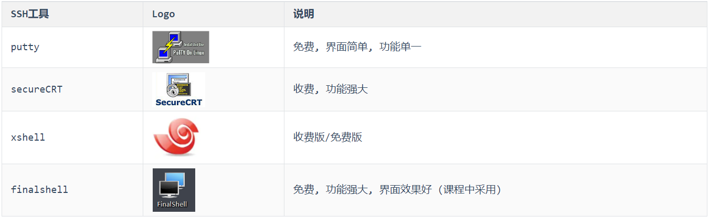

### 4.2.FinalShell安装

在资料中，提供了finalShell的安装包（"资料/03\. 远程连接工具"）。


双击\.exe文件，然后进行正常的安装即可。

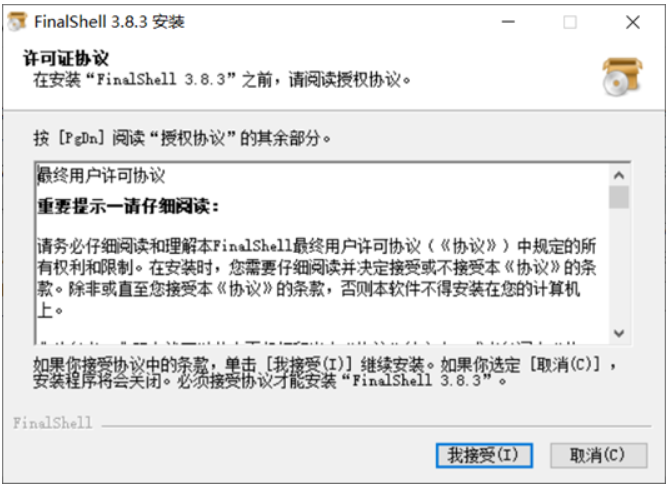

### 4.3.连接Linux

打开FinalShell，选择SSH连接。

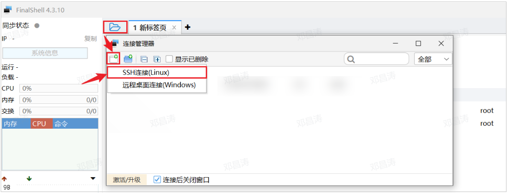

连接服务器，输入服务器的信息，IP固定的：`192.168.100.128`，用户名：`root`，密码：`1234`

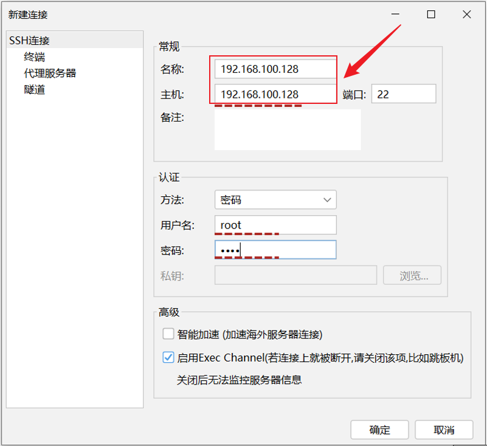

配置完毕后,双击即可连接服务器。

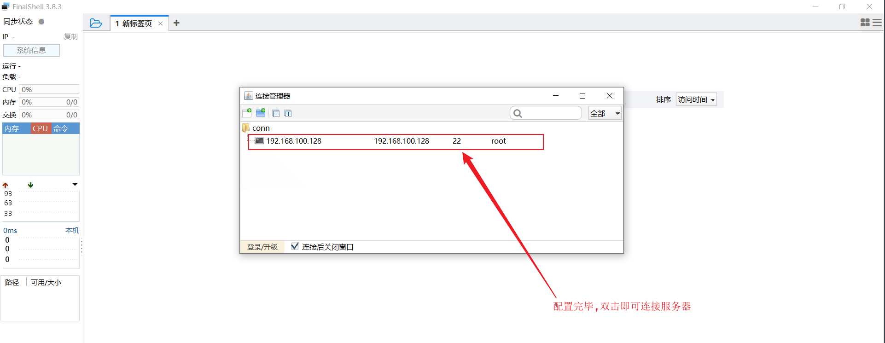

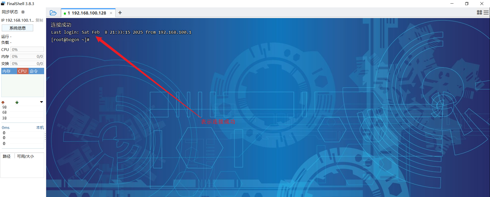

## 5.目录结构

登录到Linux系统之后，我们需要先来熟悉一下Linux的目录结构。在Linux系统中，也是存在目录的概念的，但是Linux的目录结构和Windows的目录结构是存在比较多的差异的 在Windows目录下，是一个一个的盘符\(C盘、D盘、E盘\)，目录是归属于某一个盘符的。Linux系统中的目录有以下特点： 

- / 是所有目录的顶点

- 目录结构像一颗倒挂的树

Linux 和 Windows的目录结构对比: 

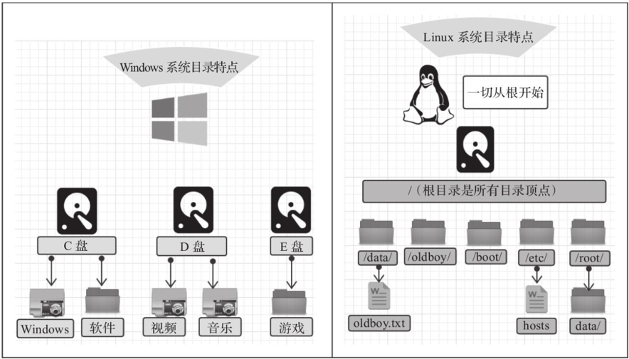

Linux的目录结构，如下： 

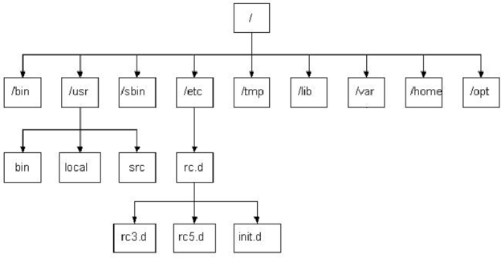

根目录 / 下各个目录的作用及含义说明:  

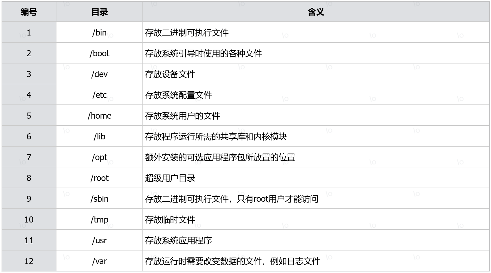

# 二、Linux常用命令

## 1.Linux命令初体验

Linux 命令格式：`command [-options] [parameter]`

说明：

- command：命令名

- \[\-options\]：选项，可用来对命令进行控制，也可以省略 （可选）

- \[parameter\]：参数，可以是零个、一个或多个（可选）

例如：

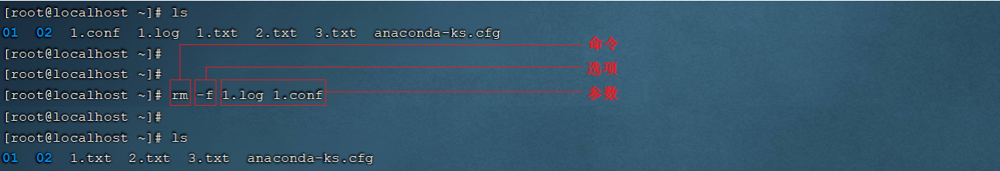

> 使用技巧：
>
> - Tab键自动补全
>
> - 连续两次Tab键，给出操作提示
>
> - 使用上下箭头快速调出曾经使用过的命令
>
> - 使用clear命令或Ctrl\+l快捷键实现清屏
>

## 2.目录操作命令

### 2.1.ls

> 作用: 显示指定目录下的内容
>
> 语法: `ls [-al] [dir]`
>
> 说明:
>
> - `-a` 显示所有文件及目录 \(\. 开头的隐藏文件也会列出\)
> - `-l` 除文件名称外，同时将文件型态\(d表示目录，\-表示文件\)、权限、拥有者、文件大小等信息详细列出
>
> 注意:
>
> 由于我们使用ls命令时经常需要加入\-l选项，所以Linux为 `ls -l` 命令提供了一种简写方式，即 `ll`   
>
> 常见用法:
>
> - `ls -al`           查看当前目录的所有文件及目录详细信息
> - `ls -al /etc`  查看/etc目录下所有文件及目录详细信息
> - `ll`                 查看当前目录文件及目录的详细信息 

操作示例:

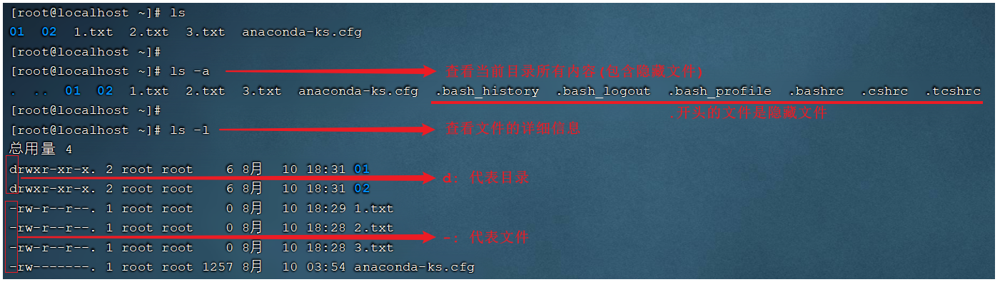

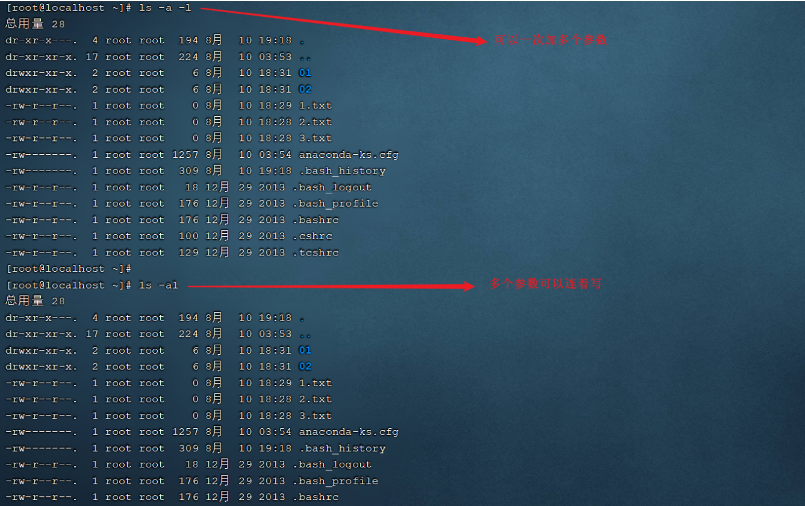

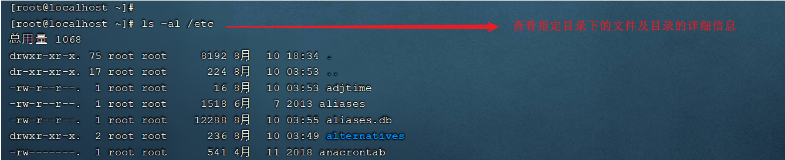

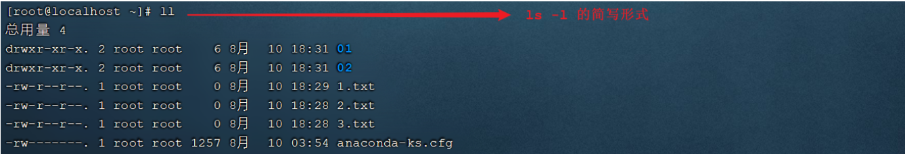

### 2.2.cd

> 作用: 用于切换当前工作目录，即进入指定目录
>
> 语法: cd \[dirName\]
>
> 特殊说明:
>
> - \~        表示用户的home目录
>
> - \.         表示目前所在的目录
>
> - \.\.        表示目前目录位置的上级目录
>
>
> 举例:
>
> - cd         \.\.                切换到当前目录的上级目录
>
> - cd         \~                切换到用户的home目录
>
> - cd         /usr/local     切换到/usr/local目录
>
>
> 用户的home目录 
>
> - root用户        /root
>
> - 其他用户        /home/xxx
>

操作示例: 

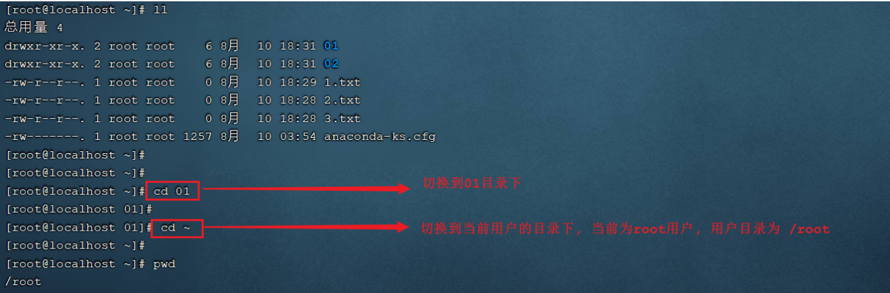

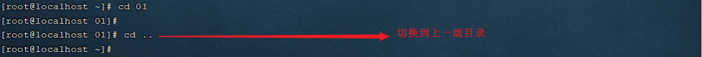

cd \.\. 切换到当前目录位置的上级目录; 可以通过 cd \.\./\.\. 来切换到上级目录的上级目录。

### 2.3.mkdir

> 作用: 创建目录
>
> 语法: `mkdir [-p] dirName`
>
> 说明:
>
> \-p: 确保目录名称存在，不存在的就创建一个。通过此选项，可以实现多层目录同时创建
>
> 举例:
>
> - mkdir itcast  在当前目录下，建立一个名为itcast的子目录
>
> - mkdir \-p itcast/test   在工作目录下的itcast目录中建立一个名为test的子目录，若itcast目录不存在，则建立一个

操作演示:

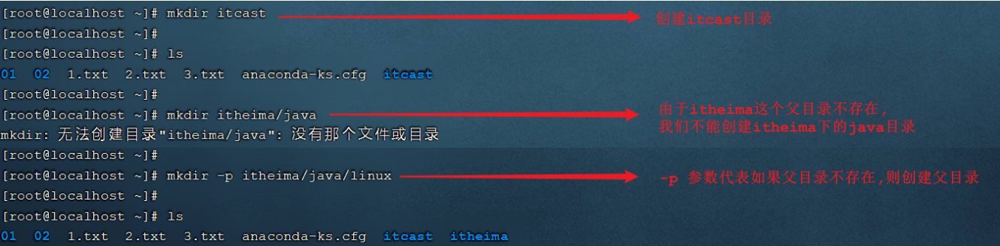

### 2.4.rm

> 作用: 删除文件或者目录
>
> 语法: `rm [-rf] name`
>
> 说明:
>
> - \-r: 将目录及目录中所有文件（目录）逐一删除，即递归删除
>
> - \-f: 无需确认，直接删除 
>
>
> 举例:
>
> - `rm -r itcast/`    删除名为itcast的目录和目录中所有文件，删除前需确认
> - `rm -rf itcast/`    无需确认，直接删除名为itcast的目录和目录中所有文件
>
> - `rm -f hello.txt`   无需确认，直接删除hello\.txt文件

操作示例: 

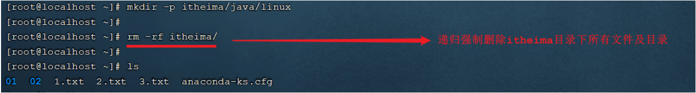

注意: 对于 `rm -rf xxx` 这样的指令，在执行的时候，一定要慎重，确认无误后再进行删除，避免误删。

## 3.文件操作命令

### 3.1.cat

> 作用: 用于显示文件内容
>
> 语法: `cat [-n] fileName`
>
> 说明:
>
> `-n`: 由1开始对所有输出的行数编号
>
> 举例:
>
> `cat /etc/profile`                查看/etc目录下的profile文件内容

操作演示: 

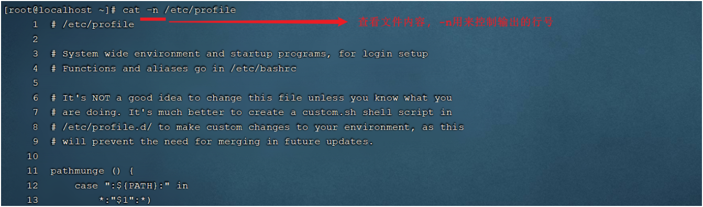

cat 指令会一次性查看文件的所有内容，如果文件内容比较多，这个时候查看起来就不是很方便了，这个时候我们可以通过一个新的指令more。

### 3.2.more

> 作用: 以分页的形式显示文件内容
>
> 语法: `more fileName`
>
> 操作说明:
>
> - 回车键               向下滚动一行
>
> - 空格键               向下滚动一屏
>
> - b                       返回上一屏
>
> - q或者Ctrl\+C        退出more 
>
> 举例：
>
> more /etc/profile                以分页方式显示/etc目录下的profile文件内容

操作示例：

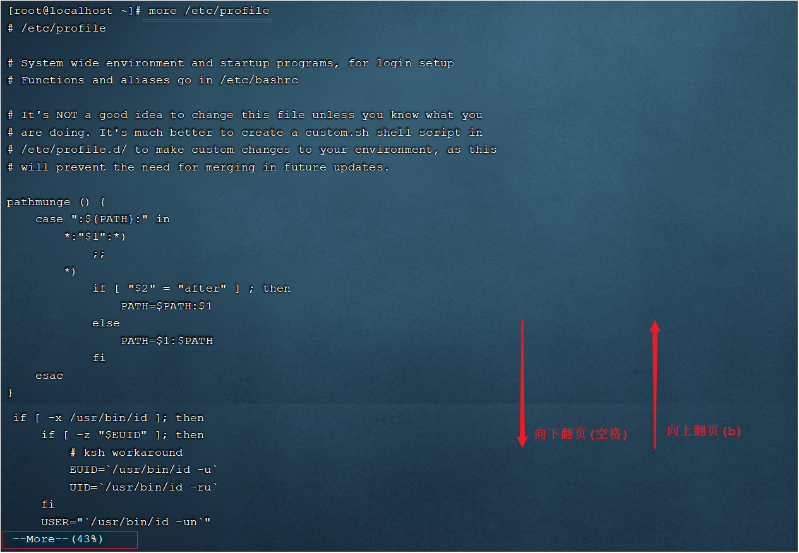

当我们在查看一些比较大的文件时，我们可能需要经常查询文件尾部的数据信息，那这个时候如果文件很大，我们要一直向下翻页，直到最后一页，去看最新添加的数据，这种方式就比较繁琐了，此时，我们可以借助于tail指令。

### 3.3.head

> 作用：查看文件开头的内容
>
> 语法：`head`` [``-n``] ``fileName`
>
> 说明:
>
> \-n ：输出文件开头的n行内容
>
> 举例：
>
> - head 1\.log  默认显示1\.log文件开头的10行内容
>
> - head \-20 1\.log  显示1\.log文件开头的20行内容

### 3.4.tail

> 作用: 查看文件末尾的内容
>
> 语法: tail \[\-f\] fileName
>
> 说明:
>
> \-f : 动态读取文件末尾内容并显示，通常用于日志文件的内容输出   
>
> 举例: 
>
> - tail /etc/profile                显示/etc目录下的profile文件末尾10行的内容
>
> - tail \-20 /etc/profile           显示/etc目录下的profile文件末尾20行的内容
>
> - tail \-f /itcast/my\.log          动态读取/itcast目录下的my\.log文件末尾内容并显示

操作示例： 

1\. 默认查询文件尾部10行记录

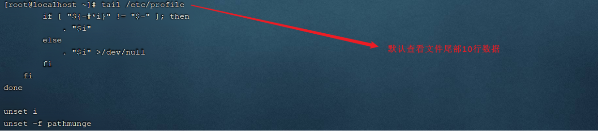

2\. 可以通过指定参数设置查询尾部指定行数的数据

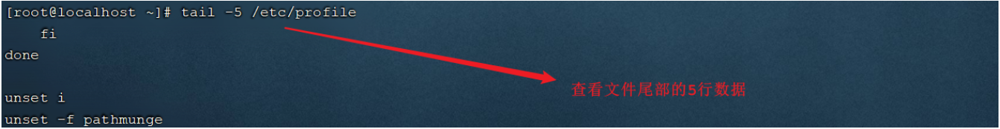

3\. 动态读取文件尾部的数据

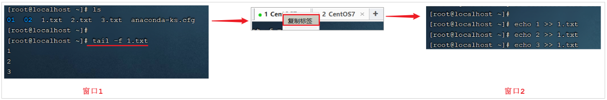

在窗口1中执行指令 `tail -f 1.txt` 动态查看文件尾部的数据。然后在顶部的标签中右键选择 "复制标签"，打开新的窗口2 , 此时再新打开的窗口2中执行指令 `echo 1 >> 1.txt` , 往1\.txt文件尾部追加内容，然后我们就可以在窗口1中看到最新的文件尾部的数据。

如果我们不想查看文件尾部的数据了，可以直接使用快捷键 Ctrl\+C ， 结束当前进程。

## 4.拷贝移动命令

### 4.1.cp

> 作用: 用于复制文件或目录
>
> 语法: cp \[\-r\] source dest
>
> 说明:
>
> \-r: 如果复制的是目录需要使用此选项，此时将复制该目录下所有的子目录和文件
>
> 举例:
>
> - cp hello\.txt itcast/            将hello\.txt复制到itcast目录中
>
> - cp hello\.txt \./hi\.txt           将hello\.txt复制到当前目录，并改名为hi\.txt
>
> -  cp \-r itcast/ \./itheima/    将itcast目录和目录下所有文件复制到itheima目录下
>
> - cp \-r itcast/\* \./itheima/    将itcast目录下所有文件复制到itheima目录下
>

操作示例: 

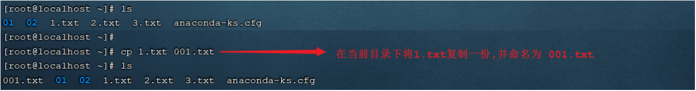

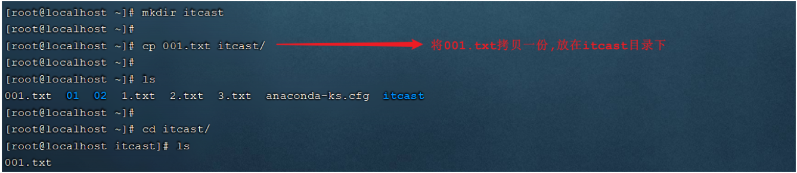

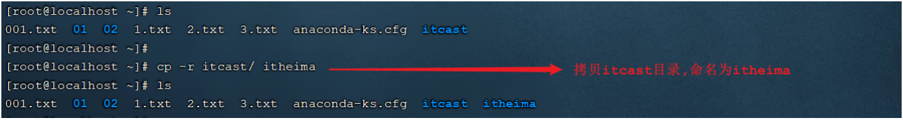

如果拷贝的内容是目录，需要加上参数 \-r 

### 4.2.mv

> 作用: 为文件或目录改名、或将文件或目录移动到其它位置
>
> 语法: mv source dest
>
> 举例:
>
> - mv hello\.txt hi\.txt                   将hello\.txt改名为hi\.txt
>
> - mv hi\.txt itheima/                   将文件hi\.txt移动到itheima目录中
>
> - mv hi\.txt itheima/hello\.txt        将hi\.txt移动到itheima目录中，并改名为hello\.txt
>
> - mv itcast/ itheima/                 如果itheima目录不存在，将itcast目录改名为itheima
>
> - mv itcast/ itheima/                 如果itheima目录存在，将itcast目录移动到itheima目录中

操作示例: 

mv 命令既能够改名，又可以移动，具体是改名还是移动,系统会根据我们输入的参数进行判定\(如果第二个参数dest是一个已存在的目录,将执行移动操作,其他情况都是改名\)

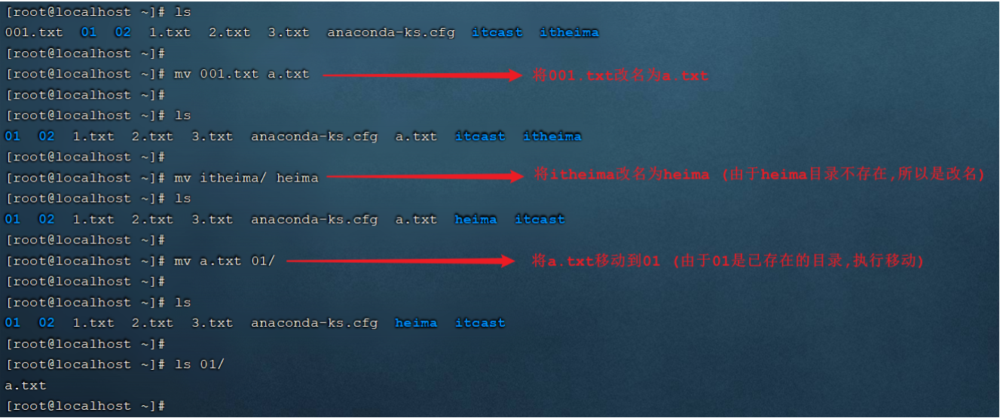

## 5.打包压缩命令

> 作用: 对文件进行打包、解包、压缩、解压
>
> 语法: `tar  [-zcxvf]  fileName  [files]`
>
> 包文件后缀为\.tar表示只是完成了打包，并没有压缩
>
> 包文件后缀为\.tar\.gz表示打包的同时还进行了压缩
>
> 说明:
>
> - \-z: z代表的是gzip，通过gzip命令处理文件，gzip可以对文件压缩或者解压
>
> - \-c: c代表的是create，即创建新的包文件
>
> - \-x: x代表的是extract，实现从包文件中还原文件
>
> - \-v: v代表的是verbose，显示命令的执行过程
>
> - \-f: f代表的是file，用于指定包文件的名称
>
> 举例：
>
> 打包
>
> - tar \-cvf hello\.tar \./\*          将当前目录下所有文件打包，打包后的文件名为hello\.tar
>
> - tar \-zcvf hello\.tar\.gz \./\*          将当前目录下所有文件打包并压缩，打包后的文件名为hello\.tar\.gz
>
> 解包
>
> - tar \-xvf hello\.tar          将hello\.tar文件进行解包，并将解包后的文件放在当前目录
>
> - tar \-zxvf hello\.tar\.gz           将hello\.tar\.gz文件进行解压，并将解压后的文件放在当前目录
>
> - tar \-zxvf hello\.tar\.gz \-C /usr/local     将hello\.tar\.gz文件进行解压，并将解压后的文件放在/usr/local目录

操作示例: 

1\. 打包

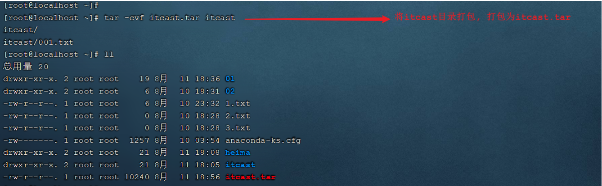

2\. 打包并压缩

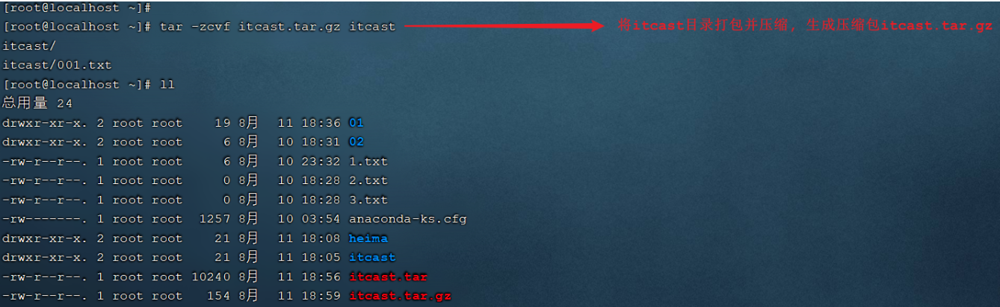

3\. 解包

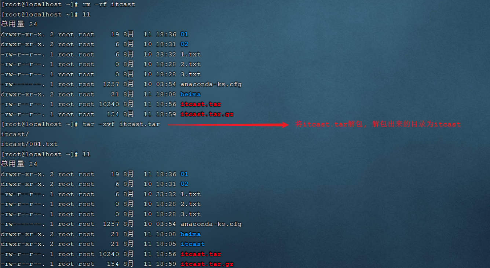

4\. 解压

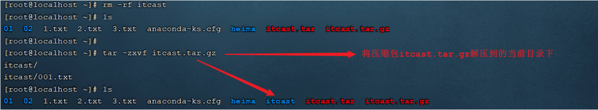

解压到指定目录,需要加上参数 \-C

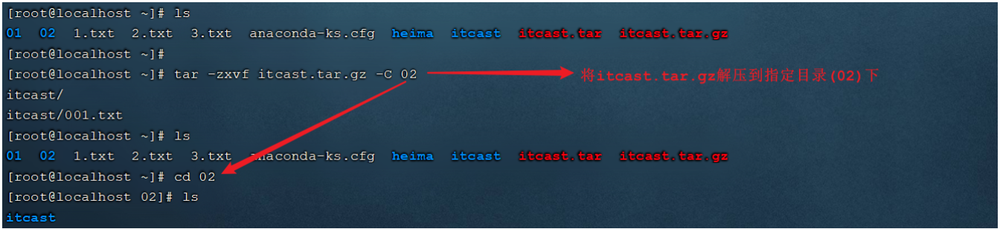

## 6.文本编辑命令

文本编辑的命令，主要包含两个: `vi` 和 `vim`，两个命令的用法类似，我们主要讲解vim的使用。

### 6.1.vi \& vim介绍

> 作用: vi命令是Linux系统提供的一个文本编辑工具，可以对文件内容进行编辑，类似于Windows中的记事本
>
> 语法: vi fileName
>
> 说明:
>
> - vim是从vi发展来的一个功能更加强大的文本编辑工具，编辑文件时可以对文本内容进行着色，方便我们对文件进行编辑处理，所以实际工作中vim更加常用。
> - 要使用vim命令，需要我们自己完成安装。可以使用下面的命令来完成安装：`yum install vim`

### 6.2.vim安装

命令： `yum install vim`

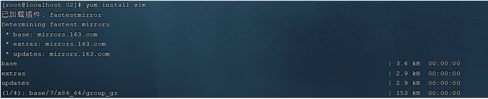

安装过程中，会有确认提示，此时输入 y，然后回车，继续安装：

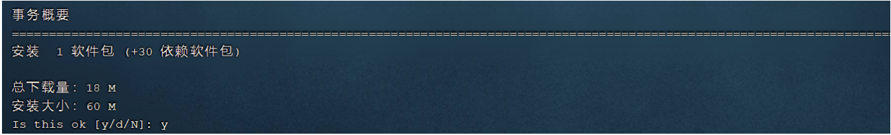

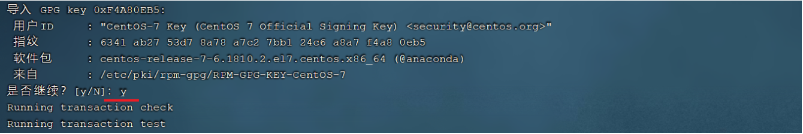

### 6.3.vim使用

> 作用: 对文件内容进行编辑，vim其实就是一个文本编辑器
>
> 语法: vim fileName
>
> 说明:
>
> - 在使用vim命令编辑文件时，如果指定的文件存在则直接打开此文件。如果指定的文件不存在则新建文件。
> - vim在进行文本编辑时共分为三种模式，分别是 命令模式（Command mode），插入模式（Insert mode）和底行模式（Last line mode）。这三种模式之间可以相互切换。我们在使用vim时一定要注意我们当前所处的是哪种模式。
>
> 三种模式:
>
> 1.命令模式
>
> - 命令模式下可以查看文件内容、移动光标（上下左右箭头、gg、G\)
>
> - 通过vim命令打开文件后，默认进入命令模式
>
> - 另外两种模式需要首先进入命令模式，才能进入彼此
>
> | 命令模式指令 | 含义 |
> |---|---|
> | gg |        定位到文本内容的第一行|
> | G |        定位到文本内容的最后一行|
> | dd |        删除光标所在行的数据|
> | ndd |        删除当前光标所在行及之后的n行数据|
> | u |        撤销操作|
> | i 或 a 或 o |        进入插入模式\(进入后光标所处的位置不同而已\)|
>
> 2.插入模式
>
> - 插入模式下可以对文件内容进行编辑
>
> - 在命令模式下按下\[i,a,o\]任意一个，可以进入插入模式。进入插入模式后，下方会出现【insert】字样
>
> - 在插入模式下按下ESC键，回到命令模式
>
> 3.底行模式
>
> -  底行模式下可以通过命令对文件内容进行查找、显示行号、退出等操作
>
> - 在命令模式下按下\[:,/\]任意一个，可以进入底行模式
>
> - 通过/方式进入底行模式后，可以对文件内容进行查找
>
> - 通过:方式进入底行模式后，可以输入wq（保存并退出）、q\!（不保存退出）、set nu（显示行号）
>
> | 底行模式指令 | 含义 |
> |---|---|
> | :wq |    保存并退出|
> | :q\! |    不保存退出|
> | :set nu |    显示行号|
> | :set nonu |    取消行号显示|
> | :n |    定位到第n行，如 :10 就是定位到第10行|
>
> 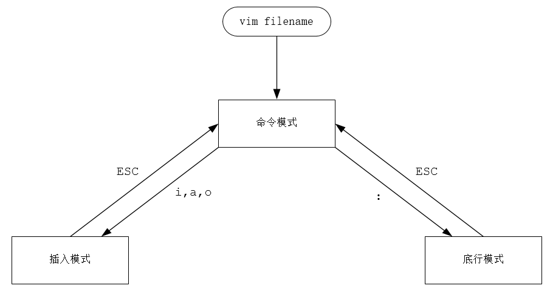
>

## 7.查找命令

### 7.1.find

> 作用: 在指定目录下查找文件
>
> 语法: find dirName \-option fileName
>
> 举例:
>
> - `find  .  –name "*.java`*"`                        在当前目录及其子目录下查找\.java结尾文件*
>
> - `find /itcast -name "*.java"`             在/itcast目录及其子目录下查找\.java结尾的文件

操作示例: 

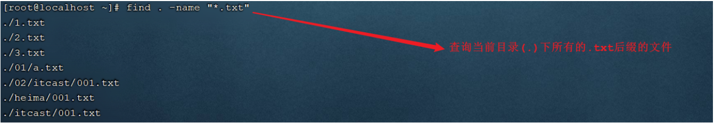

### 7.2.grep

> 作用: 从指定文件中查找指定的文本内容
>
> 语法: `grep word fileName`
>
> 选项：
>
> - \-i: 检索的关键字忽略\(ignore\)大小写
>
> - \-n: 显示关键字所在的这一行的行号
>
> - \-A: 输出关键字所在行及之后\(After\)的几行记录 \(如:\-A5 表示输出关键字所在行之后的5行记录\)
>
> - \-B: 输出关键字所在行及之前\(Before\)的几行记录 \(如:\-B5 表示输出关键字所在行之前的5行记录\)
>
> 举例:
>
> - grep Hello HelloWorld\.java        查找HelloWorld\.java文件中出现的Hello字符串的位置
>
> - grep hello \*\.java                        查找当前目录中所有\.java结尾的文件中包含hello字符串的位置

操作示例: 

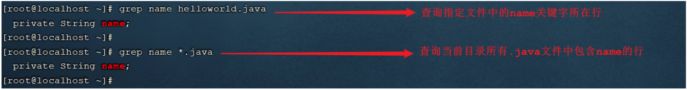

# 三、软件安装

## 1.软件安装方式

在Linux系统中，安装软件的方式主要有四种，这四种安装方式的特点如下：

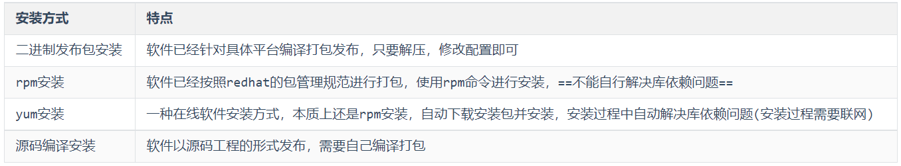

## 2.安装JDK

上述我们介绍了Linux系统软件安装的四种形式，接下来我们就通过第一种\(二进制发布包\)形式来安装JDK。 JDK对应的二进制发布包，在资料中已经提供，如下：


JDK具体安装步骤如下： 

1.上传安装包

使用FinalShell自带的上传工具将jdk的二进制发布包上传到Linux

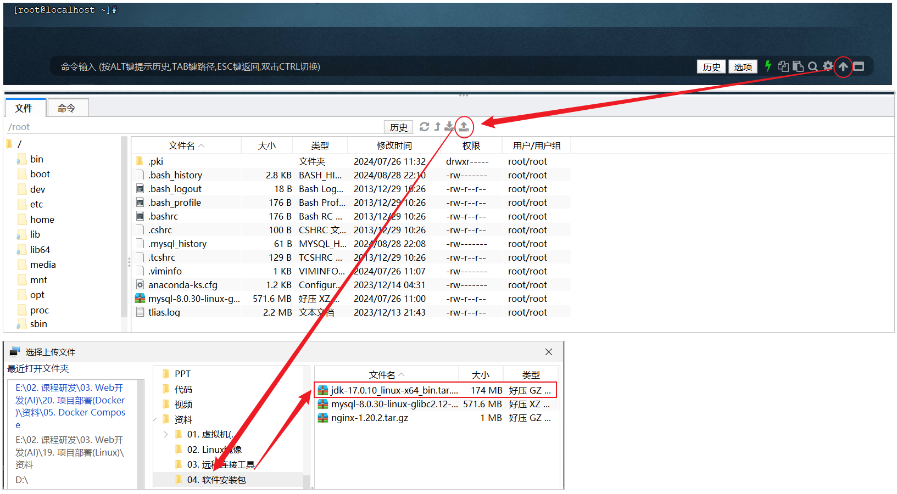

由于上述在进行文件上传时，选择的上传目录 /root，上传完毕后，我们执行指令 cd /root 切换到根目录下，查看上传的安装包。

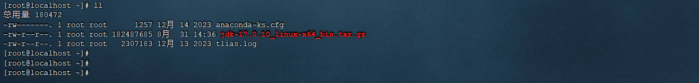

2.解压安装包

执行如下指令，将上传上来的压缩包进行解压，并通过\-C参数指定解压文件存放目录为 /usr/local。

```shell
tar -zxvf jdk-17.0.10_linux-x64_bin.tar.gz -C /usr/local/
```

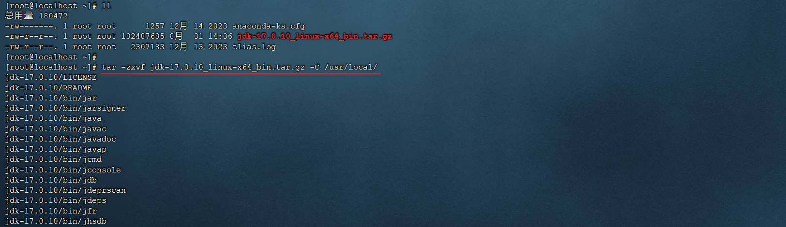

3.配置环境变量

使用vim命令修改`/etc/profile`文件，在文件末尾加入如下配置

```shell
export JAVA_HOME=/usr/local/jdk-17.0.10
export PATH=$JAVA_HOME/bin:$PATH
```

具体操作指令如下: 

```shell
1. 编辑/etc/profile文件，进入命令模式
    vim /etc/profile

2. 在命令模式中，输入指令 G ， 切换到文件最后
    G

3. 在命令模式中输入 i/a/o 进入插入模式，然后切换到文件最后一行
    i

4. 将上述的配置拷贝到文件中
    export JAVA_HOME=/usr/local/jdk-17.0.10
    export PATH=$JAVA_HOME/bin:$PATH
        
5. 从插入模式，切换到指令模式
    ESC
        
6. 按:进入底行模式，然后输入wq，回车保存
    :wq
```

4.重新加载profile文件

为了使更改的配置立即生效，需要重新加载profile文件，执行命令:

```Shell
source /etc/profile
```

5.检查安装是否成功

```Shell
java -version
```

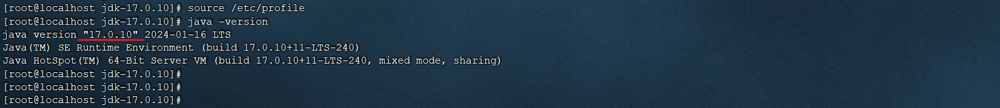

## 3.安装MySQL

### 3.1.MySQL安装

对于MySQL数据库的安装，我们将要使用前面讲解的第一种安装方式进行安装。

1.准备工作

在安装MySQL数据库之前，我们需要先检查一下当前Linux系统中，是否安装的有MySQL的相关服务（很多linux安装完毕之后，自带了低版本的mysql的依赖包），如果有，先需要卸载掉，然后再进行安装。

A\. 通过rpm相关指令，来查询当前系统中是否存在已安装的mysql软件包，执行指令如下：

- `rpm -qa`                                  查询当前系统中安装的所有软件

- `rpm -qa | grep mysql`            查询当前系统中安装的名称带mysql的软件

- `rpm -qa | grep mariadb`        查询当前系统中安装的名称带mariadb的软件

通过rpm \-qa 查询到系统通过rpm安装的所有软件，太多了，不方便查看，所以我们可以通过管道符 \| 配合着grep进行过滤查询。


通过查询，我们发现在当前系统中存在mariadb数据库，是CentOS7中自带的，而这个数据库和MySQL数据库是冲突的，所以要想保证MySQL成功安装，需要卸载mariadb数据库。

> RPM：全称为 Red\-Hat Package Manager，RPM软件包管理器，是红帽Linux用于管理和安装软件的工具。
>

B\. 通过 rpm 相关指令，来卸载对应的组件，执行指令如下：

在rpm中，卸载软件的语法为：`rpm -e --nodeps  软件名称`

那么，我们就可以通过指令，卸载 mariadb，具体指令为： `rpm -e --nodeps mariadb-libs-5.5.60-1.el7_5.x86_64`


我们看到执行完毕之后， 再次查询 mariadb，就查不到了，因为已经被成功卸载了。

2.将资料中提供的MySQL安装包上传到Linux并解压

A\. 上传MySQL安装包

在课程资料中，提供的有MySQL的安装包 ，我们需要将该安装包上传到Linux系统的根目录 /root 下面。


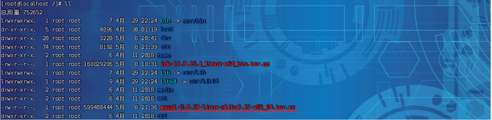

B\. 解压到 当前目录

执行如下指令: 

```shell
tar -xvf mysql-8.0.30-linux-glibc2.12-x86_64.tar.xz
```

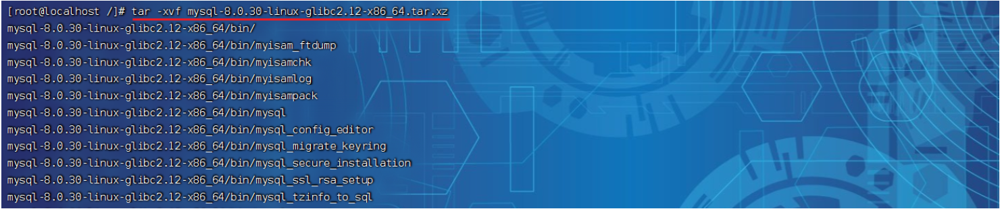

C\. 将解压后的文件夹移动到 /usr/local 目录下， 并改名为 mysql

```Shell
mv mysql-8.0.30-linux-glibc2.12-x86_64 /usr/local/mysql

cd /usr/local/mysql
```

3.配置系统环境变量

配置MySQL的环境变量, 通过vi编辑器编辑 `/etc/profile` 文件, 在尾部追加:

```shell
export MYSQL_HOME=/usr/local/mysql
export PATH=$MYSQL_HOME/bin:$PATH
```

并执行如下指令, 注册MySQL为系统服务:

```Shell
cp /usr/local/mysql/support-files/mysql.server /etc/init.d/mysql
chkconfig --add mysql
```

5.初始化数据库

```shell
#创建一个用户组, 组名就叫mysql
groupadd mysql

#创建一个系统用户 mysql, 并归属于用户组 mysql 
useradd -r -g mysql -s /bin/false mysql
```

```shell
#初始化mysql
mysqld --initialize --user=mysql --basedir=/usr/local/mysql --datadir=/usr/local/mysql/data
```

执行上述指令时, 会输入如下日志，在日志中就输出了MySQL中root用户的一个临时密码【记得复制出来，记录下来】： 

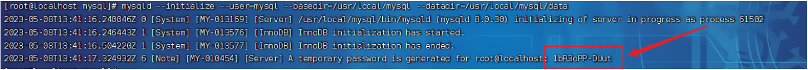

### 3.2.启动MySQL

1\. 启动MySQL服务

```shell
systemctl start mysql
```

2\. 通过命令, 登录MySQL

```shell
#xxxxx 代表上述生成的root的临时密码
mysql -uroot -pxxxxx
```

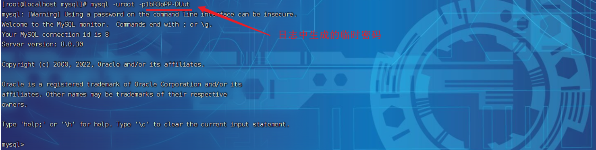

### 3.3.配置MySQL

1\. 修改root用户的密码

```shell
ALTER USER 'root'@'localhost' IDENTIFIED WITH mysql_native_password BY '1234';
```

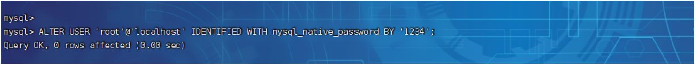

注意: 这个root账号仅仅能够在本机localhost上访问，我们在windows上是无法访问的。如果需要在window上或其他服务器上也能远程访问，需要创建一个账号，用于远程访问的。

2\. 创建账号, 并授权远程访问

```shell
CREATE USER 'root'@'%' IDENTIFIED BY '1234';

GRANT ALL PRIVILEGES ON *.* TO 'root'@'%';

FLUSH PRIVILEGES;
```

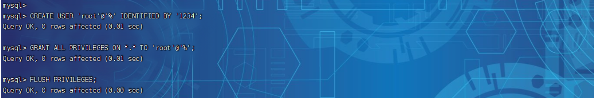

我们已经开启了MySQL的远程访问的权限，为什么还是连接不上MySQL服务器呢？？ 这是因为Linux系统的防火墙，将我们的访问拦截了。

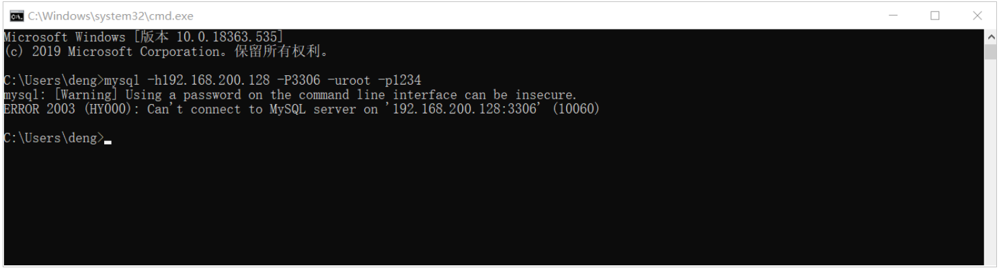

### 3.4.防火墙操作

Linux系统安装完毕后，系统启动时，防火墙自动启动，防火墙拦截了所有端口的访问。接下来我们就需要学习一下，如何操作防火墙，具体指令如下： 

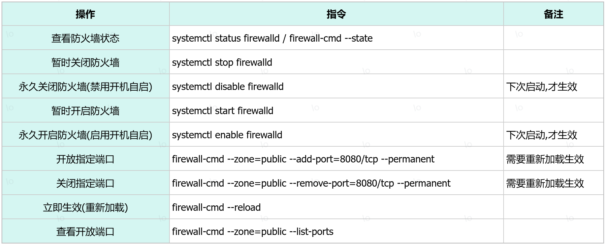

注意： 要想在windows上能够访问MySQL，需要开放防火墙的3306端口  或者 直接关闭防火墙 ，执行如下指令:

```shell
#开发防火墙的3306端口号
firewall-cmd --zone=public --add-port=3306/tcp --permanent

#重新加载
firewall-cmd --reload

#查看开放的端口号
firewall-cmd --zone=public --list-ports
```

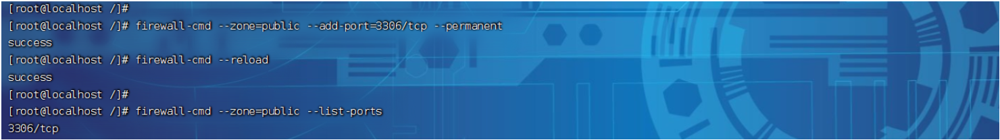

或者直接关闭防火墙: 

```shell
systemctl stop firewalld
```

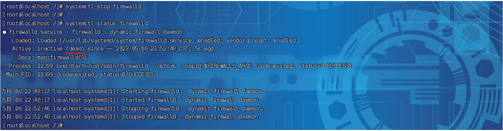

### 3.5.连接测试

关闭掉linux系统的防火墙之后，我们就可以打开windows上的命令行，通过mysql的客户端\(命令行/图形化界面\)来连接远程linux上安装的MySQL数据库了。

1.客户端连接

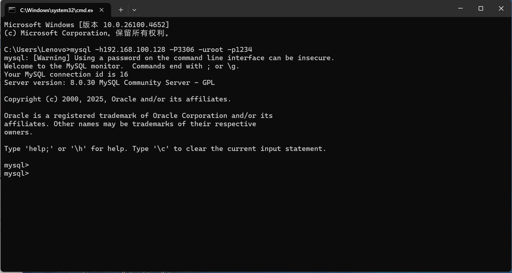

2.打开DataGrip图形化工具连接

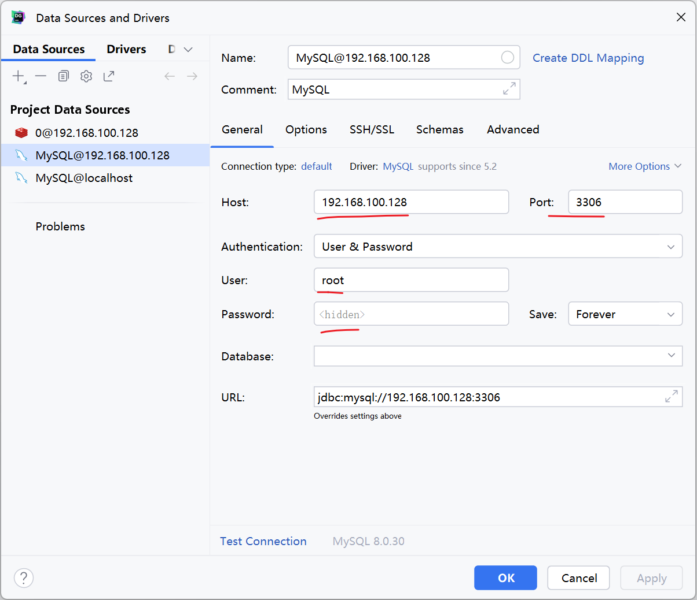

执行资料中提供的SQL脚本 `qk.sql` 。

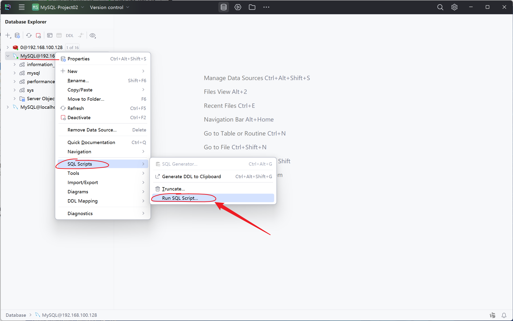

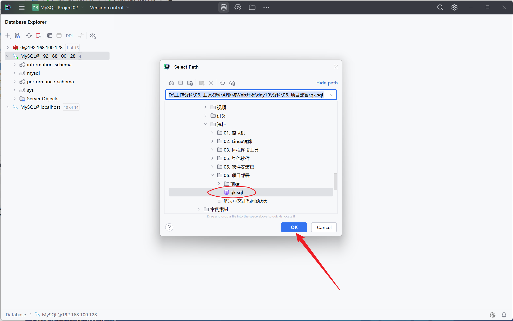

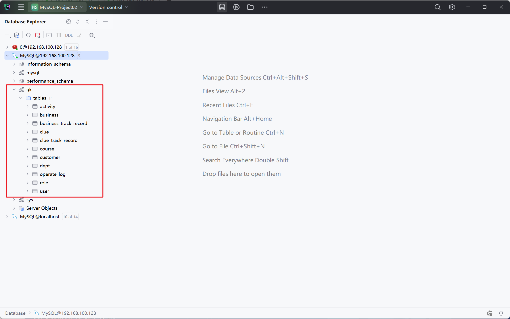

## 4.安装Nginx

### 4.1.安装

Nginx的安装包，从官方下载下来的是c语言的源码包，我们需要自己编译安装。具体操作步骤如下：

1.安装Nginx运行时需要的依赖

```shell
yum install -y pcre pcre-devel zlib zlib-devel openssl openssl-devel
```

安装C语言的编译环境\.

```shell
yum install gcc-c++
```

2.上传Nginx的源码包


3.解压源码包到当前目录

```Shell
tar -zxvf nginx-1.20.2.tar.gz
```

4.进入到解压目录后，执行指令

```shell
#进入解压目录
cd nginx-1.20.2

#执行命令配置, 生成Makefile文件
./configure --prefix=/usr/local/nginx
```

5.执行命令进行编译和安装

```shell
#编译
make

#编译安装
make install
```

### 4.2.启动Nginx

进入到nginx安装目录`/usr/local/nginx`，启动nginx服务

```shell
cd /usr/local/nginx/
sbin/nginx
```

启动完毕之后，我们可以通过 `ps` 指令查询当前系统中的nginx进程，从而确认nginx是否启动 。

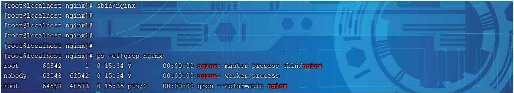

然后，我们就可以打开浏览器，访问服务器上的nginx 。

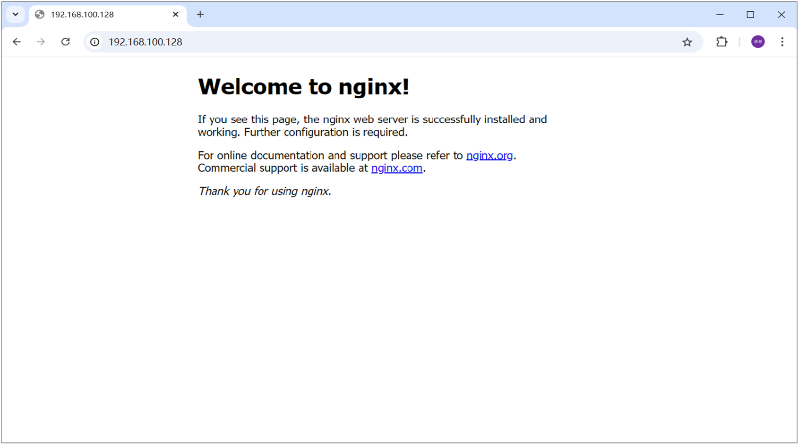

# 四、项目部署

## 1.前端项目部署

1.将nginx的安装目录的html中的静态资源文件先删除掉。

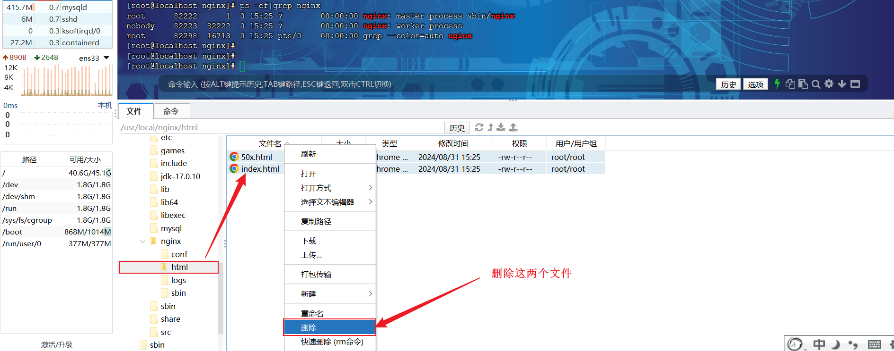


2.将资料中提供的 "资料/06\. 项目部署/前端/页面资源" 目录下的静态资源文件，全部上传到nginx安装目录下的 html 目录中\.

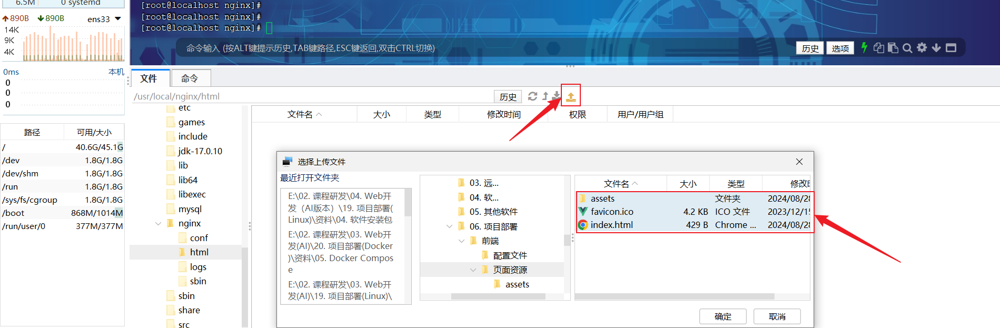

3.修改资料中提供的 `nginx.conf` 配置文件，将其上传到nginx安装目录下的 conf 目录中\.

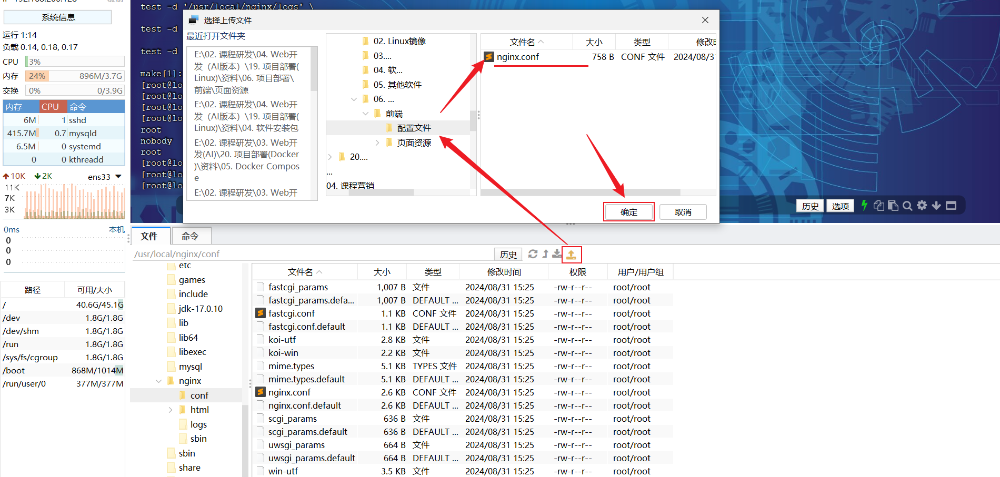

4.重新加载nginx服务的配置文件

```Shell
#重新加载配置文件
sbin/nginx -s reload
```

5.再次访问nginx \(可能会存在浏览器缓存, 可以按Ctrl\+F5, 强制刷新清理缓存\)

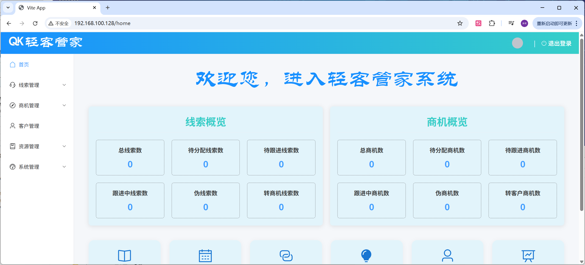

> nginx服务常见操作指令: 
>
> - 启动: sbin/nginx
>
> - 重载: sbin/nginx \-s reload
>
> - 停止: sbin/nginx \-s stop
>

## 2.后端项目部署

之前我们讲解Linux操作系统时，就提到，我们服务端开发工程师学习Linux系统的目的就是将来我们开发的项目绝大部分情况下都需要部署在Linux系统中。

### 2.1.环境准备

那现在，项目要上线了，要部署到linux服务器上了，我们也需要使用linux服务器上所安装的mysql数据库。

那此时，我们就可以再准备一份文件 `application.yml` 将里面的配置的mysql的ip地址及相关配置信息修改一下（配置Linux上安装的MySQL的信息）：

```YAML
#数据库连接信息
spring:
  datasource:
    url: jdbc:mysql://192.168.100.128:3306/qk
    driver-class-name: com.mysql.cj.jdbc.Driver
    username: root
    password: 1234
  servlet:
    multipart:
      #单个文件上传大小限制
      max-file-size: 10MB
      #单个请求上传文件大小限制
      max-request-size: 100MB
  #redis配置
  data:
    redis:
      host: 192.168.100.128
      port: 6379
      database: 0

#mybatis配置
mybatis:
  configuration:
    log-impl: org.apache.ibatis.logging.stdout.StdOutImpl
    map-underscore-to-camel-case: true
  mapper-locations: classpath:mapper/*.xml

#阿里云OSS
aliyun:
  oss:
    endpoint: https://oss-cn-beijing.aliyuncs.com
    bucketName: web2025-test
    region: cn-beijing

#mybatisplus配置
mybatis-plus:
  configuration:
    log-impl: org.apache.ibatis.logging.stdout.StdOutImpl
    map-underscore-to-camel-case: true
  mapper-locations: mapper/*.xml
  global-config:
    db-config:
      id-type: auto
logging:
  level:
    org.springframework.jdbc.support.JdbcTransactionManager: debug*
```

改造完毕之后，可以在本地的idea中先启动当前项目，然后访问一下，看看工程是否正常访问。

### 2.2.打包部署

1.执行 `package` 指令，进行打包操作，将当前的springboot项目，打成一个jar包。 \(跳过测试\)

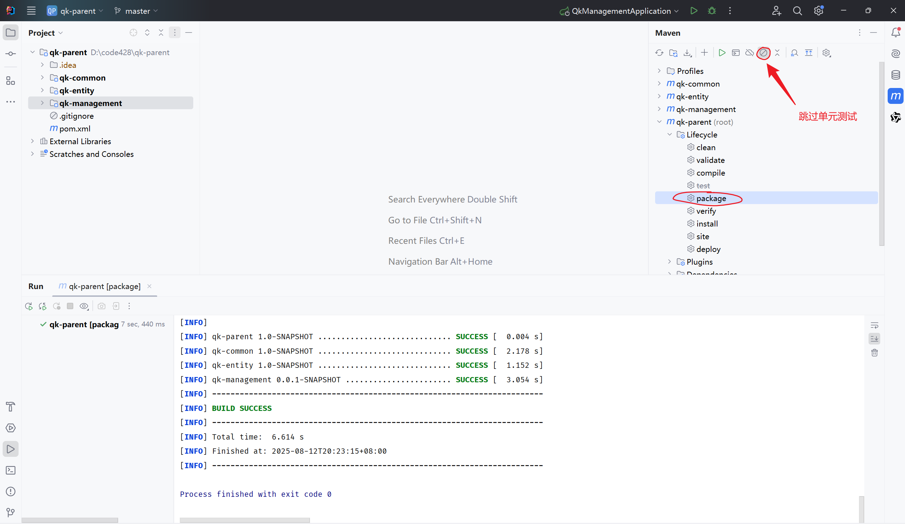

2.在Linux服务器上创建一个目录，将jar包上传到服务器 。

```shell
mkdir -p /usr/local/qk-app
```


3.通过java命令，启动项目

```shell
#进入目录/usr/local/qk-app
cd /usr/local/qk-app

#运行jar包
java -jar qk-management-0.0.1-SNAPSHOT.jar
```

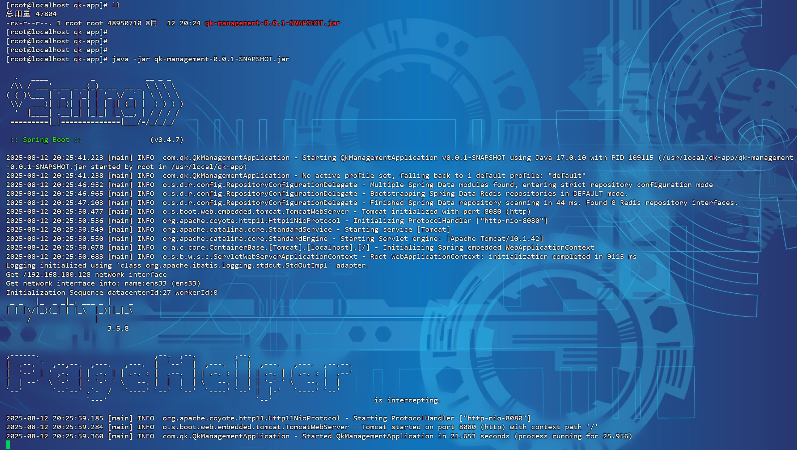

项目启动起来之后，就可以打开浏览器测试啦。


### 2.3.阿里云OSS秘钥配置

由于在开发的时候，我们将访问阿里云OSS的AccessKeyId，AccessKeySecret都配置在了系统的环境变量中了。那现在项目部署到了Linux服务器中，调用阿里云OSS进行文件上传时，程序就会获取Linux系统中的环境变量。所以此时，我们需要将AccessKeyId，AccessKeySecret配置为Linux系统的环境变量。

1.查看Windows系统之前配置的环境变量

```shell
echo %OSS_ACCESS_KEY_ID%

echo %OSS_ACCESS_KEY_SECRET%
```

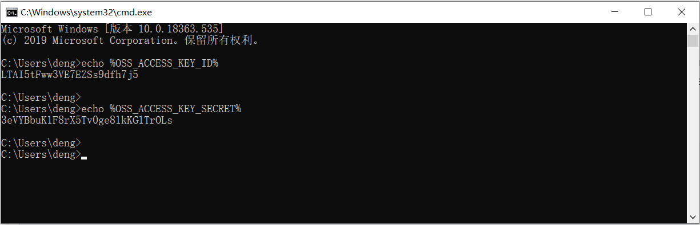

我们将上述自己的 AccessKeyId 与  AccessKeySecret 复制出来，然后在linux系统中配置环境变量。

2.执行如下指令：

```shell
echo "export OSS_ACCESS_KEY_ID=LTAI5tPQxxxxxxxx2g8RBXCJB" >> /etc/profile

echo "export OSS_ACCESS_KEY_SECRET=nZf8bZHvxxxxxxxxxxxxxxxxxGseCJ2GC" >> /etc/profile

source /etc/profile
```

> 注意\!\!\!：上述的是自己的阿里云OSS账号的 OSS\_ACCESS\_KEY\_ID， OSS\_ACCESS\_KEY\_SECRET，一个字符都不能错，在记事本中将命令组装好，然后再到命令行中执行。
>

执行完毕后，将finalShell的窗口关闭掉，重新打开一个新窗口（让环境变量生效），重新运行项目测试。 

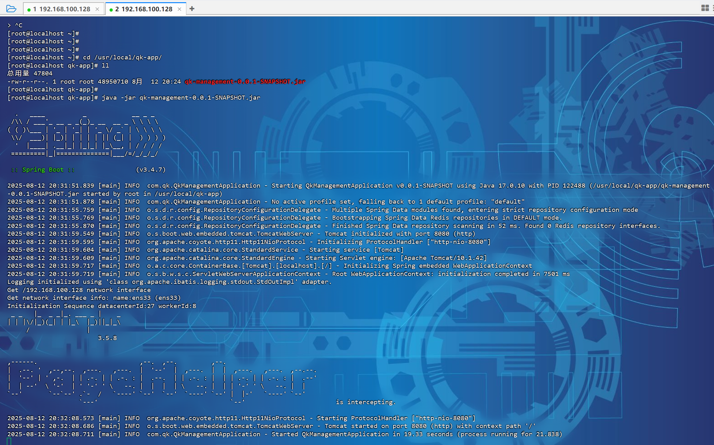

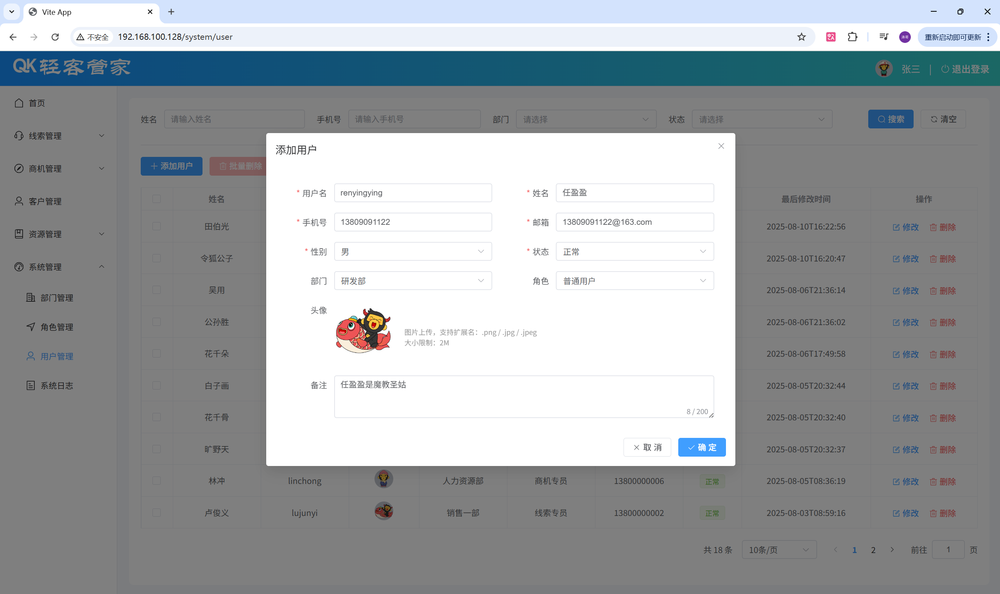

当前程序中存在的问题: 

- 线上程序不会采用控制台霸屏的形式运行程序，而是将程序在后台运行

- 线上程序不会将日志输出到控制台，而是输出到日志文件，方便运维查阅信息 

要解决上述这两个问题，我们就可以通过 nohup 指令让程序在后台运行。

### 2.4.后台运行

1.后台运行程序

```shell
nohup java -jar  qk-management-0.0.1-SNAPSHOT.jar &> qk.log &
```

通过上述指令就可以后台运行服务，服务运行之后， 所有的日志信息都会输出到 tlias\.log 文件中。

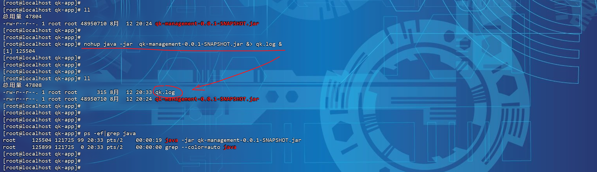

2.停止服务

```shell
#查看服务的进程信息
ps -ef|grep java

#杀掉进程
kill -9 xxxxx
```

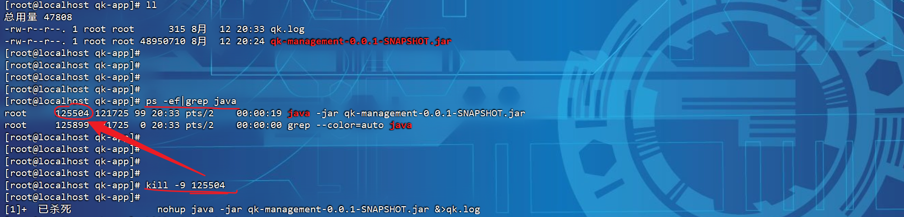

> nohup命令：英文全称 no hang up（不挂起），用于不挂断地运行指定命令，退出终端不会影响程序的运行
>
> 语法格式： `nohup command [ args … ] [&]`
>
> 参数说明：
>
> - command：要执行的命令
>
> - args：一些参数，可以指定输出文件
>
> - \&：让命令在后台运行
>
> 举例：
>
> `nohup java -jar boot工程.jar &> hello.log &`
>
> 上述指令的含义为： 后台运行 java \-jar 命令，并将日志输出到hello\.log文件
